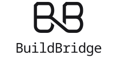

<div align="center">

<h1>
  <picture>
    <source media="(prefers-color-scheme: dark)" srcset="docs/images/buildbridge-logo-dark.svg">
    
  </picture>
</h1>

### Build, sign, and ship iOS and Android apps locally.

A desktop app for local mobile builds on Linux and macOS. Go from local code to signed releases, with device testing, signing, and store uploads in one place.

Your hardware. Your signing keys. No cloud build service required.

[Features](#features) · [How it works](#how-it-works) · [Requirements](#requirements) · [Development](#development)

</div>

---

## Features

- **Set up once.** Reuse macOS and Android build machines across projects, or use Xcode on your Mac.
- **Build as you work.** Sync your project and run test builds before setting up release signing.
- **Test on devices.** Run debug builds on iPhone or Android and inspect your app with Safari or Chrome.
- **Keep your keys.** Create, import, and reuse Apple signing credentials and Android upload keys in your OS credential vault.
- **Export signed releases.** Get verified App Store Connect IPAs, Android App Bundles, and APKs.
- **Publish from the desktop.** Upload IPAs from a managed Mac or create Google Play internal-testing drafts, with guided release steps.
- **Use the app or CLI.** Manage the same machines and builds from either.

## How it works

```text
                                          Tauri desktop ─┐
Approved projects ───────────────────┬─ buildbridge engine ◄─ buildbridge CLI
Credential vault ────────────────────┘   trusted host
                                          ├─ macOS machine lifecycle ─┐
                                          ├─ pinned SSH bridge ────────┴─ macOS / Xcode ── archive / IPA
                                          ├─ docker exec ─────────────── Android toolchain ── bundle / APK
                                          └─ native Xcode ────────────── This Mac ── archive / IPA
```

The engine is the trusted side, running inside the desktop app or the `buildbridge` command line on your host. It owns the machines, approved project folders, signing credentials, and pinned SSH connection to each guest. Everything happens on your own host; buildbridge needs no account and no server.

The desktop guides each machine through two workflows, and the command line drives the same steps:

1. **Setup:** Check the host and create the machine. For a managed macOS machine, install macOS, configure SSH, and download Xcode from Apple in a window of the app, signed in with your own Apple ID; an Android toolchain has nothing else to set up; **This Mac** reports the Xcode and signing identity it found.
2. **Build:** Set up the project, run the unsigned test build or the debug build, attach signing credentials, and export the signed archive and IPA or the signed app bundle and APK. **On a real device** runs the debug build on a phone, and **Publishing** hands the retained file to its store.

buildbridge never collects an Apple Account password or two-factor code. The local macOS login password is asked for once, to install the SSH key into a guest whose fingerprint is already pinned, and is discarded after that one session; the same step can be done by typing commands in the guest Terminal instead. For more detail, see [Product and Architecture](docs/PRODUCT_AND_ARCHITECTURE.md).

## Requirements

The automated workflow currently requires a Capacitor project with `capacitor.config.ts`, `pnpm-lock.yaml`, and a Vite+ web build. Other iOS and Android project types need additional build recipes.

For the desktop on Linux:

- Docker Engine reachable by your user
- For a macOS machine: x86_64 Linux with KVM (`/dev/kvm` readable and writable by your user), an X11 display for the one-time macOS installer console (Docker-OSX) or `/dev/net/tun` (dockur/macos), and OpenSSH client tools
- Room under `~/.local/share` for each machine: a sparse 200 GB macOS disk (tens of GB used), or a few GB of Android SDK and Gradle caches

An Android toolchain needs only Docker: no KVM, no display, no ports. To run a debug APK on a real Android device, ADB must be installed on the host.

For the desktop on a Mac: Xcode with the iOS platform, and an Apple Distribution identity and App Store profile already in the login keychain for signed exports; Docker Desktop for Android machines, which run as `linux/amd64` and so need working amd64 emulation on Apple silicon. Native Mac execution is implemented and covered by automated tests, but has not yet been accepted on physical Apple hardware.

Optional, to run a Debug build on a real iPhone from a managed macOS machine: the phone on USB, polkit (`pkexec`) to install one udev rule that releases iPhones from `usbmuxd`, and a `plugdev` group. Host-side iPhone sync is off while that rule is installed; the desktop can remove it again. This route is experimental.

Docker-OSX is an experimental, self-hosted route. Apple's licensing ties macOS virtualization to Apple hardware; review it before using buildbridge for production builds.

## Command line

The same engine as the desktop, in a terminal, on the same machines:

```sh
cargo run -p buildbridge-cli -- status
buildbridge machine create "Team Mac" --from-template xcode-26-ready
buildbridge machine start team-mac
buildbridge machine screen team-mac --open     # dockur/macos serves the screen as a web page
buildbridge project approve team-mac /path/to/app
buildbridge project sync team-mac
buildbridge build test team-mac --target device_sdk
buildbridge signing attach team-mac dist-kit && buildbridge signing provision team-mac
buildbridge build archive team-mac
buildbridge device attach team-mac 3 9 && buildbridge device run team-mac <udid>

buildbridge machine create "Android builder" --platform android
buildbridge machine start android-builder
buildbridge project approve android-builder /path/to/app && buildbridge project sync android-builder
buildbridge build test android-builder --allow-http   # HTTP APIs in this debug APK only
buildbridge signing keystore dist-kit --password-stdin < keystore-password.txt
buildbridge signing attach android-builder dist-kit
buildbridge build release android-builder --outputs both   # or aab, or apk
```

Progress goes to stderr as it happens and results to stdout; `--json` makes both machine
readable. A machine the desktop is working on is refused with the reason, and the other way
round. `buildbridge --help` lists every verb.

## Development

This is a monorepo:

```text
apps/desktop    Tauri and Vue desktop, a thin client of the engine
apps/cli        The buildbridge command line, the other client
crates/         Rust: the engine, the machines (Docker-OSX, dockur/macos, the Android toolchain, and the native Mac), and the wire protocol contract
```

Requirements are Rust, Docker, and the Node.js version managed by Vite+.

```bash
vp install
```

Run the apps:

```bash
vp run dev                              # Tauri desktop
cargo run -p buildbridge-cli -- status  # the command line, on the same machines
```

The desktop interface can be developed in a plain browser: `vp dev` inside `apps/desktop` serves it against a mock backend with one prepared macOS machine, one fresh machine and one Android builder, no Docker required.

Run the checks:

```bash
vp check                 # format and lint (vp fmt, vp lint on their own); --fix applies
vp run -r typecheck      # desktop type check
vp test --run            # desktop unit tests, inside apps/desktop
cargo test --workspace   # Rust workspace tests
cargo clippy --workspace
vp run types:generate    # regenerate the TypeScript contract from the Rust DTOs
cargo test -p buildbridge-engine --test provider_boot -- --ignored   # boots a throwaway machine per provider; run before changing an image digest
vp run -r build          # build the desktop front end
```

GitHub Actions runs the same checks on every push and pull request, with a macOS job compiling the workspace for the native Mac paths. Pushing a tag named after the workspace version, `v0.1.0`, builds the Linux and macOS bundles and the command line and attaches them to a draft release.

## License

MIT.
