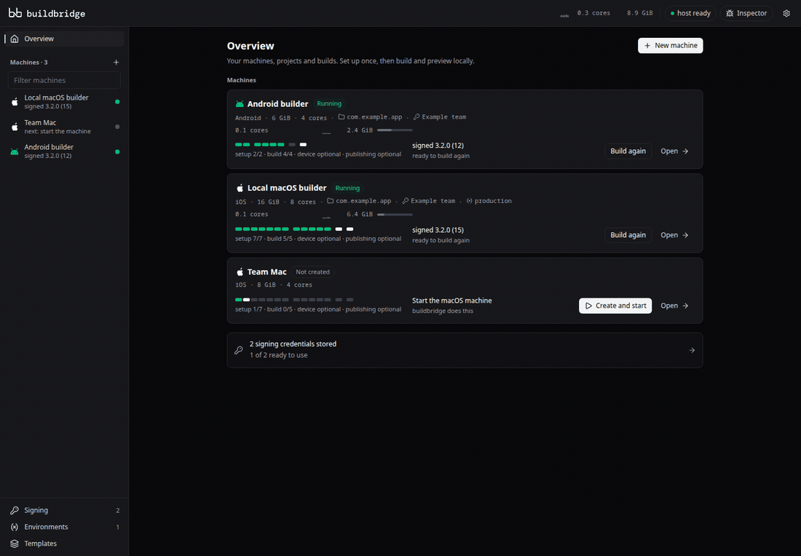
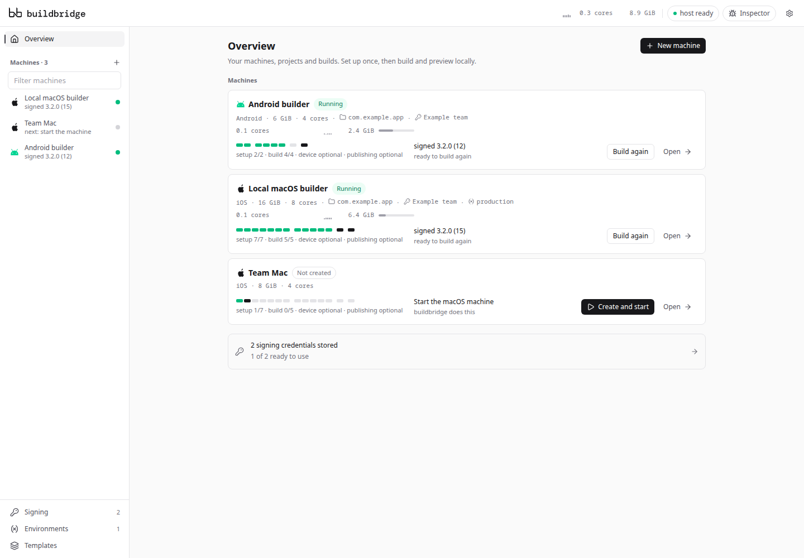
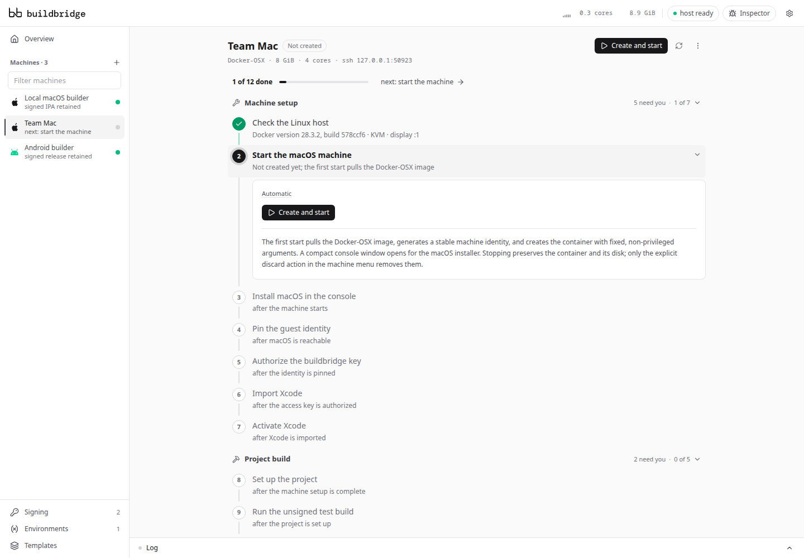
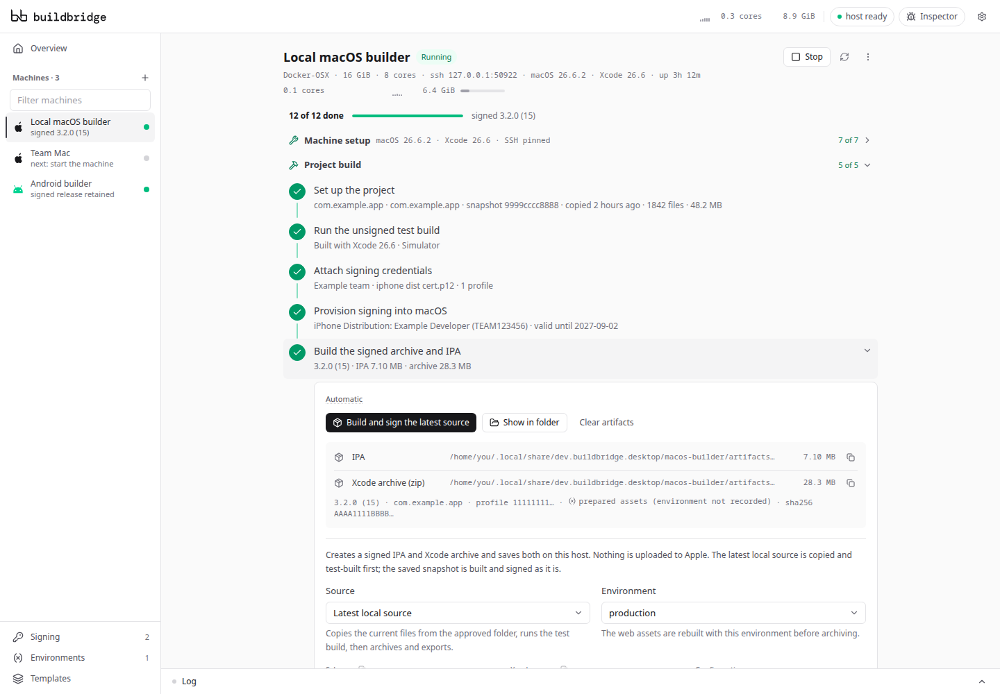
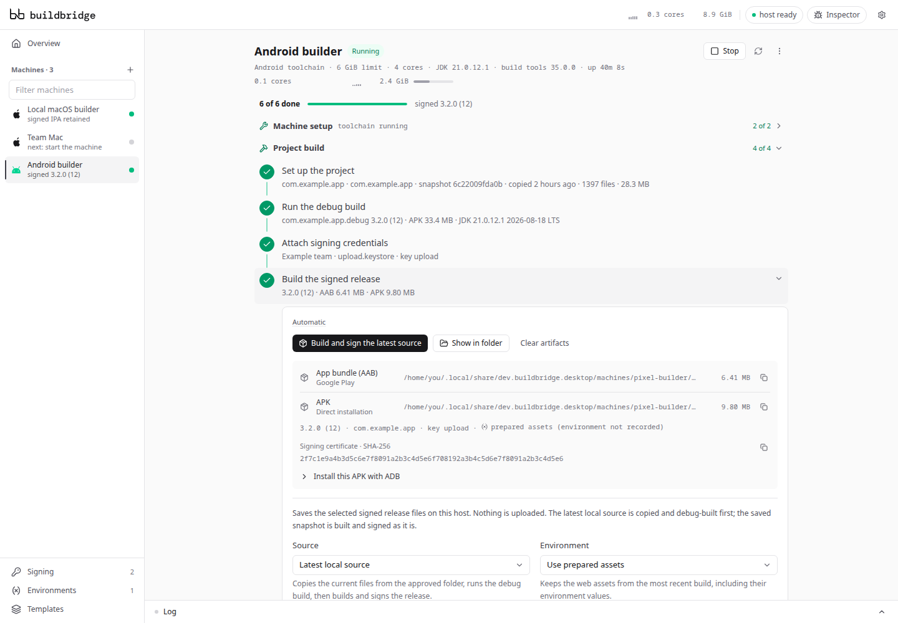

<div align="center">

<h1>
  <picture>
    <source media="(prefers-color-scheme: dark)" srcset="docs/images/buildbridge-logo-dark.svg">
    
  </picture>
</h1>

### Build iOS and Android apps. Right from Linux.

No Mac required. One workspace to build for both platforms.

Your hardware. Your signing keys. No cloud build service required.

[Features](#features) · [How it works](#how-it-works) · [Supported projects](#supported-projects) · [Requirements](#requirements) · [Command line](#command-line) · [Development](#development)

<br>



</div>

---

## Features

- **Set up once.** Reuse iOS and Android build environments across projects.
- **Build as you work.** Run test builds before setting up release signing.
- **Test on devices.** Run iPhone and Android builds; inspect WebViews with Safari or Chrome.
- **Keep your keys.** Create, import, and reuse signing credentials in your OS vault.
- **Export signed releases.** Get iOS IPAs and Xcode archives, Android App Bundles, and APKs.
- **Upload to stores.** Send IPAs to App Store Connect or create Google Play internal-testing drafts.
- **Use the app or CLI.** Work with the same machines, projects, and credentials.

## How it works

buildbridge is a desktop app that manages both build environments on your computer. On Linux, iOS builds run in a local macOS virtual machine with Xcode; Android builds run in a Docker container with the Android toolchain.

1. **Prepare your build environment.** Choose iOS or Android. The app guides you through installing macOS and Xcode for iOS; Android tools prepare themselves. Reuse the environment for future builds and projects.
2. **Choose your project and build.** Approve a local folder, choose a scheme or module when needed, and run a test build. Follow progress and logs in the app.
3. **Sign and export.** Add signing credentials when you are ready for a release. Save the IPA, app bundle, or APK to your computer, then upload through the guided publishing steps if you choose.

Local builds need no buildbridge account or server. Sign in to Apple directly inside macOS; buildbridge never collects your Apple Account password or two-factor codes.

|  |  |
| :-- | :-- |
| <picture><source media="(prefers-color-scheme: dark)" srcset="docs/images/screenshot-overview-dark.png"></picture> | <picture><source media="(prefers-color-scheme: dark)" srcset="docs/images/screenshot-setup-dark.png"></picture> |
| **See every build environment.** Check setup progress, status, and the latest build. | **Follow the setup steps.** See what is needed and what to do next. |
| <picture><source media="(prefers-color-scheme: dark)" srcset="docs/images/screenshot-archive-dark.png"></picture> | <picture><source media="(prefers-color-scheme: dark)" srcset="docs/images/screenshot-android-dark.png"></picture> |
| **Export for iOS.** Keep the signed IPA and Xcode archive on your computer. | **Export for Android.** Choose an app bundle, an APK, or both. |

## Supported projects

Bring a **Capacitor, Cordova, React Native, Expo, Flutter, or NativePHP** app, or a native **Xcode or Gradle** project. buildbridge detects the project type from your folder and shows the available schemes or application modules.

| Project | Before your first build |
| :-- | :-- |
| Capacitor, Cordova, React Native | Add the framework's iOS or Android project before approving the folder. |
| Expo | Native projects can be generated in the build environment with `expo prebuild`. |
| Flutter | Include the platform folders. buildbridge installs a pinned Flutter SDK on first use. |
| NativePHP | Run `php artisan native:install` locally first. buildbridge builds the generated projects in `nativephp/`. |
| Native Xcode or Gradle | Include an application target or module. Android uses your Gradle wrapper when present, or a pinned Gradle installation otherwise. |

JavaScript dependencies use the package manager selected by your project's lockfile: pnpm, npm, Yarn, or Bun. CocoaPods runs for iOS projects that use it.

## Requirements

### On Linux

Both platforms need Docker Engine accessible to your user.

| | iOS | Android |
| :-- | :-- | :-- |
| Host | x86_64 Linux with read/write access to `/dev/kvm` | Linux with Docker; no KVM required |
| Additional tools | OpenSSH client tools; an X11 display for Docker-OSX, or `/dev/net/tun` for dockur/macos | Toolchain installed in the container |
| Storage per environment | A sparse 200 GB macOS disk, using tens of GB initially | A few GB for the Android SDK and Gradle caches |

Machine data is stored under `~/.local/share` by default. To run the desktop from source, see [Development](#development).

### On macOS

On a Mac, choose **This Mac** to build iOS apps with your installed Xcode and iOS platform. Signed exports also need an Apple Distribution identity and App Store provisioning profile installed on the Mac.

Android builds use Docker Desktop. The container runs as `linux/amd64`, so Apple silicon needs working amd64 emulation. Native Mac execution is covered by automated tests and still awaits validation on physical Apple hardware.

### Device previews

- **Android:** Install ADB on the host to run APKs on a phone or emulator.
- **iPhone (experimental):** Connect over USB to a managed macOS machine. This needs polkit (`pkexec`) and a `plugdev` group. The app installs a removable udev rule that disables host-side iPhone sync while in place.

### macOS virtualization

Running macOS on hardware that is not Apple's is a self-hosted, experimental route, and Apple's software licence ties macOS virtualization to Apple-branded hardware. That applies to both macOS providers, Docker-OSX and dockur/macos; review it before using buildbridge for production builds. Building with **This Mac** on Apple hardware carries no such condition — it uses the Xcode and the signing identity already installed there. buildbridge signs with your own Apple Developer credentials through Xcode's own tooling either way; it circumvents nothing, and it is not a route around Apple's terms.

## Command line

The `buildbridge` CLI shares the desktop's machines, projects, and credentials. Run `buildbridge status` to see your host and machines, or `buildbridge --help` for all commands.

**iOS:** Start a prepared macOS machine in the desktop, then build from the terminal. Replace `team-mac` and `ios-signing` with your machine and signing credential IDs, listed by `buildbridge machine list` and `buildbridge signing kits`.

```sh
buildbridge project approve team-mac /path/to/app
buildbridge project sync team-mac
buildbridge build test team-mac --target device_sdk
buildbridge signing attach team-mac ios-signing
buildbridge signing provision team-mac
buildbridge build archive team-mac
```

**Android:** Create an environment and make a debug APK. For the signed release, the example uses existing Android signing credentials with an upload key and the ID `android-signing`.

```sh
buildbridge machine create "Android builder" --platform android
buildbridge machine start android-builder
buildbridge project approve android-builder /path/to/app
buildbridge project sync android-builder
buildbridge build test android-builder
buildbridge signing attach android-builder android-signing
buildbridge build release android-builder --outputs both
```

Use `--outputs aab` or `--outputs apk` to export only one Android format. Progress streams to stderr and results go to stdout; add `--json` for structured output. The desktop and CLI prevent concurrent operations on the same machine.

## Development

The desktop uses Tauri and Vue. The CLI and desktop share a Rust engine; the remote control plane is a separate service outside this repository.

| Path | Purpose |
| :-- | :-- |
| `apps/desktop` | Tauri desktop app and Vue interface |
| `apps/cli` | `buildbridge` command line |
| `crates/buildbridge-engine` | Build workflows, machines, signing, and local state |
| `crates/buildbridge-machines` | macOS providers, Android toolchain, and native Mac execution |
| `crates/buildbridge-contract` | Versioned protocol for the remote control plane |
| `crates/buildbridge-runner` | Runner client for that protocol |

See [Product and Architecture](docs/PRODUCT_AND_ARCHITECTURE.md) for the system design, credential handling, and known limitations.

### Run from source

Install Rust, Vite+ (which manages Node.js), and the desktop system dependencies listed in [CI](.github/workflows/ci.yml). Docker is needed to run managed build environments.

```bash
vp install
vp run dev
```

Run the CLI from source:

```bash
cargo run -p buildbridge-cli -- status
```

For interface development, run `vp dev` inside `apps/desktop`. It opens the UI in a browser with sample machines and a mock backend; Docker is not needed.

### Checks and builds

Run from the repository root:

```bash
vp check
vp run --filter @buildbridge/desktop typecheck
vp run --filter @buildbridge/desktop test
cargo fmt --all --check
cargo test --workspace
cargo clippy --workspace
```

After changing Rust types exposed to the desktop, run `vp run types:generate`; never edit the generated TypeScript files by hand. Before changing a provider image digest, run `cargo test -p buildbridge-engine --test provider_boot -- --ignored`, which boots a throwaway machine per provider.

Use `vp run -r build` to build the frontend, or `vp run build:desktop` to create a desktop bundle.

GitHub Actions checks pushes to `main` and pull requests, including a macOS job for native Mac code. A version tag matching the workspace version, such as `v0.1.0`, builds Linux and macOS bundles and the CLI, then attaches them to a draft release.

## License

[MIT](LICENSE).
