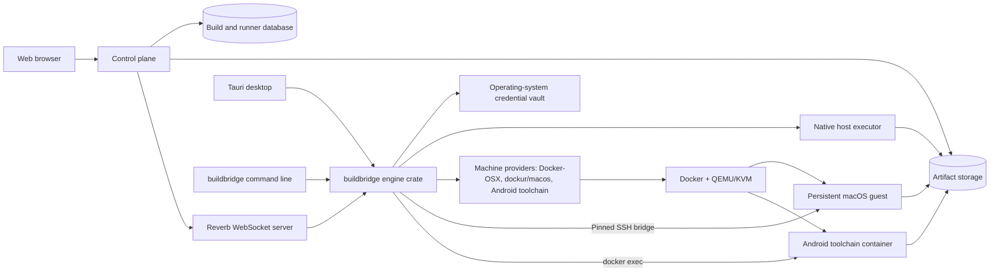

# buildbridge Product Goal and Architecture

Status: working product and engineering reference  
Last updated: 2026-09-07

This document defines what buildbridge is intended to become, the first complete workflow we are building, the boundaries between its components, and the order in which the project should expand. It should be updated when a durable product or architecture decision changes.

## North star

buildbridge makes repeatable iOS and Android builds available from one desktop. On Linux, prepare a managed macOS machine or an Android toolchain container. On a Mac, use the installed Xcode and existing signing identity directly for iOS, or Docker Desktop for Android. Approve a project, choose a build outcome, and retrieve verified output. Native Mac execution is implemented but still awaits acceptance on physical Apple hardware.

The optional self-hosted build dashboard coordinates accounts, permissions, queues, logs, and private artifact downloads. It is useful today for accessing your own builders remotely and for sharing a trusted Mac with another person. Sharing uses this service; it does not replace it. A person borrowing a builder only needs an account on the same server and an invitation, while the computer accepting jobs pairs as a runner. A hosted SaaS connection is planned and is not required for local builds.

The desktop is the product; the control plane is a remote for it.

The intended local experience is:

1. Install the buildbridge desktop on a supported host (Linux for managed macOS; macOS for native Xcode).
2. Choose **This Mac** for native iOS builds, or prepare a reusable virtual Mac or Android toolchain using a local template when available.
3. Approve a local project and choose its build environment.
4. Build the latest local source for testing, then install a debug APK or prepare an iPhone run when wanted.
5. Choose signing credentials when a signed release or device run needs them, and review any required provisioning.
6. Create a release and locate its verified artifacts. The desktop keeps source, status, diagnostics and output details accessible.
7. Optionally pair with a remote build dashboard using a short-lived, single-use code to queue typed builds, follow live logs and retain remote history.

Machine setup is a first-use phase that folds away once complete; the everyday page is the approved project, the build choices on the step that builds, and the supported device destinations. Any iOS or Android app is approvable: Capacitor, Cordova, React Native, Expo and Flutter projects and plain Xcode or Gradle projects are recognised from their files (decision 63). Native Mac builds currently use exact Git commits and provide unsigned compile or signed archive/export outcomes; remote screen sharing, dirty-source uploads and native preview are later work. Native Windows execution remains an expansion target.

“Cross-platform” does not mean pretending every toolchain can execute on every operating system. It means buildbridge presents a consistent workflow while dispatching work to a compatible executor.

## Definition of success

The local desktop succeeds when a developer can prepare a machine once, approve and build a project, preview through an explicitly supported destination, and export signed artifacts without pairing a remote service. Success is specific to the chosen outcome: a test build does not require release signing.

The broader connected platform succeeds when a developer can:

- pair and revoke runners securely;
- see the online state and capabilities of Linux, Windows, and macOS runners;
- register a local project workspace without giving the control plane arbitrary filesystem access;
- choose a compatible executor and queue a typed build;
- receive build state and logs over WebSockets rather than job polling;
- build native targets on their corresponding platforms;
- configure a persistent macOS development machine, sign in to Apple and Xcode interactively, and retain that state;
- provision certificates, profiles, and App Store Connect credentials through a deliberate secure workflow;
- run a real `xcodebuild` archive/export operation inside the macOS executor;
- inspect and retrieve build artifacts through the web interface; and
- recover safely from runner restarts, network interruptions, expired leases, and guest identity changes.

## First complete workflow

The first connected golden path is intentionally narrower than the full platform matrix, and extends the complete local workflow:

> From the web control plane, queue an Apple build on a paired Linux x86_64 runner that manages a persistent Docker-OSX guest; securely provision the guest, run a typed Xcode archive/export operation, stream live logs, and return the signed artifact.

The workflow is complete only when all of these steps work together:

1. Pair the Linux desktop runner to the control plane.
2. Validate Docker, KVM, display, storage, and OpenSSH prerequisites.
3. Create and retain a managed Docker-OSX machine and its stable machine identity.
4. Complete macOS installation, Apple login, 2FA, and Xcode setup interactively inside the guest.
5. Enable macOS Remote Login.
6. Compare and explicitly pin the guest SSH host fingerprint.
7. Generate a dedicated buildbridge Ed25519 access key on the host.
8. Install the public key for the intended macOS user: either with the macOS login password, used once over a single SSH session to the pinned guest, or by typing the shown commands in the guest Terminal.
9. Verify authenticated access and detect the macOS and Xcode versions.
10. Register an approved local workspace and synchronize a build snapshot into an isolated guest directory.
11. Provision the selected signing identity and profiles into a dedicated guest keychain.
12. Queue a typed Apple archive/export job from the web interface.
13. Wake the runner over its private Reverb channel.
14. Claim the job with a lease, execute fixed `xcodebuild` arguments, and stream ordered logs.
15. Return the archive, exported package, dSYMs, and build manifest.
16. Report completion and preserve enough state to retry safely.

We should finish this path before broadening Docker-OSX support to Windows or adding every native toolchain.

## System shape

The native side is four crates and two clients. `buildbridge-contract` is the wire contract with
the control plane; `buildbridge-runner` its HTTP transport; `buildbridge-machines` the three
providers that drive Docker, QEMU and the guests — Docker-OSX, dockur/macos and the Android
toolchain — and the native Mac executor; `buildbridge-engine` everything above them —
machines, records, vault, Apple, templates — behind one `Engine` value that any client holds.
The desktop and the `buildbridge` command line are the two clients today, both thin, both on the
same directories (decision 45).

The web application is the control plane. It coordinates identity, intent, status, logs, and artifacts. It does not execute untrusted build commands itself.

The desktop application is the trusted local runner. It owns local filesystem approval, credential-vault access, provider lifecycle, and command execution.

An executor is a build environment exposed by a runner. A runner may eventually expose more than one executor—for example, a Linux native executor and a managed macOS executor.

## Component responsibilities

### Web control plane

The control plane is not part of this repository; it consumes the protocol defined in `crates/buildbridge-contract` and nothing else from here (decision 46). It owns:

- human accounts and sessions;
- runner pairing, token issuance, revocation, and last-seen state;
- project and build configuration that is safe to store centrally;
- typed build creation and compatible-runner selection;
- build leases, retries, cancellation, and completion records;
- ordered log ingestion and real-time browser updates;
- artifact metadata, access control, and retention policy; and
- audit events for security-sensitive actions.

It must not own:

- Apple ID passwords or 2FA responses;
- raw desktop credential-vault contents;
- arbitrary host filesystem paths supplied remotely;
- general-purpose shell commands; or
- implicit trust of a newly discovered guest machine.

### The engine and its clients

The engine crate owns, on behalf of whichever client holds it:

- the user-visible pairing and connection experience;
- the long-lived runner token in the operating-system credential vault;
- Reverb connection and private-channel authorization;
- periodic runner health heartbeats;
- locally approved workspaces and executor configuration;
- native and managed-executor capability discovery;
- provider lifecycle management — Docker-OSX, dockur/macos and the Android toolchain — on supported hosts, and native Xcode execution on a Mac;
- local signing material and secret summaries;
- guest SSH keys and host-key pins;
- typed job execution and log forwarding; and
- safe cancellation and local recovery.

Its clients are thin. The Tauri desktop owns the window, the tray, the native file pickers, and forwarding the engine's events to the webview; the `buildbridge` command line owns rendering results and progress in a terminal and turning Ctrl-C into a cancellation. Both build the engine on the same directories, so they see the same machines, and the engine's per-machine lock keeps them from running one machine at once. A daemon, when one is wanted, would serve the same engine over a socket.

The engine is the primary control-plane client even when a build runs in a guest. For the first workflow, it claims the job and delegates the typed operation over the pinned SSH bridge. A separately paired guest agent remains a later optimization, not a requirement for the first signed build.

### Shared Rust crates

The Rust workspace is split by responsibility:

- `buildbridge-contract` contains versioned wire DTOs and enums shared by clients.
- `buildbridge-runner` contains control-plane transport and typed, shell-free execution logic without a Tauri dependency.
- `buildbridge-machines` (named `buildbridge-docker-osx` until decision 50) contains every provider's host probing and container lifecycle — Docker-OSX, dockur/macos since decision 47, and the Android toolchain since decision 49 — guest trust and diagnostics, every build that runs in a macOS guest, and every build that runs in the toolchain container.
- `buildbridge-engine` contains everything above them — the machine registry, per-machine records, the vault, the Apple API, templates, the runner — behind one `Engine` value and an event sink.
- `apps/desktop/src-tauri` adapts the engine to a window and a tray; `apps/cli` adapts it to a terminal.

Protocol v1 remains additive. Renaming or removing fields or enum values requires a protocol version change.

## Platform and provider strategy

VirtualBox is not the universal backend. WSL2 is not universal either; it is a Windows-specific route to the Linux/KVM environment Docker-OSX expects.

| Host | Native builds | macOS build route | Product position |
| --- | --- | --- | --- |
| macOS on Apple hardware | Native macOS/Xcode executor | Native Xcode; virtualization can be added separately when justified | Preferred Apple production runner |
| Linux x86_64 with KVM | Native Linux executor | Docker-OSX or dockur/macos through Docker, QEMU, and KVM; the Android toolchain container through Docker alone | First experimental managed-macOS workflow; the Android route needs only Docker |
| Windows 11 x86_64 | Native Windows executor | Dedicated WSL2/KVM adapter when `/dev/kvm` is available | Best-effort after the Linux golden path |
| Windows without usable nested virtualization | Native Windows executor | Connect to a remote Apple or supported Linux runner | Supported control experience, no local macOS promise |
| Remote Apple hardware | Headless/native runner | Native Xcode | Preferred production and CI path |
| VirtualBox host | Not a primary provider | Possible future community/optional adapter | Deferred |

### Why VirtualBox is deferred

Docker-OSX is built around QEMU/KVM. Standardizing on VirtualBox would add a second hypervisor lifecycle, networking model, disk format, display path, and diagnostic surface while still depending on host-specific nested virtualization behavior.

If a future VirtualBox provider is added, it must implement the same executor contract and pass the same lifecycle, trust, snapshot, cancellation, and artifact tests. It must not leak VirtualBox-specific behavior into the control plane.

### Windows and WSL2

The native Windows Tauri process cannot treat WSL2 as if it were the Windows host. A Windows provider must deliberately route Docker, KVM, path translation, port discovery, and display operations through a selected WSL distribution using fixed `wsl.exe` arguments.

The WSL2 provider should be implemented only after the direct Linux workflow is complete. This gives it a known-good Linux provider to adapt rather than creating two incomplete workflows simultaneously.

### Apple platform boundary

Docker-OSX is useful for local research and a self-hosted experimental executor, but buildbridge must not present generic-PC macOS virtualization as an automatically compliant production path.

Apple’s macOS license permits virtualization under conditions tied to Apple-branded hardware, and the Apple Developer Program agreement restricts use of Apple SDKs and Xcode on non-Apple-branded computers. This is a product and distribution constraint that needs appropriate legal review; this document is not legal advice.

The production recommendation remains a native or remote runner on Apple hardware. Docker-OSX support should be labeled experimental/self-hosted in the UI and documentation.

## Runner and build communication

### Pairing and authentication

1. An authenticated control-plane user generates a short-lived, single-use pairing code.
2. The desktop submits the code with its name, platform, architecture, version, capabilities, and protocol version.
3. The control plane atomically claims the code and creates a runner.
4. The control plane issues a runner token scoped to the `runner` ability.
5. The desktop stores that token in the operating-system credential vault.
6. Runner API and private-channel requests require the scoped token and a non-revoked runner.
7. Unpairing or revocation invalidates future access.

Human web authentication uses the control plane's own session model. Human authorization and runner authorization remain separate concerns even when one framework supports both.

### Real-time behavior

Reverb WebSockets are the primary event transport:

- each runner subscribes to its authenticated private channel;
- a queued build emits a `build.queued` event after the database transaction commits;
- the runner claims work after connection, subscription, or a build event;
- control-plane views receive runner, build, log, and artifact changes in real time; and
- reconnection triggers state reconciliation.

The heartbeat timer is health signaling, not job polling. High-frequency job polling should not return. The one reconciliation that exists rides on the heartbeat that is sent anyway: its reply carries the number of builds queued for the runner (or running on a lapsed lease), and a runner that sees a non-zero count claims immediately. That recovers a queue event lost in transit within twenty seconds without becoming the normal dispatch mechanism — dispatch is still the WebSocket event, and the count is normally zero.

### Build leases

A claim grants a time-bounded lease to one runner. Execution must be idempotent around reconnects and process restarts:

- only a compatible, non-revoked runner may claim a build;
- a runner periodically renews a long-running lease;
- completion is accepted only from the runner holding the lease;
- cancellation is a typed state transition delivered in real time;
- an expired lease can be reclaimed according to explicit retry policy; and
- duplicate artifact or log writes are rejected or de-duplicated by stable sequence identifiers.

## Project source and workspace model

buildbridge is local-first. The first source contract should use a workspace that the user explicitly registers in the desktop application.

The control plane receives an opaque workspace identifier and display metadata, not an arbitrary absolute path it can later change. A build can reference only a previously approved workspace.

For a managed macOS guest, the desktop runner creates a bounded source snapshot and synchronizes it into a per-build guest directory over the authenticated bridge. The result records the source revision, dirty-state fingerprint, and snapshot checksum so the web view can identify exactly what was built.

Future source providers can add a repository URL and immutable commit checkout, but they must use locally stored repository credentials and the same typed source contract.

Workspace safety requirements:

- canonicalize and validate the selected root locally;
- never accept a raw host path from a build payload;
- prevent traversal outside the approved root;
- apply explicit ignore and maximum-size rules;
- never include buildbridge vault files or private SSH keys;
- use a fresh per-build guest directory; and
- remove transient snapshots according to a visible retention policy.

### Current guided project workflow

The first real project fixture is the Ionic/Capacitor application at the Ionic/Capacitor fixture project. This path is development data, not a privileged or hard-coded product path. The desktop UI requires the user to approve the exact local folder; approval detects what the folder holds — the framework in front of the native projects, if any, the Xcode workspace or project and its scheme, the Gradle root and application module, the Podfile and whether its lock is committed — and stores that layout with the approval (decision 63). Nothing in the folder is run to find it out.

The desktop presents the project workflow as the first two steps of a machine's build phase (see [Desktop application](#desktop-application)):

1. **Set up the project** — paste or drop the local project folder. Approval is read-only and does not copy source. The step also holds the snapshot: a bounded, checksummed archive streamed through the authenticated, host-key-pinned SSH bridge, made by every build of the latest source and, on demand, by the step's own synchronize. The progress display reports source inspection, bytes transferred, and guest extraction.
2. **Run the unsigned test build** — prepare pinned guest tools, install the project's dependencies with the package manager it locks with, build the web assets and run the framework's own preparation for the kinds that have them (`cap sync`, `cordova prepare`, `expo prebuild`, Flutter's project configuration), resolve pods where the Podfile is against a committed lock, and compile the approved scheme with signing disabled. The target is a choice: the **device SDK** by default, which ships inside Xcode and is what the signed archive and the phone build compile against, so nothing is downloaded; or the **iOS Simulator**, the only target that can run on screen inside the guest, for which Apple's iOS Simulator platform is installed first when the selected Xcode has no compatible runtime. The guest diagnostics report which runtime is installed, so the choice is labelled with its cost before it is made. Live phase and bounded log output remain visible in the desktop UI. The multi-gigabyte Apple platform download is a one-time persistent guest operation with measured byte/percentage progress and a distinct install/register state. Remote builds queued from the control plane always use the device SDK. The guest runs one durable smoke-build job at a time, so repeating the build action after a desktop restart or development hot reload reattaches to its log instead of starting a duplicate build. If resolving the native dependencies requires CocoaPods to refresh a committed `Podfile.lock`, that change remains guest-only and is reported clearly rather than silently modifying the host project. Because a host without a Mac cannot regenerate the lock itself, the step offers **Adopt the guest's Podfile.lock**: it copies the lock CocoaPods wrote in the guest into the approved project (the previous copy is kept beside the machine's records), lists each repinned pod, and lifts the archive's drift block, since the test build that just passed compiled with exactly that lock. Committing it in the project stays the user's.

The first implementation caps an approved snapshot at 50,000 files and 2 GiB before compression. It excludes Git metadata, `node_modules`, generated native/web output, dependency stores, common IDE/cache directories, every `.env` variant, package-manager authentication files, SSH material, private keys, certificates, provisioning profiles, and App Store Connect keys. It rejects included symlinks and non-regular files. The archive checksum and source counts are retained in the local workspace record; removing approval does not modify the host project.

For this local acceptance slice, the guest target is the single managed path `~/BuildBridge/workspaces/active`; replacement is staged and validated before the previous snapshot is removed. The control-plane build workflow must evolve this into an opaque workspace ID plus fresh per-build directories, source/dirty-state fingerprints, cleanup policy, cancellation, and recipe-controlled workspace/scheme selection.

## Typed build model

The control-plane job protocol currently supports only `diagnostics`. The desktop now also exposes typed local Apple smoke-build and signed archive/export operations. The signed recipe fixes the approved workspace, detected scheme, `Release` configuration, generic iOS destination, verified team/bundle/profile/identity, and `app-store-connect` export method; it does not accept a command string or upload to Apple. These local operations prove the executor before the same recipe is added to the remotely queued protocol.

The first production build kind should be an Apple archive/export operation with validated fields such as:

- approved workspace identifier;
- executor identifier;
- Xcode workspace or project selection;
- scheme;
- configuration;
- SDK and destination;
- archive/export mode;
- export-options profile;
- signing-kit reference; and
- expected artifact types.

The web app never sends an arbitrary command string. Rust maps validated fields to fixed program names and argument vectors without invoking a shell. Future Android, Linux, or Windows build kinds follow the same pattern.

The target domain model consists of:

- **Project** — a user-facing buildable project;
- **Workspace** — a locally approved source mapping owned by a runner;
- **Runner** — a paired physical or virtual host client;
- **Executor** — a native or managed environment advertised by a runner;
- **Build recipe** — typed, reusable build configuration;
- **Build** — one leased execution attempt and its state;
- **Build log** — ordered stdout, stderr, or system output;
- **Artifact** — content metadata, checksum, retention, and access location; and
- **Signing kit** — a metadata reference to secrets retained outside normal database payloads.

## Managed macOS lifecycle

### Host lifecycle

The desktop keeps a registry of managed machines (`machines.json`); each entry owns one persistent container named after its identifier, a per-machine configuration directory, and a per-machine artifact directory. The builder created before the registry existed is migrated as machine `default` and keeps its original `buildbridge-macos-builder` container and `macos-builder/` directory, so an existing installation keeps working. For every machine the provider will:

- validate Linux x86_64, Docker daemon access, `/dev/kvm`, display, storage, and SSH tooling;
- create a stable generated machine identity;
- create and start the managed container with validated, fixed arguments, reporting image pull, identity generation, container creation, and start as distinct progress phases;
- open the interactive GTK console at a compact 1280×720 resolution with zoom-to-fit enabled;
- preserve the container and macOS disk on stop;
- never remove or rebuild the machine implicitly;
- surface missing, created, running, stopped, failed, and unavailable states without treating first-run absence as an error; and
- pin an immutable Docker image digest before production use instead of relying on `latest`.

Rebuild, reset, and delete operations are separate, explicit, confirmation-protected actions with a clear explanation of what state will be lost. The desktop currently exposes two: **Discard container and disk** removes a stopped machine's container (and therefore its macOS disk), clears its pinned host identity and guest signing record, and keeps the machine profile, access key, approved project, and retained artifacts; **Delete machine** additionally removes those per-machine files and the registry entry. Neither touches the host project folder or the signing kit in the operating-system vault, and both refuse while the container is live. Every machine publishes a distinct forwarded SSH port; the registry rejects duplicates. Long-running operations hold a per-machine busy marker that the view model exposes as a stable key, so a reopened desktop shows which step is still running instead of failing on the next click.

The Disk Utility erase and macOS installation are first-time initialization, not a per-launch workflow. Stopping and resuming the same managed container continues to use its existing macOS disk. That disk, its NVRAM file and, for migrated machines, the installer image live in the machine's own `disk/` directory on the host and are bound into the container — the documented `IMAGE_PATH` route for the disk, file binds over the image's hard-coded paths for the other two — so a container can be recreated with different arguments without losing macOS. Machines created before this layout keep their disk in the container's writable layer until a step needs the new arguments; the *Run on the device* step then migrates them in place: stop, check free space on the data directory's filesystem, `docker cp` the files out with progress, remove, recreate, start. `docker commit` was considered and rejected for this migration because overlayfs copy-up would keep a second copy of the disk inside the committed image permanently. Cloning and dependable backup still need a visible storage-health surface.

### Local templates and first-boot provisioning

buildbridge should distribute the Docker-OSX orchestration and obtain the macOS installer on the user's machine. It should not bundle or publish a preinstalled macOS disk image. Besides making releases exceptionally large, redistributing an installed Apple operating system introduces licensing and provenance risks that are materially different from automating a local installation.

A reusable setup is still practical as an opt-in, local workflow:

1. The user completes one interactive macOS installation and account setup.
2. buildbridge establishes the pinned SSH bridge and applies non-secret bootstrap configuration.
3. The guest is shut down cleanly and its host-managed disk is captured as a local template.
4. A new builder uses a copy-on-write disk derived from that local template.
5. buildbridge assigns each builder a unique serial, UUID, MAC address, SSH host identity, and access key before it is allowed to sign or build.
6. Signing certificates, provisioning profiles, keychain credentials, and App Store Connect keys are provisioned after guest authentication; they are not copied into the base template by default.

This makes disk erase and OS installation a once-per-template operation while preserving per-machine isolation. buildbridge may automate Xcode import, first-launch tasks, and its own guest agent, but it must not attempt to inject an Apple account password into an offline disk. Apple Account login remains an optional interactive capability on supported native Apple executors; the Docker-OSX workflow must not depend on it.

Docker-OSX's prebuilt `auto` flow is useful as a development reference, but its fixed older macOS image is not the production default for a current Xcode build service. buildbridge's production-facing path should create a user-owned local template from a supported installer and track the template's macOS version, Xcode version, checksum, creation time, and compatibility with the pinned provider image.

### Guest trust and bootstrap

The guest connection uses a strict trust-on-explicit-confirmation flow:

1. Probe the configured forwarded SSH port.
2. Scan only the expected guest host-key type.
3. Display its SHA-256 fingerprint.
4. Require the user to compare and explicitly trust that fingerprint.
5. Store the exact `known_hosts` pin in a restricted local file.
6. Reject a changed key as a security mismatch.
7. Require an explicit “forget identity” action before trusting a replacement.
8. Authenticate with a dedicated Ed25519 key and strict host-key checking.
9. Run only fixed bootstrap and diagnostic operations.

buildbridge must not collect or relay Apple Account passwords or 2FA responses. Apple documents additional service limitations for macOS virtual machines, and Docker-OSX sign-in is not reliable enough to be a build prerequisite. A user-owned persistent guest may use an interactive Xcode account as the preferred convenience route when Apple permits it, but the managed Docker-OSX workflow must retain host-imported Xcode and signing material as a complete route that does not require an Apple session.

### Xcode acquisition and activation

The user downloads a compatible Universal Xcode `.xip` from Apple using a trusted host browser. buildbridge then:

1. accepts an explicit host path or a Tauri file drop;
2. verifies that the completed file is a bounded XIP/XAR archive;
3. streams it directly through the pinned SSH channel while emitting measured byte and elapsed-time progress;
4. runs Apple's `xip` utility in an isolated guest staging directory so macOS verifies and expands the signed archive;
5. installs the result into the guest user's Applications directory without requesting elevation; and
6. offers an **Activate Xcode** action that opens a short-lived, host-generated command file in the logged-in macOS Terminal, where fixed `xcode-select`, license acceptance, and `xcodebuild -runFirstLaunch` operations execute with interactive `sudo` authorization.

Activation offers two routes for the administrator password those commands need. Typed into the desktop, the password is written once to the SSH session's stdin, where a single `sudo -S` reads it and runs the fixed commands over the pinned bridge; output streams back so the interface names the command in progress, and the password is never an argument on either side, never a file, and gone when the session ends. Left blank, buildbridge opens a short-lived command file in the guest Terminal and the user types the password into Apple's own `sudo` prompt, so it never leaves macOS. The Terminal route exists because a passwordless elevation would need the Authorization Services prompt, which macOS will not show in an SSH session; with a password, `sudo` needs no prompt. A per-attempt status file lets the Terminal route detect success, command failure, a closed Terminal, or a 30-minute timeout rather than waiting indefinitely. Both routes report elapsed time and verify the selected developer directory, first-launch status, and Xcode version afterward. Fixed manual Terminal commands remain available under a recovery disclosure.

Once activation succeeds, normal project preparation and unsigned builds execute over the pinned SSH bridge and do not ask for the macOS password. The current smoke-build UI bootstraps Node 24.20.0, pnpm 11.5.0, and CocoaPods 1.16.2 into the guest user's buildbridge tool directory. Node is downloaded from the official distribution URL and checked against a pinned SHA-256 digest before extraction. CocoaPods uses a pinned ActiveSupport 6.1 dependency set compatible with macOS's bundled Ruby 2.6 instead of allowing the old RubyGems resolver to select Ruby-3-only releases; the build environment explicitly preloads Ruby's standard `Logger` library required by that combination. JavaScript dependencies remain locked by `pnpm-lock.yaml`. The unsigned smoke build may refresh a guest-only `Podfile.lock` when generated native plugin metadata has drifted, and records that fact in the UI. Production archive/export recipes must instead require a reviewed, synchronized native lockfile and fail closed on drift.

Activation runs Xcode's required first-launch tasks, and the project workflow installs the selected iOS platform automatically when it is absent. Xcode may still display Apple's component-selection sheet the first time its graphical application opens. The desktop explains that the user should keep iOS selected, leave unrelated platforms unchecked, and confirm **Download & Install** once. This GUI acknowledgement and the installed components persist with the retained builder and with a future user-owned local template. buildbridge should use only Apple's supported component commands and must not depend on undocumented Xcode preference mutations to suppress the sheet.

### Guest agent direction

The host-mediated SSH bridge is sufficient for the first complete workflow and gives buildbridge a small, inspectable bootstrap surface.

A future signed guest agent can improve cancellation, log streaming, file transfer, and capability reporting. If added, the desktop still establishes trust and installs or upgrades it explicitly. The agent should reuse `buildbridge-contract` and `buildbridge-runner` rather than create a second protocol.

## Signing and secrets

The intended signing experience is convenient without making the control plane a secret store.

### Setup choices

The desktop distinguishes three signing/account strategies before asking for credentials:

1. **Link the developer team with an App Store Connect Team API key — the primary route.** The user creates a Team Key in a trusted host browser and supplies its Key ID, Issuer ID, and local `.p8` path. buildbridge verifies that key with a short-lived ES256 token and separate read-only requests for the App Store app record and Developer provisioning identifier. If Apple's exact Developer-ID filter returns an empty result for an identifier that is visible in the portal, buildbridge safely scans the bounded account inventory and matches the exact identifier locally. Once resolved, it lists safe provisioning-profile and certificate metadata and reports certificate type, expiry, and App Store eligibility rather than silently omitting an ineligible record. When no active App Store profile remains, the user can select an existing future-dated distribution certificate and explicitly confirm creation of one replacement; buildbridge downloads it into owner-only local storage and adds it to the signing kit without revoking old profiles. The signing private key and CSR are generated on the host and Apple issues the Distribution certificate through the key, so a kit holding only the Team key and a keychain password provisions a machine with everything created on demand (decision 41). The `.p8` authorizes provisioning but is not itself a code-signing identity. Every Apple resource mutation requires a clearly described user action; verification/list operations remain read-only.
2. **Import signing files — recommended working route today and independent of guest Apple login.** The user supplies a password-protected `.p12`/`.pfx` containing an Apple Distribution certificate and its private key, one or more matching `.mobileprovision` files, and a newly chosen buildbridge guest-keychain password. The files are acquired and stored on the trusted host before buildbridge transfers them through the pinned guest bridge.
3. **Sign in through Xcode — optional best effort.** The user may open **Xcode → Settings → Accounts** inside a persistent guest and complete sign-in and 2FA directly with Apple. Docker-OSX reports that Apple services can detect and reject virtualized environments, and the real acceptance guest returned Apple's generic verification failure in both macOS and Xcode. The UI tells the user to cancel rather than repeatedly retry and buildbridge does not apply VM-hiding kernel patches. This route can remain available for environments where Apple permits it, but it is not a prerequisite or the recommended Docker-OSX path.

The file-acquisition guide is part of the desktop UI:

1. On a trusted Mac, open **Xcode → Settings → Accounts → Manage Certificates**, create an **Apple Distribution** identity if needed, then export that identity as a password-protected `.p12`. The private key remains on the Mac that created the identity; an Apple `.cer` download alone cannot be used as the signing identity and cannot recover a missing private key.
2. In Apple Developer **Certificates, Identifiers & Profiles → Profiles**, create a Distribution **App Store Connect** profile using the exact project bundle ID, team, and exported distribution certificate, then download its `.mobileprovision` file.
3. Enter the `.p12` export password and create a separate buildbridge guest-keychain password. Neither value is an Apple Account password.
4. For managed profile replacement and optional TestFlight/App Store uploads, create a Team API key in App Store Connect **Users and Access → Integrations → App Store Connect API**, record its Key ID and Issuer ID, and download its `.p8` private key once. This key enables buildbridge's confirmed profile-creation action and Transporter uploads but does not replace the `.p12` signing identity or its private key.

The desktop displays the detected project team and release bundle identifier beside these instructions and provides copyable links to the relevant Apple portals. It must not imply that the certificate archive can be downloaded from App Store Connect or that a `.p8` key is a signing identity.

### Storage

- The desktop stores App Store Connect keys, certificate passphrases, and guest-keychain credentials in the operating-system credential vault.
- The desktop accepts an absolute `.p8` host path, validates its extension, bounded size, PEM envelope, filename/key-ID agreement, and owner-only Unix permissions, reads it once, and stores only the key contents in the OS vault. The source path is not returned to Vue; private contents are returned only by an explicit local credential reveal/copy action. A conventional `AuthKey_<KEY_ID>.p8` filename supplies the Key ID automatically.
- **Verify developer team** loads the key only from the host OS vault, signs a five-minute ES256 JWT locally, and performs `GET /v1/apps` plus `GET /v1/bundleIds` with the approved project's exact bundle identifier. A successful-but-empty filtered Developer-ID result falls back to a read-only, 200-record account inventory and an exact local comparison. When the opaque Bundle-ID resource is resolved, `GET /v1/bundleIds/{id}/profiles` requests name, type, platform, state, UUID, and dates only; `GET /v1/certificates` similarly requests safe certificate metadata without certificate content. The UI receives the key ID, project team, app/bundle/profile/certificate metadata, resource visibility, and verification time; it never receives the issuer ID, private key, JWT, profile payload, or certificate payload. An empty result never triggers automatic registration or revocation.
- Apple's read responses do not expose the Team key's assigned role. buildbridge therefore treats record matching as verification, not permission to mutate. Managed Apple Distribution certificate creation remains disabled until the UI asks the user to confirm an **Admin** Team key; a Developer key may remain connected for read-only/app-delivery work.
- Saving the Team API route and portable signing-file route is additive. Blank fields preserve the other already-stored route; the separate confirmation-protected **Clear signing kit** action removes the complete vault record.
- Secret values are never serialized into normal desktop view models, control-plane payloads, logs, Docker environment variables, or command-line arguments. Local credential review uses dedicated commands: the signing review fetches one allowlisted secret only after Show or Copy, while an environment editor fetches its set's secrets when opened and keeps them masked. Neither puts secret values in summaries or shared frontend stores.
- Lists expose safe summaries such as a key ID, certificate filename, and profile count. **Review credentials** on a signing card or edit dialog exposes stored identifiers and masked passwords, with independent Show/Hide and Copy controls, plus Export for saved private keys, certificates, profiles, and keystores. A missing separate Android key password resolves to the keystore password. Files still referenced on disk must exist to be exported; the `.p8` is reconstructed from the vault.
- Credential review commands are restricted to the main desktop window. Revealed values are discarded on close/unmount, window blur, document hiding, and after 30 seconds; late requests cannot repopulate a closed or changed view. Clipboard success is shown only after a successful write; buildbridge does not promise to erase clipboard history. The environment editor clears its drafts on close.
- Exports write a new file in the selected location with owner-only Unix permissions, refuse existing files and destination symlinks, and remove partial output after a failed write. Original files are kept. Passwords can be copied separately into a password manager. Review and export enable a user-managed backup; they are not automatic backups and cannot recover a vault or source file that has already been lost. Internal runner tokens, file-backed SSH identities, and native macOS Keychain identities are not part of signing credential review; one-use macOS passwords remain unsaved.
- The buildbridge SSH private key is stored in the desktop application configuration directory with restricted filesystem permissions because OpenSSH requires a file-backed identity.

### Provisioning

After guest authentication, the user explicitly selects “provision signing.” buildbridge then:

1. creates or opens a dedicated buildbridge keychain in macOS;
2. transfers certificate and profile files over the authenticated channel into a restricted staging directory;
3. imports the certificate into that keychain without exposing the passphrase in argv or logs;
4. installs provisioning profiles with predictable identifiers;
5. stores App Store Connect material only where the selected build/export operation requires it;
6. deletes transient certificate and key staging files; and
7. verifies available code-signing identities and reports metadata only.

The dedicated keychain may persist inside the long-lived guest for usability, but it is unlocked only during an authorized build. The desktop must provide an explicit action to clear provisioned signing state from the guest.

## Logs and artifacts

Logs are ordered and typed as stdout, stderr, or system messages. The runner batches them, and the web UI receives updates through the control plane’s real-time channel.

Before real builds are enabled, log handling must enforce:

- maximum line and batch sizes;
- stable sequence numbers and duplicate handling;
- redaction of known secret values and sensitive paths;
- no dumping of complete process environments;
- bounded local buffering during network interruptions; and
- visible truncation rather than unbounded memory or database growth.

The first Apple build should produce an artifact manifest containing relevant items such as:

- `.xcarchive` metadata;
- exported `.ipa` or package;
- dSYM bundles;
- selected build logs;
- source and recipe fingerprints;
- Xcode/macOS versions;
- code-signing identity metadata; and
- file sizes and SHA-256 checksums.

Artifact bytes should be streamed to a configurable storage backend rather than loaded fully into application memory. The control plane owns authorization and retention; the runner owns creation and upload.

## User experience

### Web application

The web application should provide:

- authentication and account settings;
- fleet view with runner and executor health;
- compatible-executor selection;
- projects, approved workspace mappings, and build recipes;
- build queue and cancellation;
- real-time status and logs;
- artifact download and retention state;
- runner revocation; and
- clear warnings for experimental or incompatible providers.

### Desktop application

The desktop is an application shell, not a scrolling document. A slim top bar carries the identity and the facts that are true of the whole application — whether this host can run a machine, whether the control plane is connected, and what the running machines cost right now (since 2026-09-07, see *Host settings and resource usage* below) — with the way into **Settings** at its end. A resizable sidebar lists **Overview** and every registered **machine** — macOS or Android — with a status dot (or a spinner while an operation runs), with **Signing kit** and **Control plane** grouped beneath; the selected item fills the main pane.

The mark is a two-`b` ligature drawn as filled geometry — a uniform monoline of circular arcs and straight spans, with the ascenders cut on the diagonal (since 2026-09-07; it replaced a stroked two-`B` sweep). The name is set lowercase everywhere, `buildbridge` (since 2026-09-07). The one exception is the managed guest tree — `~/BuildBridge/workspaces` and the toolchain container's `BuildBridge/artifacts` — which names real directories on machines that already exist: lowercasing those would relocate every workspace rather than rename any text, so they are left as they are until there is a reason to move them.

Both the mark and the wordmark are outlines filled from `currentColor`, so the lockup is one drawing on every machine and depends on no installed or bundled font. The wordmark is outlined from DM Mono Medium at -0.025em tracking, whose stroke weight matches the mark and whose circular bowls echo its arcs; each is sized by its height, and the width follows. `BrandWordmark.vue` and the light and dark SVG logos in `docs/images` carry the identical outlines, which also keeps the README's typography independent of Markdown heading styles and SVG image font substitution.

The desktop logo pairs an 18px-high mark with a 16px-high wordmark, vertically centred in a 24px row with a 10px gap. The splash screen and README use a stacked logo: a 64px-high mark, a 20px gap, and a 27px-high wordmark. Mark-only application icons retain their platform-specific sizing.

The visual language is buildbridge's own, written in **stock Tailwind utilities only** — no custom colour classes and no bespoke utility layer — so any Tailwind developer can read a template and know exactly what it renders. The palette is fixed by convention, documented at the top of `apps/desktop/src/style.css` and matched by the web control plane:

| Role | Light | Dark |
| --- | --- | --- |
| Page | `bg-zinc-50` | `bg-zinc-950` |
| Surface | `bg-white` | `bg-zinc-900` |
| Well and recesses | `bg-zinc-100` / `bg-zinc-50` | `bg-zinc-800` / `bg-zinc-950` |
| Hairline | `border-zinc-200` | `border-zinc-800` |
| Text | `text-zinc-900`, soft `600`, muted `500` | `text-zinc-50`, soft `300`, muted `400` |
| Action | `bg-zinc-900 text-white` | `bg-zinc-100 text-zinc-950` |
| Success, warning, failure | `emerald`, `amber`, `red` | same families, `400` weights |

Every control is a component in `apps/desktop/src/components/ui`, and none of them is a native
form control with a border drawn around it. The browser renders a select's popup, a number's
spinner and a checkbox's tick itself — its own font, its own row height, its own highlight colour,
and on Linux a menu that ignores the page's dark mode — so those are built here instead: `Select`
is a listbox (a `combobox` trigger and a teleported `listbox` panel with arrow keys, Home/End,
typeahead, Escape, click-away, and a panel that flips above the control when there is no room
below), `NumberField` has its own steppers, and `Checkbox` draws its own tick. A path is
`PathField` or `PathListField` with the browse control inside the box. Anything the user can click
therefore shares one height, radius, border and focus ring. `Field` owns the label, the optional
action beside the control, and the hint or error below the row, so a control and the button next
to it are aligned by structure rather than by a per-site margin.

The listbox panel is teleported to the body and positioned against the viewport, because a select
is usually inside a dialog or a scrolling pane that would otherwise clip its popup. Its Escape
handler stops propagation so a select inside a dialog closes itself first rather than closing the
dialog with it. Keyboard movement lives in `apps/desktop/src/lib/listbox.ts` as pure functions with
unit tests, in the same way step state does.

Hover feedback is immediate: menu rows, timeline steps, buttons, tabs, chips and listbox options
do not fade their highlight, text or hover affordances. The former 150–200 ms fades left outgoing
highlights visible as the pointer crossed into the next row, making ordinary navigation feel
delayed. Animation remains for state changes such as progress, running indicators and expanding
a section; timeline chevrons also appear on keyboard focus.

Content follows three rules that keep the interface tight. A **tooltip** exists only where the
label cannot carry the consequence or the scope on its own — "Keeps the container and its disk",
"Applies from the next sync" — and never restates the label, counts things, or narrates the
mechanism; a labelled button that already says what it does has none, and an icon-only control
always has one. The **timeline node is the status**: a number, a tick, a cross, a spinner, or a
pulsing dot. The words beside a row say only what the node cannot — how long a run has taken, that
a failure needs a person, that an open step is yours, how long it usually takes — so a step that is
simply next says nothing extra. Every **action shows that it is running**: the button that started
an operation carries a spinner until the operation returns, whether the work takes a hundred
milliseconds or an hour, and a manual refresh is visible in the same way. **Running and live are
different states.** A spinner and a sweeping bar say "wait", and they are right while an operation
works towards an end; an operation that has arrived and stays up until it is stopped — the app on
the phone with its console streaming — is *live*, and shows a steady emerald pulse, no bar, the word
"live" beside the row, and the last console line ticking as it lands. The button that started it
names it as running and does not spin, because nothing is waiting on it. **A figure that changes
while you watch never moves what sits beside it** (since 2026-09-07): a clock, a count, a
percentage or a resource reading is drawn in tabular figures inside a cell of fixed width, or
pinned to the end of its line so it grows into empty space — the usage readout leads the top
bar's right-hand group, a machine's uptime is the last fact on its header line, the log drawer's clock
is pinned right and its tab counts sit in three-character cells. On a facts line a **resource is
named by the sidebar's glyph, not a word**: the folder for the project, the key for signing
credentials, the variable mark for an environment, each with a tooltip and screen-reader text.
`DisclosureSummary` owns the type of every disclosure label (with a `quiet` form for an aside),
so no call site restyles it.

The grey ramp is `zinc`, and actions use ink — near-black in light, near-white in dark. Status uses emerald, amber and red, with amber also marking active spinners. Platform icons use white in dark mode and dark ink in light mode for Apple, and emerald for Android, retaining distinct shapes and accessible names. Filled buttons preserve contrasting spinner colours. Light and dark use `dark:` variants, following the system unless overridden. Standing rules: sentence case everywhere, no uppercase styling, no gradients, one glyph per row, and colour never carrying meaning alone — every status dot names its state on hover.

The transparent native taskbar mark uses a taller variant of the logo, filling 98% of the square icon's width and about 73% of its height for legibility at small panel sizes. `apps/desktop/src-tauri/icons/icon-source.svg` is the source for its PNG sizes; the interface logo and the black-backed platform tiles retain their own proportions.

Each machine page is one page of steps that keeps its own state while other machines are selected (tabs and a build workspace card were tried and taken out again on 2026-09-07; decisions 55 and 59):

1. **The timeline** is the whole page: setup, done once per machine and folded to one line of what it achieved once complete; the project build — set up the project, the test or debug build, the signing credentials, provisioning on macOS, the signed archive or release; the optional device run; and publishing. Each row is a numbered node that shows the step's state at a glance, and the selected step opens in place with its instructions, its choices and its controls, so a build's source, environment and version are chosen on the step that builds, and a finished build's artifacts stay on the step that made them. Each step is labelled **Automatic** (buildbridge does it), **You do this** (the user acts and buildbridge verifies afterwards), or **Assisted** (buildbridge starts it and the user confirms elsewhere). Selection follows the journey forward on its own but yields as soon as the user picks another step, and a finished machine opens on the last thing achieved. While the machine runs but SSH is not yet reachable, the page probes every ten seconds so setup advances by itself.
2. **The guided build** is the action on the build steps rather than a page of its own: building the latest source copies the folder, tests it and, from the archive or release step, exports the release, pausing for any decision such as project approval, signing provisioning or a lockfile adoption, and offering the relevant step. Its progress, pause and outcome are drawn once at the top of the page.
3. **Logs** is a drawer of bounded, secret-free output per source: session activity, the test build, the signed archive, the device, and the console tail. The drawer never opens on its own — a running step's progress strip already shows the phase and the last line, and the collapsed bar keeps a live summary — it only re-points itself at the source of whatever started, so opening it lands on the lines that matter.

Step state is derived from the backend view model by pure, unit-tested functions (`apps/desktop/src/model/steps.ts`); components never infer readiness on their own. Every native command is wrapped once in a typed backend adapter, and a development-only mock backend lets the whole interface run in a plain browser without Docker or a guest.

The **Signing** page is host-level. In the desktop each entry is called *signing credentials* and each env set an *environment* (since 2026-09-06); the code, the CLI commands, and this record keep the model names *signing kit* and *env set*. Each kit is a named set of Apple signing credentials held in the operating-system vault so they are entered once rather than per machine: always a guest keychain password, and then either an App Store Connect Team key (from which buildbridge creates certificates and profiles at Apple as machines need them) or the files exported from a Mac — a `.p12` identity with its passphrase and one or more provisioning profiles — or both. A host keeps as many kits as it has developer teams or apps (bounded at twelve), and every kit shows exactly what is stored: the identity filename, whether each password is held, the profile filenames, the Team key ID, when it was added, and which machines are attached to it. Editing a kit treats a blank field as "keep what is stored". A separate **Review credentials** dialog retrieves a selected saved secret only when requested, without altering the edit form.

A kit can also **create its own identity at Apple with no Mac anywhere**. The button on the kit
generates an RSA key and a CSR on this host with fixed-argv OpenSSL, sends the CSR to Apple's
certificates endpoint through the kit's Team key (which needs the Admin role), and packages the
returned certificate with the host key as a password-protected `.p12`, written owner-only into
buildbridge's managed certificates directory with a password OpenSSL generated and received
through the environment, never an argument. The `.p12` path and password land in the kit, the
loose key and PEM are deleted, and the existing profile action then works against that
certificate. Nothing at Apple is revoked; if the team is at its certificate limit Apple refuses
and that refusal is shown as is. The private key exists only in that `.p12`, which is why the
confirmation says to keep the host's vault backed up. Removing the kit removes the identity it
created, since its password lived nowhere else.

Every provisioning profile buildbridge downloads is retained under its owner-only managed
profiles directory, and the kit form lists what is already there so a profile can be put back into
a kit with one click. This matters because a kit stores a *path* to a profile, not the file: if the
vault is lost the files are not, and re-entering a kit should not mean going back to Apple for
something already on the disk. The same applies from the other direction — the verification list
offers **Add to kit** on any active App Store profile, which downloads Apple's copy into the
attached kit and shows **In kit** once the kit holds that UUID.

The kit form separates what is required from what is not, because the two are additive rather
than alternatives: the four signing files are what actually sign a build, and the App Store
Connect key only adds read-only verification and replacement-profile creation on top. Presenting
them as tabs would imply a choice. Instead the required set is always visible, each field is
marked, a running count and a "still needed" line name the gap, the acquisition guide is one
disclosure away, and the optional key is collapsed with a sentence about what it buys. Readiness
counts what is typed now plus what the vault already holds, so editing a stored kit does not
report its own stored values as missing.

Attachment is what ties the two levels together: a machine's **Attach signing credentials** step chooses which kit it uses, and provisioning then imports that kit into that machine's own guest keychain. The same kit can serve several machines. The page also hosts the read-only Apple verification and the confirmed replacement-profile creation, both of which run against a chosen machine — the Team key comes from that machine's attached kit and the bundle identifier from the project approved on it.

Every path the desktop asks for — the signing identity, provisioning profiles, the App Store Connect key, the project folder, and the Xcode archive — is chosen through a native file picker with the matching type filter, typed directly, or dropped on the window. The picker is the primary route, so no path has to be known by heart; a dropped file claims only a field whose filter it matches, and picking profiles adds to the list rather than replacing it.

Destructive actions — discard container, delete machine, forget pinned identity, remove provisioned signing, clear artifacts, clear signing kit, unpair — open a confirmation dialog that states exactly what is lost; high-risk ones require an explicit acknowledgement checkbox.

The main window is configured hidden and is shown when the webview reports its page loaded (since 2026-09-07). An unpainted webview is a hole that shows whatever is behind the window, so a window created visible sits there transparent for as long as the frontend takes to load, which reads as a freeze; deferring the reveal means the first thing on screen is the splash.

Closing the main window hides buildbridge to the system tray so the paired runner can continue receiving work. The tray lists every machine as a submenu with its state, start/resume, and safe stop, plus refresh, open, stop-all-then-quit, and quit-while-machines-keep-running. Window close, runner quit, and machine stop are deliberately separate actions.

The web and desktop should expose the same underlying states and identifiers, but only the desktop may perform operations requiring local trust or filesystem access.

## Current implementation

As of 2026-09-07:

| Area | Current state | Next gap |
| --- | --- | --- |
| Monorepo | Vite+ JavaScript workspace, engine crate, Tauri/Vue desktop app, `buildbridge` command line, Cargo workspace; GitHub Actions runs the checks on Linux and compiles the workspace on macOS on every push, and a version tag builds the Linux and macOS bundles and the command line onto a draft release | Signed desktop updates and release channels |
| Runner pairing | Single-use code and scoped runner token; token stored in OS vault; a runner can be removed from the control plane, which deletes its tokens, keeps its build history, and hides it from the dashboard | Human web authentication, and reusing one runner identity across re-pairings instead of creating a second record |
| Realtime | Reverb private runner channel wakes the desktop; the heartbeat is separate but its reply reports work still waiting, so a lost queue event is recovered within twenty seconds | Browser log/artifact event coverage and reconnection tests |
| Job protocol | Versioned DTOs, leases with renewal, ordered logs streamed during long jobs, completion with a kind-specific result, and heartbeats that report each machine's name and readiness | Cancellation, retries, executor assignment |
| Build kinds | Control-plane diagnostics, `apple_archive` — a signed Release archive and App Store export on a named machine, of the approved folder or of a ref of the same project — and `android_release`, the same shape on an Android machine, plus the local unsigned smoke build, debug build and signing provisioning they build on | Cancellation and retries; native Linux/Windows kinds |
| Native Mac executor | **This Mac** on a macOS host: Xcode, iOS SDK, architecture and tool discovery with separate unsigned-compile and signed-export readiness; approval of a local Git project with an existing Apple Distribution identity and App Store profile; exact-commit private checkouts, unsigned compile and signed archive/export under process and OS file locks; shared-builder invitations, grants and local policies; the queue service alive in the tray with optional launch at login | Acceptance on physical Apple hardware; remote screen sharing, dirty-source uploads and native preview; Android on a Mac through Docker Desktop is covered by tests but not yet accepted on hardware |
| Desktop lifecycle | Close-to-tray with per-machine start, stop, refresh, and explicit quit actions; a machine registry with per-machine directories, container names, ports, busy markers, and legacy migration; a sidebar shell with one page per machine, the full step timeline with each build's choices on its step, plus a log drawer; every long-running operation carries a **Stop** that kills its host-side processes and, for builds that outlive their SSH session, the job inside the guest | Notifications and richer background-state recovery |
| Docker-OSX host | Prerequisite probing, stable identity, create/start/stop/status/logs with launch-phase progress, elapsed-time and guest-readiness monitoring, explicit confirmation-protected container discard and machine deletion; the macOS disk in a host-managed `disk/` directory bound through `IMAGE_PATH`, with in-place migration of older machines; a QMP control socket and, when the host has `plugdev` and `/dev/bus/usb`, iPhone passthrough by `usb-host` hot-plug with a root-installed udev rule that releases the phone from `usbmuxd`; machine templates saved from a prepared machine and cloned as copy-on-write overlays, with the clone bootstrapped through the template's key | Image pinning, storage health, cancellation |
| macOS guest bridge | SSH reachability, Ed25519 access key, explicit fingerprint pin, one-time password-authenticated key install on the pin, password-optional Xcode activation over the bridge, mismatch rejection, macOS/Xcode probes, the Xcode archive downloaded from Apple in a window of the desktop with the import following by itself, measured Xcode XIP transfer/expansion, bounded project snapshot transfer, fixed tool bootstrap, automatic Simulator installation progress, durable unsigned-build reconnection, a validated simulator build, password-safe signing provisioning, fixed signed archive/export execution, and — accepted live on 2026-09-04 — `devicectl` listing and pairing of a passed-through iPhone, a Debug build signed with the development identity for that phone under its own Debug App ID, install, launch, its console streamed into the log drawer, and Safari opened in the guest for Web Inspector on the app | Per-build isolation, signed-job restart recovery, cancellation, and the debugger/live-reload routes |
| Env sets | Named sets of build variables in the OS vault, chosen on the build, release or device step that uses one (and on the dashboard form), written into the guest as `.env.production.local` for the web build and sourced by the build shell, with the web assets rebuilt in place for a per-archive choice; variables read back with their values, secrets by key only in summaries, fetched masked into the editor with an eye to show one; set names travel in the heartbeat | Env for native compile-time configuration |
| Signing kits | Multiple named kits in the OS vault with per-machine attachment, each able to hold an Android upload key (keystore path, alias, passwords) beside or instead of Apple material, created in one click or pointed at an existing keystore, safe stored-detail display, and named recovery states when the vault is cleared or unreadable; portable file import remains available; Xcode VM sign-in is labeled best-effort; `.p8` keys are accepted by restricted host path and retained in the OS vault; Apple app, Bundle ID, certificate, and profile metadata are verified read-only; an expired App Store profile can be replaced through confirmed native creation and owner-only retention, and an existing Apple profile can be downloaded into the attached kit or re-added from the host's retained copies; a Distribution identity can be created at Apple for a key generated on the Linux host and packaged into the kit, so no Mac is needed at any point; certificate/profile paths are revalidated and the real signing kit is provisioned and code-sign probed through a fixed native helper; archive execution unlocks and relocks the dedicated keychain within that helper's process boundary; a kit may also hold an optional development identity, imported or created at Apple the same way, and the device step registers the attached phone and creates an `IOS_APP_DEVELOPMENT` profile for it on demand, each a confirmed, non-revoking mutation; a kit holding only a Team key and a keychain password is complete, and provisioning creates the distribution certificate and App Store profile at Apple on demand | Rotation/revocation handling |
| Workspaces | Exact local path approval, project-shape validation, secret-filtered bounded archive, checksum, measured pinned-SSH transfer, atomic active-workspace replacement | Opaque workspace IDs in the control plane, dirty-state fingerprint, per-build snapshots and retention |
| Artifacts | Local `.ipa` and portable `.xcarchive.zip` transfer with bounded sizes, guest/host SHA-256 agreement, private retention, reveal/copy actions, and confirmation-protected cleanup; verified upload to an updated dashboard through bounded, lease-scoped resumable chunks with authenticated downloads, metadata only for legacy servers | Retention automation and dSYM separation |
| Android toolchain | A third provider with no virtual machine: a pinned JDK image with the SDK, Node and a second JDK prepared inside its bound home; approve, sync, retained debug APK, signed bundle and APK with a kit's upload key; automated host-ADB device discovery, install, launch and streamed app log with the same live treatment as the iPhone console; optional Google Play draft upload using a service account in the OS vault; keystore creation in a throwaway container; the `android_release` build kind and `platform` in machine reports; a live build acceptance test against a real Capacitor project | Container-hosted emulators, live device screen mirroring, and live acceptance of Play automation |
| Publishing | **Publish** as an optional journey step: a guided handoff for Google Play, direct APK distribution, TestFlight and the App Store gated on the retained file; **Upload with Transporter** from a managed macOS machine with the kit's Team API key sent through framed SSH stdin; **Upload to Google Play** saving an internal-testing draft with a service account in the OS vault, uploaded in bounded resumable chunks with mock-HTTP coverage | Direct App Store Connect API uploads, store account connections, durable publication tracking |
| Sharing and dashboard | Separate **Use a shared builder** and **Connect this computer** flows; ten-minute single-use invitations scoped to one project, signing configuration, build kind and environment names; owner-approved grants of at most thirty days, pausable and revocable, each with a private local policy; only `native-mac` with the `native_macos` executor is shareable | Sharing the managed macOS and Android providers, retention automation |
| Credential review and export | Show/Hide and Copy for stored signing passwords and the App Store Connect private key, copyable IDs and aliases, Export for credential files and the Google Play service-account key, none of it passing private file contents through Vue or overwriting a destination | — |
| Windows Docker-OSX | Not implemented | WSL2 provider after Linux golden path |
| VirtualBox | Not implemented | Deferred unless a concrete supported use case justifies it |

## Validated acceptance record and issue ledger

### Linux/Docker-OSX unsigned Apple build — 2026-09-02

The first real local executor slice has passed end to end:

- host: Linux x86_64 with Docker, QEMU, and KVM;
- executor: persistent managed Docker-OSX guest with pinned SSH identity;
- guest/toolchain: macOS 26.6.2, Xcode 26.6, and iOS Simulator 26.5;
- fixture: the Ionic/Capacitor fixture project, an Ionic/Vue/Capacitor application with CocoaPods;
- source path: explicitly approved on the host, filtered, checksummed, transferred, and atomically installed at the managed guest workspace;
- build: fixed unsigned `App` scheme build for the generic iOS Simulator with signing disabled; and
- result: the repeat UI build completed in 49 seconds and produced `App.app` under the isolated DerivedData directory. The desktop retained the successful Xcode version and presented signing as the next stage.

This unsigned-build record proves project approval, source synchronization, guest dependency bootstrap, Capacitor synchronization, CocoaPods resolution, Simulator preparation, Xcode compilation, live phase/log delivery, and successful result persistence. The later records below now also prove signing, archive/export, and local artifact return; remote web dispatch/upload and cancellation remain.

### Local signing provisioning implementation — 2026-09-02

The desktop now exposes the next guided action after a successful unsigned build:

1. In **Apple signing**, use the recommended portable signing-files route or inspect the optional Xcode-account route. The UI explains that Apple may reject VM sign-in, tells the user not to retry generic verification failures repeatedly, and states which route is executable in the current build.
2. For the currently implemented file route, follow the in-app acquisition guide, select the absolute `.p12`/`.pfx` certificate path, enter its export passphrase, select one or more `.mobileprovision` paths, and choose a dedicated guest-keychain password. Select **Store in OS vault**. These values are not returned to the Vue view model after storage.
3. buildbridge automatically reads the approved Xcode project’s unambiguous `DEVELOPMENT_TEAM` and prefers the non-debug `PRODUCT_BUNDLE_IDENTIFIER`. Both values are shown with the acquisition instructions and the approved project.
4. Select **Provision signing into macOS**. The action is enabled only after the guest/Xcode connection, signing-kit summary, detected project identifiers, and unsigned test build are ready.
5. buildbridge revalidates every host path and size, transfers the certificate and profiles through pinned SSH, creates a namespaced keychain, imports exactly one identity as non-extractable, checks certificate expiry and team ownership, proves the private key works by signing and strictly verifying a disposable local binary, checks each profile’s expiry/team/application identifier and embedded developer certificate, installs matching profiles in the current and legacy Xcode user-profile locations, locks the keychain again, and returns only certificate, identity, team, bundle, and profile metadata.
6. Use **Remove provisioned signing** to delete the buildbridge guest keychain and the exact installed profile UUIDs. **Clear signing kit** remains a separate action that removes the source credentials from the host OS vault.

The native Security-framework helper was compiled inside the live macOS 26.6.2/Xcode 26.6 guest and exercised with a generated one-day PKCS#12 fixture. Keychain creation, user search-list registration, PKCS#12 import, non-secret DER extraction, and cleanup completed successfully. A separate generated CMS profile fixture verified UUID/team/application/expiry extraction and embedded-certificate fingerprinting. The real Apple-issued `.p12` also reached and passed the native import helper; the original post-import `security find-identity -v` gate then returned no valid identity. buildbridge now validates the helper's exact imported identity count and uses an actual disposable `codesign`/strict-verification probe instead of treating that macOS 26 enumeration as authoritative.

The isolated keychain also receives Apple's public WWDR G3 intermediate before the signing probe. The PEM is retained in the release from Apple's official PKI endpoint, converted to DER in the guest, and must match pinned SHA-256 a pinned SHA-256 before import; no runtime download or password is involved. Apple documents G3 as the software-signing intermediate for Apple Development, Apple Distribution, iOS Development, and iOS Distribution certificates, with expiry on 2030-02-20. This release asset must be deliberately rotated before then. The native helper also applies Apple's `apple-tool:` and `apple:` signing partitions to the one imported private key and commits the ACL using Security.framework with the dedicated keychain password still held only in helper memory. It follows Apple's own open-source partition-list implementation and avoids the insecure `security -k <password>` command-line route. Because macOS scopes the usable unlocked state to the SSH security session, the probe mode reads the keychain password through the same protected framing, unlocks with Security.framework, runs fixed `codesign` and strict-verification children, and relocks before exit. The later archive command must use the same unlock-and-child-process boundary. No real signing credential has been read or logged during development.

The real signing retry then completed successfully in the desktop. The guest reports **Provisioned** for `iPhone Distribution: the developer team (TEAM123456)`, exact project match `com.example.app`, certificate validity through 2027-09-02, and one installed profile for `TEAM123456.com.example.app`. App Store Connect verification independently reports one active iOS App Store profile, `the created App Store profile`, expiring on 2027-09-02. This accepts the complete real certificate/private-key/profile path.

### Signed local archive/export implementation — 2026-09-02

The desktop now renders **Signed App Store archive** immediately after guest signing is provisioned. The card shows the exact non-editable recipe—detected scheme, `Release`, App Store Connect export, project bundle, app-target-only signing, and selected profile UUID—before execution. The action remains disabled if the unsigned build is missing, Xcode/signing is unavailable, or the guest-only native lockfile changed.

Selecting **Build signed archive & IPA** compiles the fixed native helper with the active Xcode SDK, sends the dedicated keychain password through the existing length-framed SSH stdin channel, unlocks that keychain in-process, and runs fixed `xcodebuild archive` and `xcodebuild -exportArchive` child argument vectors before relocking. Before the archive, buildbridge resolves the selected scheme's exact target and Bundle ID and writes a temporary target-scoped XCConfig. Only that application target receives the verified team, identity, and profile; CocoaPods targets remain profile-free. `ExportOptions.plist` fixes `destination=export`, `method=app-store-connect`, manual signing, the verified team/certificate/profile mapping, symbol settings, and no automatic version/build-number mutation. Live Xcode lines and distinct prepare/archive/export/verify/package/transfer phases are emitted to the Vue UI; secret values are never included.

After export, buildbridge requires exactly one IPA, strictly verifies the archived app with `codesign`, rechecks its bundle identifier, reads its marketing/build versions, packages the `.xcarchive` as a portable ZIP, and computes both guest checksums. Each artifact is copied through pinned SSH into a new owner-only application-data directory with a 20 GiB combined bound, written to a restricted partial file, checked for exact length and ZIP signature, checksummed again on the host, and atomically renamed only when the guest and host SHA-256 values agree. The UI retains safe version, size, hash, and path metadata and provides **Reveal folder**, path-copy, rebuild, and two-click cleanup actions. It states explicitly that this stage does not upload to Apple. Failures are also retained as a bounded safe diagnostic across desktop restarts so the recovery history is not lost.

Live acceptance completed on 2026-09-02 against the real fixture workspace in macOS 26.6.2/Xcode 26.6. Xcode reported both `ARCHIVE SUCCEEDED` and `EXPORT SUCCEEDED` for `com.example.app`, marketing version `3.2.0`, build `15`, using `iPhone Distribution: the developer team (TEAM123456)` and profile `11111111-2222-3333-4444-555555555555`. buildbridge returned an owner-only 7,096,076-byte IPA with SHA-256 a recorded SHA-256 and a 28,268,787-byte portable archive with SHA-256 a recorded SHA-256. Independent host checks reproduced both hashes and `unzip -t` accepted both files without errors. The final desktop state displayed version/build, sizes, shortened hashes, retained paths, reveal/copy controls, rebuild, and confirmation-protected cleanup.

### App Store Connect Team-key verification implementation — 2026-09-02

The desktop now exposes **Verify developer team** after a complete Team key is stored and an approved Apple project supplies one unambiguous development team and release bundle identifier. The native layer creates an Apple-compatible five-minute ES256 JWT, checks Apple's App Store app list and Developer bundle-ID list independently with exact identifier filters, and applies a 20-second timeout to each call. If the Developer bundle-ID filter succeeds but returns no data, buildbridge performs one bounded read-only account-inventory request and compares the requested identifier locally. Once the opaque Bundle-ID resource is found, it reads the related provisioning profiles and returns only names, types, platforms, states, UUIDs, and creation/expiry dates. The UI shows active versus expired/invalid profiles and recommends replacement without silently creating, revoking, or downloading anything. A provisioning `403` is retained as a safe partial result when the app lookup succeeded. `401`, `403`, `429`, timeout, invalid-key, and malformed-response failures are mapped to actionable messages without logging the `.p8`, issuer ID, JWT, or profile content.

Live verification on 2026-09-02 established that Admin Team key `KEYID12345` is accepted by Apple, project team `TEAM123456` matches, and App Store app `1234567890` exists for `com.example.app`. Apple's exact filtered Developer bundle-ID request returned an empty list even though the same explicit identifier was visible in Certificates, Identifiers & Profiles. The account-inventory fallback resolved the existing `UNIVERSAL` Bundle ID, Apple allowed its related profiles request, and the tolerant decoder rendered the live profile inventory successfully after a native restart. At that point all four returned profiles were expired: the newest iOS App Store profile expired on 2026-07-28 and the remaining App Store, ad hoc, and team profiles expired on 2025-07-31. The UI correctly reported **Replacement needed**, preserved those records, and subsequently created the explicitly confirmed replacement described below.

### Managed replacement-profile creation implementation — 2026-09-02

When verification finds no active, future-dated `IOS_APP_STORE` profile, buildbridge inventories Apple certificates without requesting certificate content. The read-only inventory displays every returned certificate with its type, serial, and expiry so a Development or expired record cannot disappear behind an ambiguous “no certificate” message. `DISTRIBUTION` and `IOS_DISTRIBUTION` records are eligible when their certificate validity date is in the future; Apple's generic `activated` metadata is not used as a code-signing eligibility gate. The user selects an eligible certificate and performs a two-step confirmation that names the exact project Bundle ID and states that no existing resource will be deleted. Immediately before profile mutation, the native command re-resolves the Bundle ID, refreshes certificates and profiles, rejects a removed/expired certificate, and refuses creation if another active App Store profile has appeared.

The confirmed request sends Apple's typed `POST /v1/profiles` body with one existing Bundle-ID relationship, one selected certificate relationship, and `IOS_APP_STORE`; it does not include devices. buildbridge verifies that the returned profile is active and future-dated, base64-decodes only bounded profile content, writes `<UUID>.mobileprovision` under its owner-only managed configuration directory, and adds that exact path to the existing OS-vault signing kit. If Apple creates the resource but download or local retention fails, the error says explicitly that the Apple profile still exists and directs the user to verify again before retrying. Existing profiles are never revoked or overwritten. **Clear signing kit** also removes buildbridge-managed profile files.

This operation deliberately uses an existing Apple Distribution certificate. The matching private key must be available in the `.p12` signing identity, and the later guest provisioning check verifies that match. Managed guest private-key/CSR and new certificate creation remain separate work; buildbridge will not create a profile against an arbitrary certificate while implying that the profile alone can sign an archive.

Live acceptance succeeded on 2026-09-02. After the user confirmed the exact Bundle ID and selected the future-dated `iOS Distribution` certificate, Apple created the replacement profile, buildbridge retained it as `11111111-2222-3333-4444-555555555555.mobileprovision` under its owner-only managed profiles directory, and the exact path was added to the existing OS-vault signing kit. The four expired profiles remained untouched.

### Run on a real iPhone — 2026-09-04

Accepted live on this host with an iPhone 11 on iOS 26.5, against two guests (macOS 15.7.9 and
macOS 26.6.2, both Xcode 26.6, QEMU 10.1.2): the host rule installed through one polkit prompt;
the phone attached by QMP hot-plug onto the container's dedicated EHCI controller with the guest
reset chosen by the guest's macOS; macOS enumerated it within seconds; **Pair with the phone**
raised Trust and produced the CoreDevice pairing; Developer Mode read as enabled once the tunnel
was open; **Prepare signing** created the development certificate, registered the UDID, registered
the project's Debug App ID with the main App ID's capabilities copied, and created the
development profile; the Debug build installed beside the store build, launched, and streamed its
console into the drawer; **Inspect in Safari** opened the guest's Safari, and Web Inspector showed
the app's network requests. The signing kit was then reduced to a Team key and a keychain password
and the whole route re-run with certificates and profiles created on demand.

### Signed Android release on the toolchain container — 2026-09-06

Accepted live through `crates/buildbridge-engine/tests/android_release.rs` against the same Ionic/Capacitor fixture project (Capacitor 8, Android Gradle Plugin 8.13, Gradle 8.13, compileSdk 36), in directories of the test's own and with a keystore created for the run, so the host's kits were untouched. In one run of eleven minutes: the container was running one second after its creation; the project was approved with its application identifier read from the app module's Gradle script; the snapshot carried 1,396 files and 28.3 MB; the first debug build prepared the toolchain (Node, pnpm, the command-line tools, build tools 35.0.0, JDK 21), let the Gradle plugin install the Android 36 platform, and read the app back as `nz.co.thinksolar.app.debug` 3.2.0 (12) built on JDK 21.0.12.1, after seven and a half minutes; `keytool` in a throwaway container created the upload key and reported its certificate; the release built the bundle and the APK in three minutes, signed and verified both in the container, and returned an 18.4 MB app bundle and a 30.0 MB APK whose sizes and SHA-256 matched the container's, signed by the certificate the keystore reported. The machine was then stopped, discarded and deleted, and its root-written home was gone from the host. Two earlier runs failed at compile and settled the JDK question recorded in decision 49: the first for lack of a Java 21 toolchain, the second because Capacitor 8's own library compiles for 21 on the JVM Gradle runs on. A fourth run the same day, after the debug build began keeping its APK (decision 52), brought a 32.6 MB `app-debug.apk` to the host with its size and checksum agreed, then the same release.

### Issues encountered and durable resolutions

| Symptom | Cause | Durable resolution and user experience | State |
| --- | --- | --- | --- |
| Desktop pairing failed against `127.0.0.1:8000` | The desktop was pointed at a control-plane URL that was not reachable from its current network context | Keep the control-plane URL editable and show the complete request failure; pairing succeeds with the correct reachable URL | Resolved and manually verified |
| A new builder showed `no such object: buildbridge-macos-builder` | Container absence was treated like an exceptional inspect failure | Model a missing container as the expected first-run state and offer **Create & launch** | Resolved and unit tested |
| Closing the QEMU window did not stop the machine and the console returned | The graphical console is not the VM lifecycle controller | Separate window close, runner quit, managed-machine stop, and stop-then-quit; expose lifecycle actions in the desktop and tray | Resolved in the UI |
| The QEMU console opened excessively large | Default guest display sizing was unsuitable for onboarding | Launch at a compact 1280×720 with QEMU zoom-to-fit; retain manual zoom controls as recovery | Resolved and manually verified |
| EFI boot and Disk Utility did not explain which disk to erase | First boot exposes installer and target disks without product guidance | The desktop identifies the largest uninitialized top-level target, instructs the user to erase it as `Macintosh HD` using APFS/GUID, and explains that this occurs once per retained disk | UI-guided by design; destructive choice remains explicit |
| macOS installation took a long time with little desktop feedback | Apple exposes the authoritative install estimate only in its graphical installer | Show the current setup stage, elapsed time, Docker output, and keep the compact console available for Apple’s remaining-time estimate | UI-guided; extracting exact installer percentage remains a future console-integration improvement |
| Remote Login and initial SSH authorization required manual setup | No authenticated guest channel exists before the first public key is installed | Require the local macOS user to enable Remote Login, explicitly pin the discovered host fingerprint, generate the dedicated key in the desktop, then install it either with the macOS login password over one password-authenticated SSH session to the pinned guest (the `ssh-copy-id` route) or with copyable Terminal commands | UI-guided trust bootstrap; the macOS password is held in memory for that one session, never stored or logged |
| Authorizing the key meant typing a 68-character public key into the guest by hand | Nothing pastes into the QEMU console window, and the desktop refused to accept the guest password on principle | Accept the macOS login password once, after the host fingerprint is pinned, and hand it to `ssh` through the environment of that one process via a fixed askpass helper; keep the Terminal commands as the no-password route | Resolved in the desktop; the password never appears in an argument, a file, or a diagnostic |
| Apple Account sign-in returned an unknown verification error in both macOS Settings and Xcode Accounts | Apple services can detect and reject generic macOS virtual machines; Docker-OSX's documented VM-hiding workaround changes kernel behavior and carries guest-agent and account risks | Do not make Apple Account login a build prerequisite or apply the patch in buildbridge; recommend file import now and make Team API-key provisioning the managed route | Resolved architecturally and manually verified; API provisioning pending |
| Opening Xcode showed the platform component chooser after command-line activation | Xcode retains a separate first-GUI-launch acknowledgement even when required tools or the selected iOS platform were prepared from the command line | Keep component installation automatic and show an in-app one-time instruction to retain iOS, omit unused platforms, and confirm Apple’s sheet; preserve the result in the retained disk/local template | UI-guided; unsupported preference hacks are deliberately avoided |
| Xcode activation failed when elevation was attempted through SSH | macOS did not present usable Authorization Services UI in the SSH session, and the desktop then held no password that `sudo` could take instead | **Activate Xcode** runs the fixed commands over the bridge with `sudo -S` when the password is typed in the desktop, and otherwise opens a short-lived fixed command file in the guest Terminal where the user enters it in Apple’s native `sudo` prompt | Resolved; the Terminal route is manually verified, and the bridge route's `sudo` stdin mechanics were verified against the live guest with a rejected password |
| CocoaPods bootstrap failed on the bundled Ruby | New dependency releases selected Ruby-3-only packages, and ActiveSupport required Ruby’s `Logger` constant | Pin the Ruby-2.6-compatible CocoaPods/ActiveSupport dependency set and preload the standard `Logger` library | Resolved and verified by the live repeat build |
| `cap sync ios` changed native lock state | Generated Capacitor plugin metadata had drifted from the copied `Podfile.lock` | Permit the lock refresh only inside the guest snapshot, report it in the UI, and never modify the approved host project implicitly | Resolved for smoke builds; signed recipes will fail closed until reviewed |
| Xcode reported that iOS 26.5 was not installed | Xcode’s application bundle did not include the matching Simulator runtime | Detect the missing runtime and run Apple’s typed platform downloader automatically | Resolved and manually verified |
| Simulator setup displayed only `Finding content…` | `xcodebuild` did not stream useful percentage text | Read Apple’s MobileAsset catalog and asset size, then report exact bytes, percentage, elapsed time, and a separate install/register state | Resolved with parser regression tests |
| Tauri hot reloads left several platform downloaders running | The original build lived only as a child of one desktop invocation | Run one durable guest-side job with a PID, status, and bounded log; later invocations reattach instead of launching duplicates | Implemented; standard repeat build verified, reconnection fault injection pending |
| The first compile failed in `CompileAssetCatalogVariant` immediately after runtime installation | The freshly downloaded Simulator runtime was visible before CoreSimulator/asset services had completely settled | Verify CoreSimulator and perform one bounded automatic retry only when the runtime was installed by that same job | Automated with marker regression coverage; clean first-install fault injection pending |
| The UI retained only Xcode’s final failure summary | High-volume output was throttled before important diagnostics reached the bounded UI buffer | Always retain and emit actionable `error:`/failed-command lines, include them in the returned failure context, and use a larger still-bounded desktop buffer | Automated with diagnostic parser tests; next real failure will validate presentation |
| Asset compilation reports three unassigned splash images | The fixture contains three legacy PNGs not referenced by its asset-catalog manifest | Treat these as project warnings, not executor failures; buildbridge must not silently rewrite approved source | Non-blocking project cleanup |
| macOS `security` warns that command-line passphrase options are insecure | `security create-keychain -p`, `security import -P`, and keychain unlock arguments expose secrets to process inspection | Compile a fixed native Security-framework helper in the authenticated guest and send length-framed passphrases only through SSH standard input; normal DTOs and logs contain metadata only | Implemented; helper compiled in the guest and imported the real Apple identity, end-to-end provisioning retry pending |
| Xcode profile storage differs between older and current releases | Older tooling uses `~/Library/MobileDevice/Provisioning Profiles`, while newer Xcode releases use its user-data profile directory | Install the already-validated profile under its UUID in both user-scoped locations and remove both copies through the explicit guest cleanup action | Implemented; real profile discovery will be checked during archive acceptance |
| Existing approved-workspace records lacked signing identifiers | Team and release bundle detection was added after the unsigned workflow had already persisted the fixture | Backward-compatible loading derives missing values from the still-approved Xcode project; explicit re-approval also refreshes them | Automated with compatibility and project-setting tests |
| The signing panel exposed unexplained `.p12`, `.mobileprovision`, `.p8`, and password fields | Code-signing assets and App Store credentials came from different Apple surfaces and the UI did not distinguish VM account login from portable provisioning | Present the routes first, show exact acquisition steps and detected project identifiers, explain the Team API key's managed-provisioning role, and provide copyable Apple portal links | Resolved in the desktop UI; API client implemented |
| App Store Connect setup required pasting private `.p8` contents into the Vue form | Copying a private key through the clipboard is unnecessary exposure and makes filename/key-ID validation impossible | Accept an absolute host path, infer conventional `AuthKey_<KEY_ID>.p8` IDs, require owner-only permissions on Unix, validate/read the file in Rust, and store only its contents in the OS credential vault | Implemented, unit tested, and accepted by Apple with the user's Team key |
| Storing a newly downloaded `.p8` appeared to do nothing | The secure host-path validator correctly rejected group/world-readable key permissions, but the failure appeared only in the page-level status area | Keep the owner-only validation and repeat its actionable error directly beside **Store in OS vault**; retrying clears the prior error | Resolved in the desktop UI; automatic host permission changes remain deliberately out of scope |
| A stored Team API key could not be checked before provisioning work | Credential shape validation cannot prove Apple accepts the issuer, key ID, signature, or provisioning permission | Sign a five-minute ES256 JWT in Rust and expose GET-only exact-identifier checks for both the App Store app and Developer bundle ID, with safe result metadata and specific recovery for authentication, permission, throttling, and network failures | Implemented and unit tested; Team-key and App Store app checks accepted live |
| A successful but empty Developer bundle-ID lookup was presented as an unregistered app even though the app existed in App Store Connect | The App Store app record and Developer provisioning identifier are distinct API resources, and checking only the latter could not distinguish mismatch from access/visibility | Query `/v1/apps` and `/v1/bundleIds` separately, display each result, preserve provisioning `403` as an actionable partial result, and never recommend creating a duplicate until the existing app's exact identifier is checked | Resolved and covered by response-parser tests |
| An Admin Team key found the App Store app but Apple's exact Developer bundle-ID filter still returned an empty result for the portal's existing explicit identifier | Apple returned a successful empty filtered result despite the identifier being visible under the same team, so treating that response as authoritative produced a false missing state | Fall back to a bounded read-only bundle inventory, exact-match locally, then inventory related profile metadata and expiry without requesting profile content or mutating Apple resources | Implemented, unit tested, and fallback accepted live |
| The user could not tell whether the existing provisioning profile had expired | App Store app and Bundle-ID existence do not report the state of related provisioning profiles | After the Bundle ID resolves, list its profiles read-only and show type, state, and expiry in the UI; recommend creating a replacement only when no active iOS App Store profile remains and never revoke automatically | Implemented, unit tested, and live verified: all four current profiles are expired |
| Apple returned “unreadable profiles response” after the fallback resolved the existing Bundle ID | The live profiles payload omitted or null-filled metadata that the initial decoder required on every profile | Decode profile attributes defensively, retain safe defaults for unavailable metadata, and classify only an explicitly active, future-dated iOS App Store profile as usable | Resolved with sparse/null payload regression coverage and live UI confirmation |
| All matching provisioning profiles were expired, but the UI could only recommend replacement | Apple profile creation needs an existing Bundle resource ID and a future-dated distribution-certificate relationship, and it mutates the developer account | Inventory safe certificate metadata, require a usable selected certificate and a second-click confirmation, recheck all preconditions natively, then create exactly one `IOS_APP_STORE` replacement without revoking existing profiles | Resolved, tested, and accepted live; replacement retained locally and added to the signing kit |
| A created profile could be lost locally if Apple omitted content from the POST response or the host vault failed afterward | Apple creation and local retention cannot be one atomic transaction | Fetch the created profile by opaque ID when the POST response is incomplete, bound/decode/write it owner-only, and surface partial-success recovery that forbids a blind retry until verification refreshes Apple state | Implemented with request/content/path tests; live fault acceptance pending |
| A valid-looking `.p12` was stored but no replacement-profile button appeared | A local `.p12` proves possession of a private key but does not explain how Apple classified the corresponding team certificate; the UI discarded non-distribution records behind one generic message | Preserve and display Apple's complete safe certificate inventory with type, serial, expiry, and a specific eligibility label; keep only future-dated distribution records selectable and never mutate Apple during diagnosis | Implemented and regression tested; refreshed live inventory exposed both Development and iOS Distribution records |
| The refreshed inventory showed a new future-dated `IOS_DISTRIBUTION` certificate with generic `activated: false` metadata while Xcode continued using a separate `Apple Development` identity and team development profile | buildbridge incorrectly treated Apple's generic activation field as a prerequisite for iOS code-signing profiles; trying the generic certificate-activation update against this record produced Apple's unrelated “no Merchant ID ios” error | Removed the unsupported activation action and stopped requesting/using that metadata for distribution eligibility. Keep the working Development identity untouched, classify future-dated `DISTRIBUTION`/`IOS_DISTRIBUTION` records as ready, and let Apple's profile-creation endpoint validate the confirmed certificate relationship | Resolved from live API evidence and confirmed when Apple accepted the replacement-profile request |
| Provisioning the real signing kit failed with “the imported archive must contain exactly one valid code-signing identity” even though native PKCS#12 import had succeeded | The old gate relied on `security find-identity -v`; current macOS 26 can fail to enumerate a valid imported identity even when Security framework returned one identity, and the message could not distinguish zero/multiple archive identities from post-import validity | The fixed helper now reports the exact PKCS#12 identity count and gives specific re-export guidance for zero or multiple identities. For exactly one identity, derive bounded certificate metadata from its DER and prove usability with a disposable `codesign` plus strict verification; surface the real signing failure if that probe fails | Identity-count and real code-sign-probe paths accepted live; the probe exposed the missing trust chain below |
| The first retry advanced past identity enumeration but reported only `certificate_expired`, while Apple's inventory showed the selected distribution certificate expiring in September 2027 | The lifetime probe mapped every failure from LibreSSL's `x509 -checkend` operation to “expired,” hiding an unsupported option, parsing failure, or incorrect guest clock behind the same message | Read `notBefore` and `notAfter` explicitly, parse them with macOS `date`, compare both against the guest epoch, and include the certificate boundary plus guest UTC time in any failure. Continue only when the imported certificate is currently valid | Resolved with command-shape regression coverage and live diagnostic confirmation |
| The corrected lifetime check showed that the imported `.p12` expired on 2026-07-28 even though Apple lists a different distribution certificate valid until September 2027 | The exported archive contains the old distribution identity; creating a replacement provisioning profile does not update the certificate/private key inside an existing `.p12` | Keep the newly created profile. In the failed guest-signing panel, show UI-only recovery: on the trusted key-owning Mac select the unexpired Distribution identity under Keychain Access → login → My Certificates, confirm its private key, export only that item, replace the `.p12` path/password, and store the partial update in the OS vault without erasing profiles or API credentials | Resolved live: replacement the replacement `.p12` passed identity, team, and lifetime checks |
| Keychain Access showed only expired Distribution identities after a new `.certSigningRequest` was generated | A CSR is the signed public-key request, not an Apple-issued certificate or portable identity; the matching private key remains in the login keychain on the Mac that created it. The host Downloads directory contained the valid 2048-bit RSA CSR and the expired `.p12`, but no issued `.cer` | The permanent acquisition guide and expired-certificate recovery explain both branches: download the already-issued unexpired Distribution `.cer` from its Apple Developer record without creating a duplicate, or upload the CSR only if it has not been issued. Open the resulting `.cer` on the same key-owning Mac, verify it pairs under **My Certificates**, then export that one identity as `.p12` | Resolved live; the resulting replacement identity imported successfully |
| The valid replacement identity reached the real signing probe but `codesign` returned `errSecInternalComponent` with “unable to build chain to self-signed root” | buildbridge's fresh isolated keychain contained the leaf certificate and private key but not Apple's WWDR G3 intermediate. Apple assigns G3 to both legacy iOS/iPhone Distribution and unified Apple Distribution software-signing certificates | Bundle Apple's public WWDR G3 intermediate from the official PKI endpoint, convert it to DER, verify its pinned SHA-256, and import it automatically into only the dedicated keychain before the disposable signing probe. Keep private-key ACL handling and passwords unchanged | Resolved live: the next retry no longer emitted the trust-chain warning and advanced to the private-key authorization failure below |
| With the WWDR chain installed, the disposable probe still returned `errSecInternalComponent` while replacing its ad-hoc signature | Current macOS additionally gates unattended Apple signing with the private key's partition-ID ACL, and the dedicated keychain's usable unlocked state does not cross into a later SSH login merely because the import helper left it open | Mirror Apple's open-source partition-list implementation inside the native helper: set `apple-tool:` and `apple:` on the imported private key and commit access using the in-memory dedicated-keychain password. Run the fixed `codesign` probe as the helper's child after an in-process unlock, then relock. Never pass the password to `security -k`, argv, or logs | Resolved live: the disposable Xcode 26 test isolated the session boundary, and the following real retry provisioned and code-sign probed the Apple identity successfully |
| The first signed archive retry applied the App Store profile to every CocoaPods target, and the next applied the distribution identity globally | Command-line Xcode build-setting overrides are inherited by every target in the scheme; Pods do not accept an app provisioning profile and automatically signed Pods reject a manually specified distribution identity | Resolve the scheme's exact application target and Bundle ID before building, generate a temporary XCConfig whose values are keyed by `TARGET_NAME`, and keep the exact manual profile/identity mapping for that app target and export only. The UI describes this as **App target only · locked export** | Resolved with fixed-recipe coverage and live acceptance; Pods compiled and the signed App archive/export succeeded |
| The first target-scoped retry said Xcode did not return the application target even though `-showBuildSettings` contained it | The general SSH output sanitizer correctly capped output at 4,000 characters, but Xcode emitted the required target fields later in a much larger settings listing | Filter the guest output to only `TARGET_NAME` and `PRODUCT_BUNDLE_IDENTIFIER`, preserve pipeline failure, validate both values, and keep the host-side bound | Resolved with parser coverage and live acceptance |
| A signed-archive failure was visible in the current progress panel but disappeared after a native desktop restart | Progress events are deliberately transient and there was no durable safe failure record for this local operation | Clear a restricted `archive-error.txt` at run start/success, retain a control-character-filtered 8,000-character diagnostic on failure, reload it into the view model, and remove it with artifact cleanup | Resolved in the UI and exercised across the live retries |
| A native restart briefly reported that no default credential store was set | The Linux host credential-vault adapter was temporarily unavailable while the restarted desktop initialized; the macOS guest login state is not involved | Keep credentials in the host OS vault, surface vault failures without falling back to plaintext, and retry once the host session service is available | Transient; subsequent verification succeeded without changing credentials |
| Saving API credentials after a portable signing kit, or the reverse, could replace the other route with blank form values | Secret inputs are deliberately cleared after storage, so a later partial form submission did not contain the earlier values | Merge non-empty validated input into the existing vault record; only the confirmation-protected clear action removes all routes | Resolved and unit tested |
| The desktop was one 6,300-line scrolling panel with three separate step rails, per-section error slots, and a single global operation lock | Every capability had been appended to one component with no step model, no per-machine state, and no way to reattach after a restart | Rebuilt the desktop as a sidebar-and-tabs shell (the tabs were removed again on 2026-09-07; decision 59) over a typed backend adapter, per-machine sessions, and pure step derivation with unit tests; the native layer reports a stable busy key per machine and launch-phase progress | Rebuilt 2026-09-03; every prior command remains reachable |
| Only one macOS machine could exist; its container name and directory were hard-coded and the profile could not be changed without a rebuild command that did not exist | The first slice modelled a singleton builder | Added a machine registry with per-machine container names, directories, ports, and artifacts; migrated the existing builder as `default` without moving its container or files; added confirmation-protected discard and delete | Implemented and unit tested; live migration of the accepted builder pending |
| The desktop reported `Realtime connection error: [object Object]` and both surfaces sat on **realtime disconnected** | `pusher-js` reports failures as nested plain objects, so the reason never reached the screen; the reason itself was that another project's Reverb held the default port 8080 and answered the handshake with `4001 Application does not exist`, and buildbridge's own Reverb container published no host port | Read the close code and message out of whatever shape arrives (`lib/realtime.ts`, unit tested) and name the endpoint, the code, and — for 4001 — the likely port clash; `describeError` never prints `[object Object]` again; the Reverb service moved to 8081 in `.env.example` with a comment saying why | Resolved and verified end to end: the control plane reports **realtime connected** |
| A build queued while the desktop was connected sat at **queued** indefinitely | Its `build.queued` broadcast failed (the queue worker still pointed at the old Reverb port) and nothing ever re-checked: the heartbeat reported health only | The heartbeat reply now carries the number of builds waiting for the runner; a non-zero count triggers a claim, so a missed event costs at most one heartbeat interval | Resolved with a control-plane test and a contract test |
| Starting a new machine showed a spinner for minutes while Docker pulled the image | `launch` reported nothing until it returned | Emit preparing, pulling-image, generating-identity, creating-container, starting, and completed phases | Implemented; the desktop shows the phase and elapsed time |
| A hot-plugged iPhone was listed by QEMU but macOS never registered it, on any configuration | Three causes stacked: the emulated xHCI never assigns an iPhone an address; the guest's permission to reset the phone is required by macOS 15 and fatal on macOS 26; an early rule selected a USB configuration on the host, which either made the phone a camera or handed its network interfaces to `cdc_ncm` | A dedicated `usb-ehci` controller on every USB-capable container, the reset flag keyed by the guest's macOS major, and an ownership-only host rule that leaves usbmuxd's configuration-0 parking in place | Resolved and accepted live on two guests |
| Trust appeared on the phone but `devicectl` still reported it unpaired, and Developer Mode read as unknown | Trust gives only the lockdown pairing; CoreDevice needs its own, and Developer Mode is reported only through an open tunnel | The trust rung runs `devicectl manage pair` itself, and the listing runs `device info details` per phone to open the tunnel | Resolved |
| A detached phone could not be attached again without a restart | QEMU reads a phone cleanly only the first time it opens it in a process; a re-add after `device_del` leaves a stale libusb entry | The step names the state (`replug`) and offers Restart the machine; attach is once per plug by design | Resolved by design; noted in the panel |
| Provisioning failed with `-25264` importing a `.p12` exported on this host | OpenSSL 3 packages PKCS#12 with algorithms macOS's Security framework does not read | Repackage with SHA1-3DES and a SHA-1 MAC before transfer, in place, when the file needs it | Resolved |
| Both native crate roots had grown past 7,600 lines each, every feature's code in five or six disjoint ranges of one file, and the machine list and the machine page could name different signing kits | Every command and helper had been appended to the crate root; the list view auto-picked a sole kit while the tested rule for the machine view never does | Split each root into modules by concern with a mechanical item mover (bodies unchanged, `pub(crate)` where a boundary was crossed, `use super::*` in each child), and route the list view through the same kit resolution as the machine view | Done 2026-09-04; every test passes unchanged, both roots are under 2,000 lines |
| An archive with a different env set failed in the guest with Capacitor's "CocoaPods is not installed", on a machine whose test build had passed | Only the test build laid the toolchain down; the archive's web-asset rebuild assumed it, and a guest prepared under the older layout (system-Ruby gems) had no pod where the portable-Ruby layout looks | The test build's idempotent, SHA-pinned preparation of Node, pnpm, portable Ruby and CocoaPods is one function that every guest script running the project's tools starts with | Resolved 2026-09-04; the archive with the env set rebuilt through the command line |
| The Debug build was refused because its bundle identifier had no profile | A project's Debug configuration often carries its own suffixed identifier, and Apple profiles are per App ID | Read the identifier the Debug build carries from the guest, register it at Apple with the main App ID's capabilities copied, and make the development profile for it; fall back to signing the app target under the approved identifier when only that has a profile | Resolved; the debug build installs beside the store build |
| A Tahoe (macOS 26) install on dockur/macos went black in its second stage: four vCPUs spinning in two kernel instructions, no disk I/O, no response to input, and a reset booted the installer again | dockur/macos's authors do not recommend Tahoe on it yet ("runs very slow"); the hang is in the guest, under its QEMU 11 and `vmware-svga`, not in buildbridge | The profile form recommends Sequoia for a dockur/macos machine and labels Tahoe with their warning; choosing the provider moves the release to its recommendation | Open: Sequoia on dockur/macos not yet installed here |
| Xcode 26.6 refused the unsigned device build: `generic/platform=iOS` ineligible, "iOS 26.5 is not installed. Please download and install the platform" | Since Xcode 15 the iOS platform (the Simulator runtime) is a separate component, and Xcode 26.6 requires it before it accepts even the generic device destination; the device SDK target had promised "no download" | The device SDK build tries without it, and when Xcode refuses for that reason installs the platform the way the Simulator target does, with progress, then builds again; the labels no longer promise no download | Resolved in code; first run pending |
| The iOS platform download sat at "4.10 KB / 10.6 GB" for the whole download on macOS 26 | Progress was the size of the asset directory older macOS versions used; macOS 26 downloads under `AssetsV2/downloadDir/…`, so the directory stayed empty while Apple's own log reached 99.6 percent | Progress now reads xcodebuild's own "(x GB of y GB)" report from its log, with the directory size as the fallback, and "Installing" in the log ends the download stage | Resolved in code |
| A Simulator test build on the dockur/macos Tahoe machine hung in the storyboard step: `ibtoold` and its `AssetCatalogSimulatorAgent` idle at zero CPU, twice, and `simctl boot` of the freshly installed iOS 26.5 runtime hung as well | The iOS Simulator runtime does not come up under CoreSimulator on that guest (dockur/macos, QEMU 11.1, macOS 26); a device SDK build compiles with the iPhoneOS tools and never needs the runtime | Use the device SDK target on that machine, which the archive and phone build use anyway; the stalled Simulator step should eventually be detected and named rather than waited on | Open |
| The second test build sat in "Building web assets" for over twelve minutes with Node at a full core and nothing written | A native sample put the time in Tailwind's content scanner: the workspace's `.buildbridge` directory held 14,528 files of DerivedData from the first compile, which the project's ignore file does not cover, so the scanner crawled Xcode's build output | Every guest recipe now writes a `.gitignore` of `*` inside `.buildbridge` before it runs the project's tools | Resolved in code; the guest was given the file by hand for the next run |
| On the dockur/macos machine an attached iPhone never appeared in macOS: QEMU showed it enumerated, macOS's log showed it enumerated and then torn down 1.4 s later, and the host kernel showed the phone leave and return as a new device at that instant | An iPhone re-enumerates itself once when a host first configures it. Docker-OSX's QEMU sees that through libusb hot-plug and re-attaches by port; the dockur image's libusb is built on libudev, whose events need a udev daemon the container does not run, so QEMU there keeps a dead handle and libusb's device list never learns of the returned phone. Handing the phone over by its device node (`hostdevice`), which QEMU opens directly, made macOS enumerate and keep it | dockur/macos machines attach by device node, and the settling loop hands the phone over again by its new node when the host's device number changes; Docker-OSX keeps the port route and its reset rule unchanged | Resolved in code; proven by hand on the machine |
| The first Android debug build failed in the container at `compileDebugJavaWithJavac` with "Cannot find a Java installation matching languageVersion=21", and with only that fixed at "invalid source release: 21" | Capacitor 8's plugins ask Gradle for a Java 21 compile toolchain, and its core library compiles for 21 on the JVM Gradle itself runs on; the container carried JDK 17 alone, chosen because the Gradle that Capacitor 5 and 6 pin refuses to run on 21 | Both JDKs are present in the toolchain's home, registered for Gradle's toolchain lookup, and the project's committed Gradle wrapper version decides which one Gradle runs on: 8.5 and newer on 21, older on 17 | Resolved 2026-09-06; the third live run passed |
| Gradle warned that `sdk.dir` in `local.properties` named a directory that does not exist | The project's `android/local.properties` names the SDK on the developer's machine and travelled in the snapshot | `android/local.properties` is excluded from every snapshot, as build output and `.env` files are | Resolved 2026-09-06 |
| Android preview showed a blocked mixed-content API request from `https://localhost` to an HTTP LAN endpoint, followed by Axios `Network Error` | The app's WebView blocks HTTPS-to-HTTP requests. The local ThinkSolar project already sets `usesCleartextTraffic=true`, but does not enable Capacitor's separate `android.allowMixedContent` setting. Building a debug APK does not automatically permit mixed content | **Allow HTTP APIs for debug builds** explicitly enables mixed content and Android cleartext access in that debug build's generated inputs, preserving the project's source and HTTPS trust settings. It defaults off, requires rebuilding and reinstalling, and is excluded from releases. Off follows the project's own policy. [Capacitor documents mixed-content access as development-only](https://capacitorjs.com/docs/config) | Implemented 2026-09-07; debug-on, debug-off and release APK contents verified with a Gradle fixture |
| With the HTTP override confirmed in the WebView (Chrome logged the allowed-mixed-content warning rather than a block), the Android preview's API calls still got no response | The phone's Wi-Fi was off, so it sat on mobile data with no route to the computer's LAN address; the API container was listening and answered the host itself | The device listing asks each ready phone for its Wi-Fi or Ethernet address over ADB (`ip -4 -o addr`), reads this computer's own networks (`ip` on Linux, `ifconfig` on macOS; loopback, link-local and container, VM and tunnel networks left out), and the device step warns when they share none, naming the network to join. Mobile-data and VPN addresses never count as shared, an emulator is not asked since it reaches the host through its own gateway, and a phone that cannot answer is left unmarked rather than warned about. The command line's device table carries the same column | Implemented 2026-09-07; parsers and matching unit tested against the phone's and the host's actual output |
| Tests that write an executable and then run it fail intermittently under `cargo test --workspace` with `Text file busy (os error 26)` | A test binary runs its tests on many threads and several of them spawn child processes; a fork between the write and the exec leaves the forked child holding the still-open write descriptor, and the kernel refuses to execute a file any process has open for writing until that child is gone. Recorded on 2026-09-07 against `android_inspector`'s browser fixture alone, which understated it: stressing the suite for 0.1.0 caught the same race in `buildbridge-machines`, where `android_device`'s fake `adb` took nine tests down in one of six full-workspace runs. Every fixture that writes a script and then runs it is exposed — the browser, `adb`, `gradlew` and the mock `iTMSTransporter` — while `docker.rs`, which writes an executable but only reads back its argv, is not | Not a product fault: nothing buildbridge ships executes a file it has just written, so the wait belongs with the fixtures. `test_scripts::write_runnable` writes the script with a `--buildbridge-probe` guard chosen for the interpreter its shebang names — an interpreter the module does not know is a panic, not a silently unguarded fixture — then runs the file with that argument until the kernel stops reporting `ExecutableFileBusy`. The probe asks exactly what the test is about to ask, and the guard answers it by doing nothing, so it cannot touch what the test then asserts the script did | Resolved 2026-09-08; eight consecutive full-workspace runs clean, against one failure in six before |
| `buildbridge machine create --provider dockur-macos` installed Tahoe unless `--macos` was given, the configuration this ledger records as hanging on that provider | The command line kept a fixed `tahoe` default while the desktop's profile form had moved to recommending Sequoia per provider (decision 47) | The command line's `--macos` has no fixed default: omitted, it is the resolved provider's recommendation, tahoe on Docker-OSX and sequoia on dockur/macos, the same table the desktop applies; a named release still wins | Resolved 2026-09-07 and unit tested |
| A remote build failed after one 30-second timeout on lease renewal although its two-minute lease was still valid | The log pump treated every renewal error as a refusal | Only a definite refusal, 401/403/404/409/410 from the dashboard or the local policy check failing, aborts at once; transport and 5xx errors retry until the lease's own expiry, or after three consecutive failures when the expiry cannot be parsed | Resolved 2026-09-07 and unit tested |
| A finished remote archive failed on one slow 4 MiB artifact chunk | Chunk uploads ran under the client-wide 30-second request timeout and were never retried | Each chunk gets its own timeout, 60 seconds plus its size at 256 KiB/s, and a failed chunk resumes from the offset the dashboard reports, with five attempts per offset | Resolved 2026-09-07; fixture-server tests cover a dropped connection, a 503 and a stuck offset |
| A torn `google-play-connection.json` made disconnecting, reconfiguring and deleting the machine fail forever | An unparsable marker was a hard error on every path | An invalid marker reads as not connected; removal deletes the file and cleans any recoverable vault entry best-effort; deleting a machine reports a Play cleanup failure as a warning instead of failing | Resolved 2026-09-07 and unit tested |
| Clearing or rebuilding during a remote build's upload could remove the file mid-stream | The machine or native operation was released before the artifacts were uploaded | The upload holds an `uploading_artifacts` machine operation, or the native Mac operation guard, for its duration | Resolved 2026-09-07 |
| A release record with no artifacts bricked the machine view with no way out | Loading it returned an error that every reader propagated | Such a record loads as no release, saving one is still refused, and clearing removes it | Resolved 2026-09-07 and unit tested |
| Private records were world-readable for an instant and could be left torn | `fs::write` followed by a chmod to 0600 | A temporary file created private, synced and renamed over the target; three private-write implementations became one | Resolved 2026-09-07 and unit tested |
| Refreshing the sharing page beside the runner tick or the command line failed with "Another buildbridge process is updating sharing permissions", and a busy Mac was told to finish its setup | Every read rewrote `sharing.json` under a non-blocking lock, and the readiness flag folds in busy | The file is written only when pruning changed something, the lock is waited for up to 500 ms, and a busy Mac is reported as busy | Resolved 2026-09-07 and unit tested |
| Refreshing the Android device list failed during a build, and a slow `adb devices` blocked builds | The listing took the per-machine operation lock | The listing runs without the machine operation; installs still claim it | Resolved 2026-09-07 |
| The Android device step showed no phone until Refresh devices was pressed, where the iPhone step finds its phone on its own | The step listed devices only on demand | The step lists devices when it opens and asks host ADB again every five seconds while it stays open and the machine is idle, quietly, so a phone that is plugged in, authorized or unplugged shows without a refresh; a refresh asked during a probe shares its answer rather than racing it, and a listing that fails stops the poll until a refresh succeeds | Resolved 2026-09-07 and unit tested |
| A large AAB upload to Google Play aborted after a few transient errors spread across it | The resumable-upload retry budget never reset | The budget resets whenever the acknowledged offset advances | Resolved 2026-09-07 and tested against the mock server |
| A git failure forwarded the local checkout path, and could forward a remote token, to the dashboard | The error builder took the first non-dash argument, the `-C` directory, and echoed stderr verbatim | The message names the real subcommand and redacts local paths and remotes | Resolved 2026-09-07 and unit tested |
| A strict older dashboard could reject heartbeats, and a claim or client could print secrets in a log | `sharing_paused` lacked the additive-field skip; `ClaimedBuild` and `ApiClient` derived `Debug` over their tokens | The field is skipped when false; manual `Debug` implementations print `<redacted>` for lease and runner tokens; build sub-resource paths all go through the checked-id helper | Resolved 2026-09-07 and unit tested |
| A native helper's process group could be killed after its leader was reaped, when the id may already belong to another process | The group id is reserved only while the leader is a zombie or members remain | The group is killed before `wait`; after reaping, only when `kill -0` shows survivors | Resolved 2026-09-07 and unit tested |
| The desktop launched from Finder reported "find Node.js on this Mac" although the terminal built fine | The cleared environment's PATH held only system and Homebrew directories, not nvm, volta, fnm or corepack under the home directory | PATH appends those managers' existing default directories, with nvm's `default` alias resolved to its install | Resolved 2026-09-07 and unit tested with a fake home |
| A shared native build failed with "Server does not allow request for unadvertised object" | Fetching one commit by hash needs `uploadpack.allowReachableSHA1InWant`, which some Git servers lack | On that refusal the checkout fetches every branch and checks out the hash; `rev-parse` still pins the result | Resolved 2026-09-07 and unit tested |
| The Android HTTP-debug recipe test failed with "File exists" from its second run on macOS | `mktemp name.XXXXXX.gradle` is a GNU template; BSD keeps the non-trailing X's literal | `mktemp -d` with trailing X's and an `init.gradle` inside it | Resolved 2026-09-07 and unit tested |
| Every native status poll, from the window and from the runner every 20 seconds, shelled out to `shasum` over the provisioning profile | No cache beside the toolchain probe's | The hash is cached by path, modification time and length | Resolved 2026-09-07 and unit tested |
| An activity label lookup by a name such as `constructor` returned a function instead of nothing | The label tables were plain objects indexed by a backend-supplied string | Lookups check own keys only | Resolved 2026-09-07 and unit tested |
| Android debug output said `BUILD SUCCESSFUL`, then APK transfer failed with `No such file or directory` | The detachable worker can leave a completed log after the desktop exits. Source synchronization replaced the active workspace, but the next debug invocation could replay the completed worker's old success and APK metadata; the new source tree held neither dependencies nor the old APK. The desktop also retained log lines from previous debug attempts | Before synchronization or release, refuse unfinished Android workers and preserve their files. Before any new operation, discard completed worker records so debug builds execute against the current snapshot. An unfinished debug worker can still be reattached on the unchanged workspace. Clear prior debug logs only when a new operation is accepted, and direct failures to their diagnostic instead of assuming the host project is wrong | Fixed in code 2026-09-07; stale-result replay and worker-state regression tests added |
| Remote builds reported no phase or log lines to the control plane | The log forwarder read a `progress` key, but every progress event flattens its fields beside `machineId` | The forwarder reads the flattened fields, falling back to a nested `progress` for older payloads | Resolved 2026-09-06, found while adding the Android build kind |
| Ticking a checkbox low on a scrolled machine page shifted the whole window up and left a blank band beneath the app | The hidden real input behind the checkbox is absolutely positioned with no positioned ancestor, so it stayed at the pane's unscrolled position below the window; focusing it scrolled the document, which had spare height from hidden tooltip text placed the same way | The checkbox label and the tooltip anchor are positioned so hidden helpers stay beside their controls, and every scroll container is positioned so nothing inside it can stretch the window | Resolved 2026-09-07, reproduced and verified in WebKitGTK |
| The machine page's tab went back to its default on every sidebar click, so a tab chosen a moment earlier was gone after a visit to another machine or page | Opening a machine without a named step cleared its remembered tab together with its step, treating both as "open fresh" | Obsoleted the same evening: the tabs went with the one-page redesign, and what a person opens or folds on a machine page — the step, the timeline's phases, the sections after it — is what is now kept per machine for the session | Obsolete; superseded by decisions 59 and 61 |
| Choosing **Saved snapshot** on a build step did nothing: the picker fell straight back to Latest local source | The per-machine build draft was created with `drafts[id] ??= {…}`, and that operator evaluates to the raw object it assigned rather than the reactive one the store keeps. A step that captured the draft once in its setup therefore wrote its choices into an object nothing was watching | The store reads the draft back out of its record after creating it, so every caller shares the tracked object. A unit test captures a draft, writes to it, and expects a computed over it to change | Resolved 2026-09-07 and unit tested |

### Automation and UI boundary

buildbridge automatically performs repeatable, non-interactive work: provider probing, container lifecycle, source filtering and transfer, tool installation, runtime download, dependency installation, build execution, progress/log collection, bounded retry, signing-kit transfer/import/match verification, signed archive/export, signature verification, artifact packaging, checksummed return, and local result retention. The desktop presents a typed action and state for each operation; a terminal-only happy path is not acceptable.

User interaction remains intentional where buildbridge cannot safely infer consent or accept a secret: erasing an installation disk, creating the first macOS account, enabling Remote Login, confirming a new host fingerprint, entering the local macOS administrator password for `sudo` when the user prefers the Terminal route, and any optional Apple login/2FA. These actions must be explained step by step in the desktop and verified automatically afterward. buildbridge must not automate them by collecting passwords, bypassing trust prompts, or silently performing destructive actions.

The one place buildbridge does accept the macOS login password is installing the initial SSH key. With the host fingerprint already pinned, the desktop may take the password once, hold it only in memory for a single password-authenticated SSH session that appends the key to `authorized_keys`, and then discard it. It is never stored, logged, or reused, and the copyable Terminal commands remain available for anyone who prefers not to enter it. Xcode activation offers the same choice: typed into the desktop, the password feeds one `sudo -S` over the bridge; left blank, the guest Terminal opens and the password never leaves macOS. Administrator optimizations still use the Terminal route only.

### Verification baseline

The 2026-09-07 repository baseline, the one tagged as 0.1.0, is:

- 609 Rust workspace tests pass across the contract (43), runner (8), machines (276), engine (279), command-line (2) and desktop (1) crates, with 7 ignored on purpose because they boot a machine, pull an image or need a local JDK; Rust documentation tests pass;
- Rust formatting and workspace Clippy pass with warnings denied;
- 305 desktop unit tests in 31 files pass over the step, device, signing, environment, operations, path, bounded-number, listbox, control-plane-chip, realtime-failure, dialog, tooltip, secret-value, build-flow, native-Mac, machine-order, Android-device, Apple-upload, Google-Play-upload, version, preferences, utilities and store helpers;
- Vite+ formatting/lint, desktop Vue type checking, production bundling and a check that `apps/desktop/src/types/generated` matches the Rust DTOs pass;
- GitHub Actions runs the same checks on every push and pull request, with a second job compiling and testing the workspace on macOS because the native Mac paths cannot be compiled from Linux, and a version tag builds the Linux and macOS bundles and the command line onto a draft release; and
- the live fixture acceptance results above remain recorded separately from automated tests. Native Mac execution, Android on a Mac through Docker Desktop, and a set version travelling through a live archive or release are covered by unit tests and are not yet accepted on hardware.

Any regression discovered in a later milestone must add a focused automated test where deterministic reproduction is possible and a row in this ledger when it changes workflow or recovery behavior.

### Current milestone: signed local archive and export

The next slice keeps execution local in the desktop while proving signing before remote orchestration is expanded:

1. Add a typed **Provision signing** action to the desktop signing panel. **Implemented.**
2. Create a dedicated buildbridge keychain in the guest and transfer the selected certificate and provisioning profiles over pinned SSH without placing passphrases in argv or logs. **Implemented with a fixed native Security-framework helper.**
3. Verify the imported identity by an actual disposable code-sign operation, then verify profile application identifier, development team, bundle identifier, certificate expiry, and certificate/profile fingerprint match; display only safe metadata and actionable mismatches. **Implemented and accepted with the real Apple identity/profile in the Xcode 26 guest.**
4. Add read-only Team API-key verification that reports safe team/key metadata, Bundle-ID fallback resolution, provisioning-profile expiry, and required permissions without sending the credential to the web control plane. **Implemented and accepted live, including fallback resolution and four expired profiles.**
5. Generate the signing private key and CSR, then add explicit API-backed actions to create/download an Apple Distribution certificate and matching App Store Connect profile. **Both are implemented: the key and CSR are generated on the Linux host with fixed-argv OpenSSL, Apple issues the certificate through the kit's Team key, and the result is packaged as a `.p12` straight into the kit; profile creation/download follows.** Show the exact production resources before mutation and never revoke or replace an existing certificate implicitly.
6. Add typed project controls for scheme, configuration, archive mode, and export method, using detected defaults where unambiguous. **Implemented locally with a fixed detected scheme, `Release`, and App Store Connect export recipe.**
7. Run `xcodebuild archive` and `xcodebuild -exportArchive`, then produce an artifact manifest with sizes and SHA-256 checksums. **Implemented and accepted live with the real Xcode 26.6 the fixture project; both returned artifacts independently passed checksum and ZIP verification.**
8. Let the user reveal or copy the local artifact path from the desktop, with explicit cleanup and signing-state removal actions. **Implemented for the local IPA and portable Xcode archive.**
9. Add success, invalid certificate, mismatched profile, locked keychain, cancellation, and secret-redaction tests. **Metadata/parser, fixed-recipe, bounds, backward-compatibility, framing, helper-import, and real signing-identity coverage exists; signed-job restart recovery and cancellation remain.**

Only after this local signed slice passes should the same typed recipe be queued from the control plane and observed in a browser over Reverb.

## Delivery phases

### Phase 0 — control-plane foundation

Status: substantially complete.

- Monorepo structure and shared tooling.
- Runner pairing and a scoped runner token.
- Reverb private-channel connection.
- Typed diagnostic build claim, logs, leases, and completion.
- Docker-OSX managed container lifecycle.
- Guest SSH trust and readiness checks.

### Phase 1 — first signed Apple build

Status: in progress; the local unsigned smoke-build, real signing provisioning, signed archive/export, verified local artifact return, and the Debug run on a real iPhone are accepted. The remaining Phase 1 work is control-plane dispatch/download, cancellation, lease renewal, and signed-job restart recovery.

- Register an approved local workspace. **Implemented locally in the desktop UI.**
- Define the executor and Apple build recipe contracts.
- Snapshot and synchronize source into the guest. **Implemented for the managed active workspace.**
- Add fixed guest bootstrap/file-transfer operations. **Implemented for pinned Node/pnpm/CocoaPods and the first fixture.**
- Run an unsigned iOS Simulator smoke build and expose phases/logs in the desktop UI. **Implemented and validated with the real Capacitor fixture on 2026-09-02.**
- Provision a dedicated guest signing keychain and profiles. **Implemented and accepted with the real Apple signing kit on 2026-09-02.**
- Execute typed `xcodebuild archive` and `-exportArchive` operations. **Implemented and accepted locally with Xcode 26.6 on 2026-09-02.**
- Stream logs in real time. **Implemented for local smoke and signed archive operations.**
- Run a Debug build on a plugged-in iPhone with its console streamed. **Implemented and accepted live on 2026-09-04.**
- Save a prepared machine as a template and clone new machines from it in seconds. **Implemented 2026-09-04; live save and clone pending.**
- Upload an artifact manifest and downloadable output.
- Implement cancellation, lease renewal, and restart recovery.

Acceptance test: from the web UI, a user queues one configured project, observes live execution in the Docker-OSX guest, and downloads a verifiably signed output without entering Apple ID credentials into buildbridge.

### Phase 2 — production Apple runners

- Run the same typed Apple workflow on a native Mac desktop runner. **Implemented with scoped sharing, compatibility checks and private artifact delivery; physical Mac acceptance remains.**
- Add a headless remote-Mac runner mode.
- Make executor selection capability-driven.
- Test certificate rotation, profile replacement, Xcode upgrades, and revocation.
- Add artifact retention and audit history.

Acceptance test: the same project recipe runs on a native or remote Apple executor without changing the control-plane workflow.

### Phase 3 — Windows and broader native builds

- Implement native Windows workspace and build capabilities.
- Add the deliberate WSL2/KVM Docker-OSX adapter where supported.
- Implement path, port, display, and lifecycle translation through fixed `wsl.exe` arguments.
- Add typed Linux, Windows, Tauri, or other build recipes based on actual user needs. The Android recipe landed early, on 2026-09-06, as the Android toolchain container (decision 49).

Acceptance test: Windows runners build supported native targets, and eligible Windows 11 machines can expose the same experimental managed-macOS executor contract through WSL2.

### Phase 4 — hardening and distribution

- Signed desktop updates and release channels.
- Protocol compatibility and upgrade policy.
- Executor isolation and resource quotas.
- Backup/export for machine configuration without exporting secrets by default.
- Metrics, structured diagnostics, and actionable failure recovery.
- Threat-model and Apple licensing/distribution review.
- Multi-user authorization and deployment hardening if buildbridge moves beyond local/team use.

## Durable decisions

The following decisions should be treated as settled until this document is deliberately revised:

1. buildbridge remains a monorepo with separate web, desktop, and shared Rust packages.
2. The control plane is a web service; the engine on the Linux host is the trusted runner.
3. Reverb WebSockets are the primary build-notification transport.
4. Runner tokens scope API and private-channel access; human and runner identities remain distinct.
5. Build jobs are typed and mapped to fixed argv. The web cannot submit arbitrary shell.
6. A runner can expose multiple executors; Docker-OSX is an executor provider, not a separate control plane.
7. The first end-to-end workflow is direct Linux/KVM plus Docker-OSX.
8. Windows Docker-OSX support uses a dedicated WSL2 adapter after the Linux path works.
9. VirtualBox is not the default cross-platform architecture.
10. Native or remote Apple hardware is the preferred production Xcode path.
11. buildbridge never collects Apple Account passwords or 2FA, and Docker-OSX builds do not require an in-guest Apple Account session.
12. Signing secrets remain local and are provisioned only across an authenticated, pinned channel.
13. Guest identity changes fail closed and require explicit re-verification.
14. Local workspace paths are approved in the desktop and referenced remotely only by opaque IDs.
15. Destructive machine, trust, pairing, and secret operations are explicit and confirmation-protected.
16. buildbridge distributes installation automation, not a preinstalled macOS disk image.
17. Reusable macOS templates are created and retained locally, with unique identity and access material per derived builder.
18. Signing secrets and Apple account credentials are excluded from base templates by default.
19. The first real fixture is an Ionic/Vue/Capacitor application with CocoaPods and an Xcode workspace; it proves the executor before signing is added.
20. Local source sync is an explicit UI action, uses a bounded filtered archive, and travels only over the authenticated pinned guest bridge.
21. The initial real build is deliberately unsigned. It compiles against the device SDK by default, which ships inside Xcode, and against the iOS Simulator only when chosen, because that alone costs a multi-gigabyte runtime download; signing, archive/export, and artifact delivery are separate later milestones.
22. Signing passphrases move from the host OS vault to a fixed, unprivileged native macOS helper only through length-framed SSH standard input; they are never interpolated into shell commands, process arguments, logs, or ordinary UI result models. Explicit local credential review is a separate, narrowly scoped read.
23. App Store Connect Team-key verification is native, local, short-lived, and GET-only. The private key, issuer ID, and JWT never enter the Vue view model, guest, control plane, or normal logs.
24. Apple provisioning-profile creation is a separate, explicitly confirmed native action. It rechecks the exact Bundle ID, selected active certificate, and absence of an active App Store profile immediately before mutation; it never revokes existing Apple resources.
25. The desktop manages a registry of macOS machines. Each machine owns its container, identity, keys, host-key pin, approved project, signing record, and artifacts; the signing kit is host-level and shared. The pre-registry builder is migrated as machine `default` and keeps its container and directory.
26. The desktop derives every step's state from the backend view model through pure functions with unit tests, and can run against a development-only mock backend.
27. Every control is a shared component from the desktop's own UI directory. No native select, number spinner, or checkbox reaches the screen — a select is a listbox with full keyboard support, not a bordered `<select>` — and a field's label, action and hint are laid out by `Field` rather than by per-site spacing. The interface uses stock Tailwind utilities: neutral zinc surfaces and text, ink-coloured actions, emerald/amber/red status, amber activity spinners, and neutral Apple/emerald Android platform icons. Colour accompanies a shape or text, and filled buttons preserve spinner contrast. Sentence case, flat fills, hairline rules; no uppercase styling, no gradients, and no ellipsis on a button label.
28. Losing the host's credential vault is a recoverable, named state rather than an error or a
    silent reset to "unconfigured". A machine reports `signingHealth`, and a runner reports
    `credentialsMissing`, so the interface can distinguish a fresh install from a keyring that was
    cleared while its on-disk records survived.
29. Signing material is stored as one or more named **signing kits** in the host's operating-system vault, and each machine is attached to one kit. The files and passwords are entered once per kit and shared by every machine attached to it; provisioning remains per machine, importing the attached kit into that machine's own guest keychain. Nothing is attached on a machine's behalf, not even when the host holds exactly one kit: which identity signs a build is a choice, and the interface shows it being made.
30. Provisioning profiles buildbridge downloads are retained on the host and offered back to any
    kit. A kit references a profile by path, so retention is what makes a lost vault recoverable
    without contacting Apple. Pulling an existing profile from Apple into a kit is a read-only
    download and is distinct from creating a replacement profile, which stays a confirmed mutation.
31. The desktop is complete without a control plane, and the interface says so: an unpaired
    desktop is **local only**, a neutral state, and only a pairing that exists but is not working
    gets warning or failure colour. Remote triggering and history are what pairing adds.
32. A remote build names a machine and, optionally, a ref of the project already approved there.
    The control plane never supplies a repository or a filesystem path; the runner fetches only
    from the approved project's own remote and refuses a revision whose bundle identifier or team
    differs from the approved one.
33. Long-running builds keep their lease by renewal and stream their logs while they run. A lease
    that lapses is re-offered to the same runner, never silently abandoned.
34. Build environments are **env sets**: vault-held, chosen per build with no implicit fallback,
    applied at synchronization, and rebuilt into the web assets in place when a release or a
    device run chooses another (decision 59 retired the per-machine default this once had). The control plane learns set names, never values, and may name one
    for a remote build only if the runner reported holding it.
35. Every long-running operation can be stopped from where it is shown, and a stop is an
    outcome, not a failure: it kills the operation's processes on both sides of the bridge,
    keeps nothing already retained, and records no diagnostic.
36. Signing identities can be created without a Mac. The private key is generated on the Linux
    host, Apple signs the CSR through the kit's Team key, and the result is packaged into the
    kit; the key never exists anywhere but that kit's `.p12`. Nothing at Apple is revoked or
    replaced by this path, and Apple's refusal, when it comes, is shown unedited.
37. Guest optimizations are a fixed catalogue with the source's own tiers and caveats. A
    user-level tweak runs over the bridge; anything needing an administrator goes through the
    guest's Terminal, never through a password buildbridge holds. The extremely insecure ones
    are offered with the source's warning unedited and an explicit acknowledgement, on the
    grounds that the guest is reachable from this host's loopback only.
38. The macOS disk is host-managed: it lives in the machine's `disk/` directory and is bound into
    the container, so recreating a container is cheap and never loses macOS. Older machines are
    migrated by copying the disk out, never by `docker commit`, which would double the footprint
    through overlay copy-up.
39. Running on a physical iPhone is an optional, experimental step over raw QEMU `usb-host`
    passthrough: hot-plugged over QMP onto a dedicated EHCI controller every USB-capable
    container carries, with the guest allowed to reset it — never `usbfluxd`, never
    `--privileged`, never a configuration chosen on the host, never a restart to attach. The host
    releases the phone through one root-installed udev rule with a fixed argv, the UDID always
    comes from the attached phone, and device registration, development certificate and
    development profile are confirmed, non-revoking mutations at Apple. Trust and Developer Mode
    stay the user's actions on the phone.
    The app's own web view is inspected from the guest's Safari, not from the desktop: the
    device step's **Inspect in Safari** turns Safari's Develop menu on where macOS allows it to
    be set over SSH (its preferences are protected, so the read-back decides), opens Safari in
    the guest's graphical session, and then lists the three things to click — Web Inspector on
    the phone, the Develop menu setting if macOS refused it, and Develop › phone › the app's
    page. Only the Debug build is inspectable; nothing is automated through Safari's menus.

40. A kit provisions with either identity. The distribution set — identity, export password and
    an App Store profile — is what the archive needs; a development identity with its password
    is enough to run on a phone. A development-only kit is complete for that route alone, and
    the interface says so wherever it is shown: the archive step stays locked with the reason,
    and the kit card, the attach step and the provision step each name the limitation. Apple
    counts certificates per team, so one kit per team holding both identities is the intended
    shape, not one kit per identity.
41. A Team key and a keychain password are a complete kit. The keychain password is the one
    thing nothing can create; everything else the Team key creates at Apple when a machine first
    needs it: the Apple Distribution certificate and the App Store profile for the project's
    bundle identifier during provisioning, the development identity and device profile when a
    phone is prepared, and a development certificate Apple no longer honours is replaced the same
    way. Files exported from a Mac remain the other route, and a kit can hold both: files are
    used where they exist and the key creates the rest. The kit dialog is built around that
    order — keychain password, then Team key, then files — and ends by saying exactly what the
    kit could do if saved now. buildbridge still never replaces a live App Store profile it did
    not create; when one exists for another certificate, provisioning says so and stops.
42. Both native crate roots are split by concern, and stay split. The engine crate's root (the
    desktop crate's, until decision 45 moved it) holds the wire DTOs, the token keyring and
    the `Engine`; every command lives in the module of
    its feature — `ops` (busy markers, cancellation, progress), `runner`, `machine_lifecycle`,
    `usb`, `devices`, `signing_kits`, `certificates`, `optimizations`, `env_sets`,
    `apple_profiles`, `guest_access`, `builds`, `views`, `records` (per-machine files). The
    provider crate's root holds the configuration model, the DTOs, `ProviderError` and the guest
    probe; the rest is `process`, `ssh`, `docker`, `xcode`, `workspace`, `podfile`, `signing`,
    `profiles`, `build_log`, `smoke_build`, `archive`, `optimizations`, beside the earlier
    `usb`, `qmp`, `disk`, `device_run`. A child module starts with `use super::*`, so shared
    imports, DTOs and constants are declared once in the root; an item another module calls is
    `pub(crate)`; the roots glob-import (desktop) or re-export (provider) every module, so the
    command list, the crate's public API and the root's tests read as before. A new command
    goes into its feature's module and one line in `generate_handler!`; a new provider
    operation goes into the module of its concern; nothing new is appended to a root.
43. Machine templates are host-local, never shipped. Apple's licence keeps macOS on Apple
    hardware and the installer cannot be driven from outside the VM, so buildbridge ships no
    disk; instead a machine the user has prepared can be saved as a template — macOS asked to
    shut down, the disk compressed into a standalone qcow2 with its NVRAM and install media —
    and a new machine cloned from it is a copy-on-write overlay made by the image's own
    `qemu-img` in seconds. Every container that runs a clone binds the template directory
    read-only at the fixed path the overlay's backing file names, and a template is never
    deleted while a clone reads through it. The template also carries the source machine's
    guest access key (owner-only), its pinned host key and its guest username, so a clone
    needs no console: buildbridge pins the identity it already knows, installs the clone's own
    key through the template's and retires the template's, and the journey begins at the
    project step. Discarding a clone's container and disk is its reset: the next start clones
    the template again. Saving is offered once a machine has its identity pinned and its key
    authorized and keeps its disk on this host; the natural moment is after Xcode is activated.
44. The TypeScript contract is generated, never mirrored by hand. Every serde type in the
    contract, provider and engine crates derives ts-rs's `TS` with `#[ts(export)]`, 64-bit
    fields carry `#[ts(type = "number")]` because serde writes them as JSON numbers, and
    `vp run types:generate` runs the crates' export tests into `apps/desktop/src/types/generated`
    (committed, lint-ignored) and writes its index; `types/backend.ts` re-exports it and keeps
    only the event envelope and the short aliases the interface used. A new DTO is a Rust
    struct with the derive and one regeneration; a renamed field fails the desktop's type
    check at every place that read it. The first generation found four drifts in the
    hand-written file, which is the reason it exists.
45. The engine is a crate, and every client is thin. `crates/buildbridge-engine` holds
    everything buildbridge does — the registry, the per-machine records, the vault, the Apple
    API, templates, the runner — behind an `Engine` value built from two directories and an
    `EventSink`; nothing in it knows whether a window, a terminal or a daemon is listening. The
    desktop (`apps/desktop/src-tauri`, under nine hundred lines) is one generated wrapper per
    command that hands its arguments to the engine function of the same name, a sink that
    forwards events to the webview and refreshes the tray, and Tauri's directories. The command
    line (`apps/cli`, the `buildbridge` binary) builds the same engine on the same directories
    under the desktop's identifier, prints progress to stderr and results to stdout, and takes
    `--json` for both; its verbs follow the journey. Two processes never run one machine at
    once: an operation leaves a lock file beside its machine with its pid and label, a second
    process refuses and names what holds it, and the desktop shows a machine the command line
    is building as busy. A daemon, when one is wanted, serializes the same engine functions
    over a socket; nothing else has to change.
46. The control plane is outside this repository, and the protocol is the seam. This repository
    is the engine, the desktop and the command line; the service a runner pairs with — accounts,
    builds queued from commits, runners people bring — is a separate deliverable that consumes
    `crates/buildbridge-contract` and nothing else from here. The contract is protocol version
    1, additive only, with the runner's client in `crates/buildbridge-runner` exercising every
    route (`api/runner/pair`, `heartbeat`, `realtime`, `builds/claim`, `builds/{id}/logs`,
    `builds/{id}/lease`, `builds/{id}/complete`, and `api/broadcasting/auth` for the private
    Reverb channel that carries `build.queued`). A change to the wire shape lands in the contract
    crate first, with its tests, and any server follows; a JSON Schema published from the crate
    is the intended way to hold a server written in another language to it.
48. Both provider images are pinned by digest, and each has a boot test. The two community
    images stay, because the provider is a tenth of the system and the part neither of us wants
    to own is keeping OpenCore, QEMU and each new macOS booting together, which dockur/macos
    ships monthly. What is owned instead is the seam and the proof: `DOCKER_IMAGE` and
    `DOCKUR_IMAGE` name a digest (Docker-OSX as pulled on 2026-09-05 from upstream's last
    commit of 2025-11-11; dockur/macos v3.12), an upgrade is a deliberate commit that names
    what changed upstream, and `crates/buildbridge-engine/tests/provider_boot.rs` boots a
    throwaway machine per provider in directories of its own: for the two macOS providers it
    waits for QEMU to answer on the control socket and for the guest's screen to light up (a
    `screendump` through QMP into the one directory each provider binds from the host), and
    for the Android toolchain it pulls the JDK image and waits for the container's JDK to
    answer; then it removes everything. The tests are ignored by default because the macOS
    ones download Apple's recovery image and need the machine's memory free; they run on purpose before a digest changes and after any change to how a
    container is created. A buildbridge image of its own is the fallback if an upstream breaks
    the seam repeatedly or a single supported path is wanted; the `dockur` module is its
    template.
47. A machine names its provider, and dockur/macos is the second one. Docker-OSX has been
    quiet since late 2025 while dockur/macos ships monthly, and its layout matches what
    buildbridge bolted onto Docker-OSX by hand: every file of a machine under one storage
    directory, a QMP socket and extra QEMU arguments through environment variables, a
    per-machine identity it generates itself, and a screen served as a web page rather than a
    window on the host's X display, which a headless host and the command line can use. So
    `MacBuilderConfig` carries a `provider`, fixed at creation because the disk directory's
    layout belongs to the provider that made it, and the lifecycle branches on it: the
    `dockur` module of the provider crate builds the container (`/storage` bound from the
    machine's disk directory, both published ports on loopback, the tun device and
    `NET_ADMIN` its network needs, `DISK_FMT=qcow2`, the same USB device rule and phone
    controller), refuses to start when the machine's memory is not actually free on the host
    because the image would, and reaches QEMU's control socket through `docker exec` and
    netcat because QEMU is root in that image and its socket is not the host user's to open;
    `QmpEndpoint` names the two routes and every QMP caller takes one. Everything spoken over
    SSH to the guest is untouched. Templates work for both: a template keeps one naming
    whichever provider saved it, records that provider and the release, and a clone takes both,
    its overlay placed where its own image keeps the disk; a dockur/macos clone gets a fresh
    identity and boot image because neither is in the template. Disk migration stays
    Docker-OSX's because that disk starts on the host, and the console window because the
    screen is a page. Neither provider is called experimental in the interface; the chooser
    describes how they differ (screen, host needs, disk, track record) and leaves the choice.
    The screen's port is the one after the SSH port, so the port check covers both. The provider crate keeps its name for now; it is the
    macOS-machine crate, and renaming it is churn without a third provider. Run live the same
    day, which corrected three things. The `QMP` value is spelled out as the full chardev
    (`unix:/run/buildbridge-qmp.sock,server=on,wait=off`): the image version in use passes a
    bare path through untouched, and QEMU exits on it. QEMU serves that socket to one client
    at a time, so the relay is `nc -q 1`, which leaves a second after the engine closes its
    input, and every read through the relay times out, so a socket someone else holds reports
    the machine's control as unreachable instead of hanging the engine. And a stop reads the
    grace the container was created with, two minutes for dockur/macos because it asks macOS
    to shut down before QEMU exits, rather than the thirty seconds Docker-OSX needs. What the
    run showed: the image keeps everything under `<disk dir>/<macOS version>/` (`base.dmg`,
    `boot.img`, `data.qcow2`, `macos.vars`, and the generated identity as `macos.sn`, `.mlb`,
    `.rom`, `.mac`, `.id`), owned by the host user rather than root, the screen answers on the
    published loopback port, the phone controller is in the guest's peripheral list, and the
    recovery image boots to the installer.

49. The third provider is an Android toolchain container, and it is the first without a virtual
    machine. Android's SDK, Gradle and the JDK run natively on Linux, so what a machine needs
    is a reproducible toolchain rather than an emulated operating system: `MachineProvider::
    AndroidToolchain` is a pinned `eclipse-temurin:17-jdk-noble` image (by digest, 2026-09-06)
    kept alive with `sleep` under `--init`, its home bound from the machine's `home` directory
    on this host, with `--memory` and `--cpus` as limits on its builds rather than a machine's
    hardware, and no port, device or display. Everything spoken to it goes through `docker
    exec` with a fixed script, mirroring what the macOS providers speak over SSH: the same
    bounded, secret-filtered snapshot streamed in, the same detachable job wrapper so a
    desktop restart reattaches, and the same artifact transfer with sizes and checksums agreed
    on both sides. The toolchain prepares itself on the first build, every download pinned by
    SHA-256 as the macOS guest's are: Node and pnpm, Google's command-line tools (the image
    ships no `unzip`, so the JDK's `jar` opens the zip), the SDK licences, the platform tools
    and build tools 35.0.0 for `zipalign`, `apksigner` and `aapt2`; the platforms a project
    asks for are installed by its own Gradle plugin into the same SDK. Two JDKs are present: the
    image's 17 and a pinned Temurin 21 downloaded beside it, both registered through
    `org.gradle.java.installations.paths` in the toolchain's own `gradle.properties` for plugins
    that ask for a compile toolchain, and the project's committed Gradle wrapper version decides
    which one Gradle itself runs on — 8.5 and newer on 21, older on 17 — because Capacitor 8's
    own library compiles for Java 21 on the running JVM while the Gradle that Capacitor 5 and 6
    pin refuses to run on it. The journey is six steps where
    the macOS one is twelve: the host (Docker and nothing else), the container, then the
    project, the debug build (`assembleDebug`, read back with `aapt2`), the kit, and the signed
    release (`bundleRelease` and `assembleRelease`, the bundle signed with `jarsigner` and the
    aligned APK with `apksigner`, both verified in the container). Nothing is provisioned: a
    signing kit gained an Android upload key — keystore path, key alias, and passwords in the
    vault, beside its Apple material or alone — and the key and its passwords are streamed
    into the container as owner-only files for one release and removed afterwards, never an
    argument or an environment variable, because `docker exec --env` would put the secret in
    the host's process list. A kit can create its upload key in a throwaway container of the
    image with `keytool`, the password on stdin and the keystore on stdout, written owner-only
    under buildbridge's managed keystores directory; the person chooses that password and is
    told to keep it, since buildbridge cannot recover the file or password. Google Play can
    reset a registered upload key; that does not recover the old key or replace a direct APK's
    app signing key.
    `android/local.properties` joined the snapshot exclusions: it names the SDK on the machine
    that made it. The container writes into its home as root, so deleting a machine empties
    the home through a throwaway container first, the way dockur/macos storage already was;
    that helper is now shared. Templates, USB, optimizations and the guest bridge refuse an
    Android machine by name. The contract gained `BuildKind::AndroidRelease` with a payload
    shaped like the archive's, `MachineReport.platform` (`ios` or `android`, additive), and an
    `android` runner capability; the runner dispatches by kind now instead of assuming
    anything it declines is an Apple archive. Two bugs surfaced on the way and were fixed: the
    remote log forwarder read a `progress` key the flattened event never had, so no phase or
    log line from a machine reached the control plane, and the command line printed a
    `lastLine` field no event carries instead of `logLine`. `MacBuilderConfig` and the crate
    name stay as they are: renaming them is churn across three crates and the generated types
    for no behaviour, and the record notes it as deferred. The live run: see the acceptance
    record below.

50. The crate and the types are named for what they hold now. `buildbridge-docker-osx` became
    `buildbridge-machines` the moment a third provider made the old name a lie, which decision
    47 had said would be the moment; `MacBuilderConfig` is `MachineConfig`, `MacBuilderView` is
    `MachineView`, the sync result both platforms return is `WorkspaceSyncResult`, and the
    engine functions and desktop commands that every machine answers to lost their `mac_builder`
    infix (`get_machine`, `configure_machine`, `launch_machine`, `stop_machine`, `trust_mac_guest`,
    `forget_mac_guest_trust`). Names that are genuinely macOS's — the guest access view, Xcode,
    the Apple workspace and archive — keep saying so. Two strings did not move because hosts
    already hold them: the vault entry every signing kit lives in is still
    `dev.buildbridge.desktop.macos-builder`, and the legacy machine's directory and container
    keep their names. The rename was mechanical and the generated TypeScript followed it. The
    same change gave the machine form a **Platform** choice above the provider: iOS or Android,
    each with one sentence on what a machine for it is, and the provider list under it holds
    only the providers that build for that platform, the recommended one first. Only the
    provider is stored, because it decides the platform; the platform is how the choice is
    made, on the command line as `--platform ios|android` beside `--provider`. Since
    2026-09-06 the provider's differences end with a **Source** row naming the repository its
    image comes from (sickcodes/Docker-OSX, dockur/macos, and Adoptium's Temurin containers
    for the toolchain), opened in the host's default browser by the desktop's `open_url`
    command; a project's own page belongs in the person's browser, not a window of this app,
    which is reserved for pages that hand something back to it, such as Apple's download in
    decision 51. The command takes only `https` addresses, one fixed argument to the
    platform's opener.

51. Xcode is downloaded through the app, not fetched by it. Apple keeps the archive behind an
    Apple ID sign-in, and buildbridge's standing rule is that it never handles an Apple
    credential, so the desktop hosts the download instead: the Import Xcode step's button opens
    Apple's downloads page in a window of the app, searched for the Xcode the guest's macOS
    takes (26 on Sequoia and Tahoe, 16.2 on Sonoma, 15.2 on Ventura, decided by
    `recommendedXcode`), the person signs in on Apple's page as they would in any browser, and
    the webview's download hook (`WebviewWindowBuilder::on_download`) sends any `.xip` the
    page hands out into `<data>/xcode/` under the desktop's own directory, leaving every other
    download to the webview's default. The webview reports a request and an end and nothing
    between, so the desktop polls the file's size twice a second and shows the bytes so far;
    on a successful end it closes Apple's window and the store imports the archive without
    another click, or offers the import when the machine happens to be busy. The page gets no
    access to the app; the hosted download is the desktop's alone (the browser preview
    simulates it), and the command line keeps taking a path. Importing a `.xip` already on the
    host stays as the second route on the step. Not yet exercised against Apple's live page
    when written; the archive transfer it hands over is the one accepted on 2026-09-02.
52. An Android build's preview is the debug APK on this host. Every debug build brings its
    APK, named `app-debug-<version>-<build>.apk` since 2026-09-07, to a `debug-…` directory
    under the machine's artifacts, one per machine
    with the previous one removed as the next build starts, transferred and verified the way
    the release is, recorded on the workspace and shown on the step with a Reveal button and
    the `adb install -r` command ready to copy. That is how the app reaches a phone plugged
    into this host with USB debugging on, or any emulator, which takes an APK by drag and drop.
    No emulator runs in the container and no phone is handed to it: an emulator needs KVM and
    a screen path, which the toolchain was chosen for not needing, and handing a phone over USB
    to a root container is the iPhone work again without a way to prove it here. Both stay
    open until a project needs them.

53. Every step offers its simplest route beside the careful one. Handling a password inside
    buildbridge is acceptable when the other route stays: the key install takes the macOS login
    password once beside the Terminal route, and Xcode activation the same, both from before.
    What was missing were the two passwords buildbridge made people invent for it. The guest
    keychain password is now invented when a kit is saved without one — thirty-two hexadecimal
    characters from `/dev/urandom`, no dependency — because it locks a keychain buildbridge
    creates inside a machine and nothing else ever asks for it; typing one stays possible for
    anyone who wants to know it, and the simplest kit is a name and a Team key. The Android
    upload key dialog gained **Invent one**, which fills the password, shows it and offers a
    copy, since that one the person must keep; typing their own stays. The trust step's words
    now say what its button always did: pinning the scanned fingerprint is the usual step for
    a guest on this host's own loopback, and comparing it in the guest Terminal first is the
    careful option for a shared host. Two steps stay as they are on purpose. Xcode's download
    keeps the hosted window rather than taking the Apple ID password into buildbridge: Apple
    requires the password and a two-factor code either way, so holding them here would move
    the typing without removing it, at the cost of reimplementing Apple's sign-in protocol,
    which changes. And installing macOS has no simpler route than a template; Apple's
    installer cannot be driven unattended from outside the guest.
54. A long operation is never held in a dialog. Saving a template takes minutes, and the engine
    runs it as a machine operation — lock held, progress emitted — whatever the window shows, so
    the dialog only names the template, starts the save and closes. The progress then shows
    wherever the work is looked for: on the machine's Launch step, with Stop, in its header
    badge and its menu item, on the Templates page as a card ahead of the saved templates, and
    on the sidebar's Templates entry. A save another buildbridge process runs is known by the
    lock it holds and shown the same way without progress, and the templates are read again
    when its lock is gone, since no event crosses processes. A failed save stays on the
    Templates page and the machine until the machine's next operation succeeds, the lifetime a
    step gives its own failure. Discard and delete still hold their dialogs: they take seconds,
    and nothing else on the page is open to say so.

55. **Superseded by decision 59, which removed these tabs; recorded as it stood.** The desktop
    separates first-use machine setup from the daily project workspace. Tabs follow
    process order: Machine setup, Build, Preview, then All steps. A prepared machine opens on
    Build; Preview names the destinations actually supported; Machine setup
    and All steps retain the complete diagnostics and individual operations. The guided
    **Build latest source** interaction applies the selected environment, synchronizes the
    approved folder, tests it and, when requested, exports a release using the existing engine
    commands. Project approval, signing provisioning and lockfile adoption remain explicit
    decisions: the guide pauses and offers the relevant panel instead of silently making
    them. Continuing a paused release reuses the tested snapshot and refuses a changed one.
    Cancellation stops the current operation and prevents subsequent stages. The guide lives
    in the desktop session so navigating between pages does not interrupt it; it is not a new
    persisted engine job or a restart-recovery promise. The CLI's individual commands are
    unchanged. Initial machine probing retains the known machine name and provider above a
    centered loading panel, with an accessible status announcement and reduced-motion support.
    The check reports no staged progress because it resolves as one result; refreshes retain
    the existing workspace, and a pending first probe stays visible until a result or error.

56. Details remain available without dominating the first action. Machine creation leads with
    platform and name, summarizes its selected provider and hardware, and keeps comparisons
    and overrides in disclosures. Provider changes and local templates supply compatible
    defaults, including reserving dockur's SSH and screen ports. Shared dialogs keep actions
    in a fixed footer and contain keyboard focus, including nested dialogs and their listboxes.
    The scrollable body keeps its intrinsic flex basis: a zero basis collapses the auto-sized
    dialog in WebKit. Dialog layout checks cover the desktop's WebKit engine as well as Chromium,
    including expanded forms at the minimum window size.
    Technical reference uses the shared step detail disclosure; security choices, blockers,
    download consequences and required inputs stay visible. Remote builds are labelled as an
    optional addition to the local desktop.

57. A machine's attached environment records what its last build used: neither a default for the
    next one nor evidence of what existing web assets contain. The desktop labels a null archive/release environment as
    **Use prepared assets** and explains that existing environment values are retained. The
    guided latest-source build names the environment it applies; saved snapshots explicitly
    exclude newer local edits. Durable environment versions and provenance for pre-existing
    snapshots are not recorded by the current engine contract, so the UI must not infer them
    from the current attachment. Artifact provenance and retention/history beyond the current
    records remain an open extension. A device preview remains the existing iPhone run/console
    and
    Android APK routes; Simulator compilation does not imply simulator launch or a hosted
    browser preview. Managed Android installation and interactive Simulator launch require
    separate executor capabilities before the UI may promise them.

58. Sidebar machine order is a desktop preference: drag anywhere on a machine row or press
    Alt+Up/Down on a focused machine, and the chosen order survives app restarts in local storage
    alongside the other view preferences. Newly registered machines append to the sidebar. The
    Overview sorts running machines first, then most recently opened or operated on in this desktop,
    falling back to creation time. Sidebar order breaks equal-time ties. Background status
    probes do not count as use, and dashboard activity does not rewrite the sidebar order.

59. A machine is one page of steps (2026-09-07). The tabs of decision 55 put the same step
    panels in two places — Preview and Publish were their timeline rows under a heading, Machine
    setup was the timeline filtered to its first phase — and every decision on the Build tab
    jumped into All steps, so the page read as the same information in two formats. A build
    workspace card above the timeline, tried the same evening, read as the same information a
    third time: the project it named was the approve row, its source choice was the sync row,
    and its artifacts were the archive row. So the choices now live on the step that uses them.
    The test and debug build steps hold source, environment, compile target or HTTP allowance
    and version beside one action: **Build latest source** copies the folder through the guide
    and compiles it, **Rebuild saved snapshot** compiles what was copied last time. The archive
    and release steps hold the same source choice beside theirs, so **Archive the latest
    source** synchronizes, tests and archives with the guide's pauses, while the saved snapshot
    is archived as it is. The device step holds its own web-asset choice. Approval and
    synchronization are one **Set up the project** step: the folder is approved once, read-only,
    and the snapshot it produces is refreshed by every build of the latest source or by the
    step's own synchronize, with the snapshot's facts on the same panel. The interface keeps no
    default environment to save: the environment is chosen where it is used, and the engine's
    per-machine attachment (decision 34) simply follows the last build. Artifacts stay on the
    step that made them, and a finished machine opens on the last thing achieved.

60. What the page says at a glance (2026-09-07, later). The page ends with a **Retained files**
    section under its own heading, like the guest optimizations and open by default: one row per
    file with what it is for, its path, its size, **Show in folder** and a copy of the path, so
    an artifact is found without opening a step (a chip line in the header was tried first and
    read as clutter without a heading). Copying a value is always the copy glyph with a tooltip
    naming what it copies, never a button spelling out "Copy path" beside the value it copies. Only a failure
    earns a banner on the machine page, and it can be dismissed; what an operation achieved is
    on its row and its panel, so the green notice that repeated it is gone. A device run is an
    activity rather than an achievement: the device step is never done, its row keeps the last
    run as a fact, and a phase made only of optional steps shows no count in its header. The
    build steps lay out alike, buttons alone in the action row and every choice a full-size
    field in the body, so no two controls of different heights sit side by side.

61. A machine page comes back as it was left (2026-09-07, last). The step a person had open,
    the phases they folded or unfolded, and the sections after the timeline are remembered per
    machine for the session, so moving between machines and pages loses nothing; opening a
    machine from a step link still opens that step, and a phase that completes still folds.
    Every phase header carries its own glyph, tinted once the phase is complete, so the sections
    read alike whether or not they are folded. The progress line's "next" is a button that opens
    the next step in place. A saved snapshot is described wherever a build offers to reuse it,
    by its hash, when it was copied, its size and the environment written with it, and the
    engine records the time of every synchronization for that (`lastSyncedAtEpochSeconds`, null
    on older records), so "the last copied snapshot" is never the whole answer.

62. One shape for each thing (2026-09-07, last). A consistency pass over every pane, step and
    dialog settled the rules the interface had drifted from: controls that sit on one row share
    a height, and an action row holds the small size throughout; a choice is a labelled field in
    the body of its panel, never a shrunken control beside a button; copying a value is the copy
    glyph with a tooltip naming what it copies; the same choice carries the same label wherever
    it appears; a figure that changes while you watch sits in tabular figures in a fixed cell; a
    pane header is a bare heading and one description; a failure names what failed, why, and the
    diagnostic. Deliberately kept as they are: **Delete** for a template against **Remove** for a
    vault record, since the consequences differ; the red **Apply** on an extremely insecure guest
    optimization, where red is the warning the tier itself carries; the labelled **Copy
    invitation**, which copies more than the code shown beside it; and the labelled **Show** and
    **Copy** pair on a hidden secret, where a lone glyph would be the odd control out.

63. Any iOS or Android app, detected from its files (2026-09-08). Every mobile project ends in
    the same two things — an Xcode workspace or project with a scheme, and a Gradle project with
    an application module — and differs only in what stands in front of them. Approval now runs
    `detect_project` in the machines crate, which reads the folder and never runs anything in
    it: a `pubspec.yaml` depending on Flutter means Flutter; a `package.json` depending on
    `@capacitor/core`, on `expo` with an app config, on `react-native`, or on `cordova` means
    that framework; anything else is native, with the Xcode container and the Gradle settings
    searched for at the root and one directory down. The result is a `ProjectLayout` stored on
    the workspace record — kind, package manager, the container Xcode opens and whether it is a
    workspace or a bare project, the scheme with the shared schemes and application targets it
    was chosen from, the Podfile's directory and whether its lock is committed, the Gradle root,
    the application module's path with the other application modules — and records from before
    detection deserialize to the one Capacitor layout that used to be assumed. The seven fixed
    recipes now render from it (`recipes.rs`): the package manager the project locks with (pnpm,
    npm, Yarn 1 or Yarn through corepack, Bun, installed on first use beside pnpm), the web
    build through the package's `build` script and `cap sync` or `cordova prepare` for the kinds
    that have web assets, `expo prebuild` when the native project is not committed, Flutter's
    `pub get` and `build ios --config-only` or `local.properties` after installing the pinned
    Flutter SDK into the tools directory, CocoaPods where the Podfile is, a shared scheme written
    for an application target that has none, `-workspace` or `-project` for `xcodebuild`, and
    module-scoped Gradle tasks with the outputs found under the module's build directory
    (Flutter's under the project's own `build`). React Native's debug APK bundles its
    JavaScript through an init script, so the phone runs it without a Metro server here; the
    HTTP override keeps its Capacitor mixed-content part only when a Capacitor config is there.
    A version is read from and written into wherever the kind keeps it: the Xcode project and
    the module's Gradle script, a Flutter app's pubspec, or an Expo app's `app.json` while the
    native projects are not on the host. The snapshot leaves out every Gradle module's `build`
    by finding the script beside it, and `Pods`, `.dart_tool` and `.expo` anywhere. The desktop's
    project step names the kind, what Xcode opens or which module Gradle builds, and offers the
    other schemes or application modules; the command line's `project approve` takes `--scheme`
    and `--module`. Detection is a reading of the folder, so a project whose scheme or module is
    computed at build time can still name it explicitly. Expo's native project names are
    predicted from the app's name before prebuild writes them; the approval says so.

    **What the fixtures taught it (2026-09-08, the same day).** A boilerplate project of each
    kind was generated beside the existing Capacitor fixture and approved through the command
    line, which found three things worth fixing. An identifier a Gradle script *computes* rather
    than writes — Cordova's, from its `<widget>` — was reported as unknown, so the widget's id is
    now read as the fallback, as Expo's app config already was. A project whose Xcode file
    declares more than one bundle identifier — Flutter's, whose test target takes the app's with
    `.RunnerTests` appended — detected none, because only a `.debug` suffix was filtered; the
    rule is now that an identifier which extends another belongs to a build type or a bundled
    target, and the one nothing else is a prefix of is the app's. And the machine prepared Node
    and pnpm, or Ruby and CocoaPods, whatever the project was, so a native Gradle project paid
    for a Node download it would never call and failed when npm's connection dropped; each tool
    is now installed only for a project that uses it, which the layout already says.

    **A Gradle project need not commit a wrapper (2026-09-08).** Cordova's generated Android
    project carries `settings.gradle` and `build.gradle` and no wrapper at all, because the
    Cordova command line brings its own Gradle; the same is true of some hand-made projects.
    The wrapper is still the project's own choice of Gradle wherever there is one, and the
    layout records whether there is. For a project without one, the toolchain installs a pinned
    Gradle beside the SDK — checked against its digest like every other download, and unpacked
    with the JDK's `jar`, since the image ships no `unzip` — and the recipes run that instead of
    `./gradlew`. Everything else is unchanged: the same module-scoped tasks, the same init
    scripts, the same artifacts. The version buildbridge supplies is named here rather than
    guessed per project, and a project that wants another commits a wrapper.

    **One row per framework (2026-09-08, later).** What differs between Capacitor and Flutter
    and the rest had spread across the detector's search paths, its kind inference, two error
    messages and the recipes' match arms, so adding a framework meant finding six places.
    `frameworks.rs` now holds one row each: how a folder is recognised as that framework, where
    it keeps its Xcode and Gradle projects, whether it installs JavaScript dependencies and
    whether it produces web assets, how its native projects are named before it writes them
    (Expo's predictor is a field, not a special case), and what to tell someone whose folder has
    neither project yet. The rows are tested in order, so a more specific framework comes before
    a more general one and `Native` matches anything last. Adding a framework is a row here plus,
    when it has a step of its own, one function in `recipes.rs` — and the compiler names those
    two match arms, so nothing can be forgotten quietly.

    **NativePHP (2026-09-08, later).** `php artisan native:install` writes a Swift or Kotlin
    shell around a statically compiled PHP and the Laravel application into `nativephp/`, whose
    `ios` and `android` are an ordinary Xcode project and an ordinary Gradle project. buildbridge
    recognises the folder by `nativephp/mobile` in `composer.json`, or by `config/nativephp.php`
    beside one, and builds those two exactly as it builds any other native project. The shell is
    not predicted the way Expo's is: it is the package's to name, and its documentation asks
    people to keep `nativephp/` out of Git, so a folder that has not had the install run is
    refused with that instruction rather than guessed at. A plain Laravel application is not
    mistaken for one. The PHP toolchain itself stays out of the machine: buildbridge builds the
    shell that is there, and running the install inside the machine would need a pinned PHP and
    Composer, which is the next step if anyone wants a build from a bare checkout.

    **What was built (2026-09-08).** Each fixture was approved, synchronized and built for
    Android through the command line, in a throwaway toolchain container of its own, and every
    kind produced a debug APK the container read back: the native Gradle project
    (`com.example.nativeapp.debug 1.2.0 (3)`, no JavaScript anywhere), NativePHP
    (`com.example.nativephpapp.debug`, the generated shell built like any other), React Native
    (`com.rnapp 1.0 (1)`, whose APK carries the megabyte `assets/index.android.bundle` the init
    script asks for, so the app runs without a Metro server on the host), Expo
    (`com.anonymous.expoapp 1.0.0 (1)`, its native project written by `expo prebuild` inside the
    container), Flutter (`com.example.flutter_app 1.0 (1)`, the pinned SDK installed there
    first), Cordova (`com.example.cordovaapp 1.0.0 (10000)`, on the supplied Gradle and the
    installed command line) and the Capacitor fixture, unchanged. The iOS side was verified by
    detection only: approving each fixture names the right container, scheme and identifier, and
    a real `expo prebuild` confirmed the predicted name. The Apple recipes were then run for
    real on a booted macOS machine (15.7.9, Xcode 26.6), unsigned against the device SDK, in the
    three shapes that differ most: the Capacitor fixture, from a workspace record written before
    the layout existed, which deserialized to the assumed Capacitor layout and built unchanged
    with pnpm, the web build, `cap sync` and CocoaPods; the native Xcode fixture, a bare
    `.xcodeproj` opened with `-project`, whose recipe installed no Node, no Ruby and no
    CocoaPods because the layout says it needs none; and the Flutter fixture, which installed
    the pinned Flutter SDK into the guest, ran `pub get` and `build ios --config-only`, resolved
    its pods and compiled `Runner.app`. The remaining four followed on the same machine:
    NativePHP's generated shell, Cordova's `platforms/ios` after `cordova prepare ios` (no
    Podfile, so no CocoaPods installed), Expo's prebuilt project, and React Native, whose pods
    resolved the whole React graph before Xcode compiled it. Every framework now compiles on
    both platforms. What is still only detected: the signed archive and the signed Android
    release for anything but Capacitor, and running on a device.

    **The JDK is chosen when Gradle runs, not before (2026-09-08).** The wrapper says which JDK
    Gradle needs, and the recipe read it once at the top, before the framework's own step. An
    Expo project has no wrapper at all until `expo prebuild` writes one, so the read always
    found nothing and the build settled for the image's JDK 17 — which happened to work, since
    Gradle 9 runs on 17, but would not for a project that needs 21. The selection now runs
    immediately before the Gradle invocation, in both the debug build and the release, so it
    sees whatever the framework just wrote.

64. A headless export needs the keychain to be the machine's own (2026-09-08). Signing an
    archive and exporting it are told about the keychain differently. The archive is signed with
    `--keychain` in its settings file, so `codesign` is pointed straight at buildbridge's
    keychain and never has to look. `xcodebuild -exportArchive` re-signs the app itself and
    looks the identity up through the user's *default* keychain and search list instead. On a
    machine nobody has signed in to, the login keychain is the default and it is locked, so that
    lookup failed with `errSecInternalComponent` even though the identity was sitting unlocked
    in buildbridge's own keychain a line above. The archive succeeded and the export failed on
    the same run, which is why it had gone unnoticed: it only ever worked on a machine whose
    screen someone had logged into, and the first export after a headless start would fail.
    The signing helper now makes buildbridge's keychain the only keychain and the default one
    for the length of the operation, and puts the previous default and search list back however
    the operation ends — the same thing Apple's guidance has continuous integration do. Verified
    on a real machine: the same project that failed to export now produces a verified IPA, and
    the guest's default keychain and search list are unchanged afterwards.

    Being put back matters more than the taking over, so three things guarantee it. The helper
    catches the hangup, interrupt, termination and broken-pipe signals rather than dying on
    them: the handler only records that it happened, since a signal handler may not call into
    Security, and the wait around the running tool notices, stops that tool and everything it
    started, and returns failure, which takes the same cleanup path a finished run takes. The
    tool it runs is given its own process group so one signal reaches all of it. And the keychain
    it goes back to is never buildbridge's own — a run that finds its own keychain already the
    default treats the machine's first other keychain as what to restore, so a state left behind
    by a run that was killed outright repairs itself on the next one rather than being handed on.
    The search list keeps the machine's own keychains and only puts buildbridge's in front,
    which is what makes such a state harmless in the meantime. Verified on the machine: an
    archive cancelled while it was signing left the default keychain as the machine's own and
    no `xcodebuild` behind it, and a clean run afterwards both exported and repaired a default
    that an earlier interrupted run had left pointing at buildbridge's keychain.

65. Finding a machine in the sidebar (2026-09-08). A host that builds for several teams ends up
    with more machines than fit the eye, so the machine list takes a filter: one field under the
    heading, matching the machine's name, the platform it builds for, its identifier, and
    whatever its second line currently says, so "android", "signed" and half a remembered name
    all find something. It is this session's filter and not a setting — emptied or escaped it is
    gone, and it never changes what a page shows, only which rows are offered. The heading counts
    what is shown against what exists while it is on, so a filter is never invisible. Reordering
    is suspended while it is: dragging a row that is one of three shown, into a list of ten,
    would move it relative to rows nobody can see. The field appears only once there is more than
    one machine to tell apart, since a field that filters one row is furniture. The matching
    itself is a model function with its own tests rather than a closure inside the component,
    because what a machine answers to is a product decision and will grow.

66. A machine's hardware is editable once it is stopped (2026-09-08). Memory, cores and the SSH
    port used to be fixed for the life of a container, and the only way to change them was to
    discard the container — which deletes the macOS disk, or the toolchain's home with the SDK
    and the caches. That was the wrong price: none of those numbers is stored in the container,
    they only reach the machine through the argv it was created with. So the rule is now the
    machine's state rather than the container's existence. While it runs, the hardware fields
    are fixed and the name is not; stopped, all of them change, and saving a changed one removes
    the container so the next start creates it again from the saved profile. Everything a
    machine keeps is bound from this host — the disk and its NVRAM, the control directory, a
    toolchain's home — so a recreate costs a boot, never an install or an SDK download. Two
    things still refuse. The macOS installer is not hardware: it names the release that is on
    the disk, not one that could be installed over it, so it closes as soon as that disk is
    ready, whether or not a container exists — the check is the disk, not the container,
    because a recreate leaves a machine with a disk and no container. And a machine made before
    the disk moved to this host keeps macOS inside its container, where removing the container
    would take the installation with it; that one is refused with the same instruction the USB
    rebuild gives, to enable USB first and move the disk out. The removal happens under the
    machine's operation lock and before the registry is written, so a removal that fails leaves
    the machine exactly as it was rather than storing hardware its container does not have.
    Editing a profile is `configure_machine` in the engine, so it is `buildbridge machine
    configure <machine> [--name] [--memory] [--cores] [--port] [--macos]` on the command line
    as well as the desktop's profile dialog: the command reads the stored profile and moves
    only what it names, since the engine is handed a whole profile and anything left out would
    otherwise be reset. Both clients disable or refuse the same fields, but neither decides —
    the engine refuses a running machine, an installed release and a disk still inside its
    container whichever client asks.

### Credential loss and recovery

The host's operating-system keyring holds two things: the runner token and every signing kit. A
keyring can be reset, recreated on a password change, or come up locked, and when that happens the
on-disk records survive: `runner.json`, `machines.json`, each machine's `signing.json`, its
approved workspace, and its retained artifacts. A guest keeps its provisioned keychain and
installed profiles, because those live inside the macOS machine.

Treating that as "never configured" is wrong and sends a person looking for a problem they do not
have, so both surfaces name it:

| Condition | What the interface reports | Recovery |
| --- | --- | --- |
| `machines.json` lists a machine, `signing.json` exists, no kit resolves | `signingHealth: kit_missing` — the **Attach signing credentials** step **fails** and the signed-archive step is blocked | Store the kit again, attach it, then provision once more. Provisioning recreates the guest keychain, so the new keychain password need not match the old one. |
| The vault itself cannot be read | `signingHealth: vault_unavailable` plus the underlying reason; the machine view still renders | Unlock the keyring and refresh. Nothing has been lost. |
| `runner.json` exists but its token does not | `credentialsMissing` on the runner, distinct from "not paired" | Generate a new pairing code and pair again; machines and artifacts are unaffected. |
| A kit has to be entered again and its profile paths are gone | The kit form lists the profiles already on this host under the profiles field | Add the retained file back with one click. Apple is not contacted and no profile is created. |

A vault read failure never fails the machine view. The view reports the condition and continues,
so a locked keyring cannot make a working machine look broken.

### Remote signed archives

The control plane can queue an `apple_archive` build on any machine a runner reports as ready.
Readiness is computed by the desktop — container running, guest identity pinned, a project
approved, signing provisioned — and sent with every heartbeat along with the machine's name, the
approved project's name and bundle identifier, and the project's git remote if it has one. The
dashboard offers a signed build on each ready destination. Owner-controlled managed machines
accept an optional branch, tag or commit; native Mac and shared jobs require the full commit SHA.

The payload is deliberately small: `{ machine_id, ref }`. The control plane never names a
repository or a path. A ref is a revision *of the project already approved on that machine*, and
the runner fetches it from that project's own `origin` into a per-machine checkout directory with
fixed-argv git, then refuses to build it if its Xcode project targets a different bundle
identifier or team than the approved one — the provisioned signing would not match. A blank ref
builds the approved folder as it is. The ref grammar is validated three times, by the control
plane, the contract crate and the runner, and is limited to what git itself would accept.

Execution is the build phase's own steps in order — synchronize, unsigned test build, signed
archive — run by the same commands the desktop uses, so the desktop shows the same progress live.
Every progress event those commands emit is also forwarded as an ordered control-plane log line
by a pump thread that sends batches every two seconds and renews the two-minute lease every
thirty seconds; a lapsed lease is offered back to the runner by its next claim rather than lost.
Completion carries a result with the artifact names, sizes and SHA-256 checksums, the marketing
version and build number. Updated servers also receive verified artifacts through bounded,
lease-scoped uploads and provide authenticated downloads. Legacy servers receive metadata only.

### Stopping an operation

Every running operation — starting a machine, importing Xcode, provisioning, synchronizing, the
test build, the signed archive — shows a **Stop** on its progress strip. Stopping is not an error
path dressed up: the operation's scope (`OperationScope` in the Docker-OSX crate) is entered by
the blocking thread that runs it, every `ssh`, `docker` and `tar` child it starts is registered
there, and a stop terminates those children and refuses further spawns under that scope. The
operation then returns **Stopped.** rather than whatever the killed process last said, the
desktop reports it as an outcome rather than a failure, and no failure diagnostic is retained
for it. The test build and archive deliberately survive a dropped SSH session so a restarted
desktop can reattach; a stop therefore also reaches into the guest and terminates the job's
process group by the pid files under `~/.buildbridge/tools/jobs`, then clears them so a later
run starts fresh rather than reattaching to a corpse.

### Env sets

An env set is the environment a build runs with: a named list of variables held in the host's
operating-system vault under its own entry, next to the signing kits, and chosen per build.
As with signing kits, nothing is chosen on a machine's behalf: a build runs with exactly the
set chosen on the step that starts it, or with none, because a production build silently pointed
at the wrong backend is worse than a build that fails to start.

The machine's attachment is a record of the last build, not a default for the next one. Every
synchronization writes the chosen set into the guest so the build runs with it and the attachment
follows; every **build, release and device run chooses its own set** — on its own step in the
desktop and on the dashboard's form. Choosing
a different set does not repeat the sync or the test build: the archive recipe writes the chosen
set into the existing guest workspace, rebuilds the web assets (`vp build`, `cap sync ios`), refuses
to continue if that moved the native lockfile, and then archives. A staging TestFlight build and a
production store build therefore come from one snapshot, about a minute apart, and each retained
archive records which set it was built with. Native code that reads its environment at compile
time is outside this mechanism, and the interface says so.

The set is rendered twice, because its two readers quote differently: as `.env.production.local` for Vite's dotenv loader (double quotes
with `$` and backticks escaped; single quotes when the value holds a double quote) and as a
single-quoted `export` script for the guest build shell, which the unsigned test build sources
before installing dependencies. Both files are uploaded over the pinned SSH bridge through stdin,
land owner-only, and are replaced or removed by the next sync. A value that the two renderings
would read differently — line breaks, or both kinds of quote — is refused at save time by the
dialog and again by the runner.

A set holds two kinds of entry, and the dialog keeps them in two sections. A **variable** is
configuration that is not sensitive — an API base URL, a feature flag — and reads back with its
value, so editing shows it as stored. A **secret** — a token, a key, a DSN — is masked as it is
typed and left out of every summary. When the editor opens on a stored set it fetches that set's
secrets through a dedicated command and holds them masked, with an eye icon on each row to show
one, so a secret can be checked without being retyped. Copy works while masked, reports clipboard failure, and leaves the on-screen value hidden. Closing the editor clears its drafts and invalidates pending reads. If that fetch fails the row stays blank,
where blank keeps what is stored, and the runner still refuses to carry a stored secret over into
a variable unless its value is entered. Both kinds are rendered into the guest the same way. Sets
stored before the distinction existed read back as secrets, since that is what they were promised.

### Guest optimizations

Below a machine's timeline is a **Guest optimizations** section: the tweaks from
`sickcodes/osx-optimizer` that matter for a build VM, as a fixed catalogue in the Docker-OSX
crate. Each entry carries the script verbatim, a check that prints whether the guest already has
it, the source's own caveat, and a tier in the source's own words — *recommended*, *at your own
risk*, *extremely insecure*. The desktop lists them with their current state (asked in one round
trip over the bridge; a check that cannot run reads as *unknown*, never as *not applied*) and an
**Apply** button. Items that only touch the user's defaults run straight over the bridge; items
that need an administrator open the guest's own Terminal with a fixed command file, exactly as
Xcode activation's Terminal route does, so `sudo` reads the password from its TTY and buildbridge
never sees it.
The riskier the tier the more the button asks first: at-your-own-risk items confirm with the
caveat shown, and the extremely insecure ones — disabling passwords, passwordless sudo for every
account — require an explicit acknowledgement and are shown with the source's warning unedited.
They are offered only because the guest listens on this host's loopback and nowhere else.

### Running on a real iPhone

The thirteenth step, **Run on the device**, is optional and labelled experimental. It installs a
Debug build of the approved project on an iPhone plugged into this host and streams the app's
console into the log drawer. It is the only step that reaches outside the container, so its
ladder is shown as a readiness grid and every rung has one primary action:

1. **Prepare the host** installs one udev rule, `/etc/udev/rules.d/40-buildbridge-iphone.rules`,
   through a single `pkexec /usr/bin/install` with fixed arguments. Sorted after `usbmuxd`'s own
   rule, it keeps the configuration-0 reset that holds `ipheth`/PTP off the phone but drops the
   `usbmuxd` ownership and systemd activation, and hands the node to `plugdev` at `0660`. While
   it is installed, host-side iPhone sync is off for every iPhone on this host; the step says so
   and offers the mirror removal. The user replugs the phone so the new mode applies.
2. **Enable USB on this machine** recreates the container with `--device-cgroup-rule=c 189:* rwm`,
   a `/dev/bus/usb` bind and `--group-add=<plugdev gid>`; never `--privileged`. A machine whose
   disk is still inside the container is migrated to the host first (see *Host lifecycle*).
3. **Attach** hot-plugs the phone over QMP — `device_add usb-host` by `hostbus`/`hostport` —
   onto a **dedicated `usb-ehci` controller** that every USB-capable container carries from
   creation, with the guest's permission to reset the device **chosen by the guest's macOS
   version**. Each of those was measured on a phone on the desk, twice: on the machine's own
   emulated xHCI macOS never assigns an iPhone an address; macOS 15.7 configures a phone it may
   reset within ten seconds and never configures one it may not; macOS 26 resets a phone it may
   reset into re-enumerating on the host, which leaves QEMU with a dead handle, and configures
   one it may not reset within two seconds. Nothing is restarted, and no login on the guest is
   needed: the USB stack, Trust and pairing are system daemons. The host **never selects a USB configuration**: the
   phone stays parked in configuration 0 by usbmuxd's own rule, so no Linux driver can bind, and
   QEMU claims every interface once macOS has chosen — selecting the last configuration on the
   host hands those interfaces to `cdc_ncm` instead. One caveat governs the design: QEMU reads a
   phone cleanly only the first time it opens it in a process, so a detached phone must be
   unplugged and plugged in again before it is attached again, and the step says so. Attaching
   then waits for macOS to list the phone and runs `devicectl manage pair` itself, because
   tapping Trust gives the guest only the older lockdown pairing; the CoreDevice pairing
   `devicectl` and Xcode use is that second step, and it raises the Trust prompt on the phone.
   Containers created before the controller existed are rebuilt once from the machine's
   profile, with the disk kept and macOS asked to shut itself down first.
4. **Trust** and **Developer Mode** are the user's on the phone; the step polls
   `xcrun devicectl list devices` until the guest reports the phone paired over a wired tunnel.
5. **Prepare signing** registers the phone with the team (its UDID comes from the attached
   phone, never from a text box), creates a development certificate into the kit when it holds
   none, finds or creates an `IOS_APP_DEVELOPMENT` profile listing that phone, downloads it into
   the kit, and provisions the machine again so the guest keychain holds both identities.
6. **Build and run** compiles the App scheme in `Debug` for `generic/platform=iOS` inside the same
   fixed native helper that archives use. A project often gives its Debug configuration a
   suffixed bundle identifier so both builds can sit on one phone, and Apple profiles are per
   App ID, so **Prepare signing** reads the identifier the Debug build carries from the guest,
   registers it at Apple when it is not the approved one — copying the main App ID's
   capabilities onto it, so a Debug build keeps the entitlements the app relies on — and makes
   the development profile for that identifier. The debug build then installs beside the store
   build. Should a kit still hold only a profile for the approved identifier, the app target
   alone is signed under that one and the step says so. Every other target keeps its own
   identifier, verifies the bundle (signature, embedded profile UUID,
   `get-task-allow`), then a detached guest job runs `devicectl device install app` and
   `devicectl device process launch --console --terminate-existing`. Stop ends the console and
   keeps the run; every line reaches the drawer's **Device console** tab.

7. **Inspect in Safari**, offered once a run exists, turns Safari's Develop menu on in the guest
   as far as macOS allows from an SSH session, opens Safari in the guest's graphical session,
   and lists the three things to click — Web Inspector on the phone, the Develop menu setting if
   macOS refused it, and Develop › phone › the app's page. Only the Debug build is inspectable,
   and nothing is driven through Safari's menus (decision 39).

Two things learned from the first real phone on this host, both now handled. usbmuxd's own udev
rule parks an iPhone in USB configuration 0 so that usbmuxd can choose a configuration itself; an
unconfigured device looks unenumerable at first sight, and an early version of buildbridge's rule
assigned a configuration back — a camera, as it turned out, and the highest configuration hands
the phone's network interfaces to the host's `cdc_ncm` instead. The settled design leaves the
parking alone: macOS selects the configuration itself while enumerating, within seconds.
Separately, QEMU lists the passed-through device id as soon as it owns the host port, whether or
not it could read the phone: a phone reset during the handover comes back as a low-speed device
with no readable descriptors, which only a physical replug clears. Attachment is therefore judged
by whether QEMU read the phone's own descriptors, not by the id being present, so the step no
longer reports a phone as attached while macOS has nothing.

What made the upstream reports flaky is now understood and designed around: the guest's
permission to reset the phone is a catch-22 whose right answer depends on the guest's macOS
version, the emulated xHCI never addresses an iPhone where a dedicated EHCI does, and a QEMU
process reads a phone cleanly only the first time it opens it. With those three fixed the step
has been reliable on two guests; the experimental label stays until more hosts and phones have
been through it.

A team's kit may hold only a development identity. Such a kit provisions and carries a machine
through this step, but the signed archive stays locked until a distribution identity and an App
Store profile are added, and every place the kit appears says so.

Why not Docker-OSX's documented `usbfluxd` route: since iOS 17, developer services run as
CoreDevice/RemoteXPC over the phone's USB Ethernet interface, which a `usbmuxd` proxy never
carries, so `ideviceinfo` sees the phone while Xcode and `devicectl` do not. Whole-device
`usb-host` passthrough carries it. Out of scope and said so in the panel: Xcode's debugger and
Instruments, Capacitor live reload, and a QR/OTA install route.

### Runner identity and removal

Pairing creates a runner record and a scoped token. **Unpair** in the desktop clears only that
host's stored token, because a desktop that has just deleted its credential cannot authenticate a
revocation; **Remove** in the control plane is the other half — it deletes the runner's tokens and
sets `revoked_at`, so the record stops authenticating and leaves the dashboard while every build
it ran stays readable. Nothing is deleted, because builds reference the runner.

A consequence worth naming: pairing the same desktop twice produces two runner records, and the
older one lingers until it is removed. Reusing one identity across re-pairings would need the
desktop to present a stable host identity at pairing time, which is a protocol change rather than
a UI one.

## Native Mac sharing and the dashboard (2026-09-06)

**Remote builds are off until a host asks for them (2026-09-08).** The whole feature — pairing, the queue, sharing a Mac — needs a buildbridge server to pair with, and that service is self-hosted and outside this repository, so a fresh installation has nowhere to point it. Rather than ship a working feature that looks broken, `remoteBuilds` on `HostSettings` gates it, `false` by default, and there is no toggle in the Settings dialog: `buildbridge settings set --remote-builds on` turns it on, and the `runner` commands are hidden from the command line's help until it is. Off, the desktop draws no sidebar item, no control-plane chip, no **Share this Mac**, and no runner pane; the runner store reads the local status, because that is what names the host's platform, but opens no realtime connection and subscribes to no activity; and the queue service checks the setting each tick rather than once at startup, so turning it on from the command line takes effect without a restart. The engine refuses `pair_runner`, `heartbeat_runner`, `run_once` and `create_sharing_invitation` while it is off, so a host that was paired before the flag existed goes quiet too — pairing state does not imply consent, and the stored token is left untouched for whenever the setting comes back on. A settings file that cannot be read counts as off. The mock backend keeps remote builds on, because the preview exists to show the interface. This is a release decision, not an architectural one: everything below still describes what the feature does when it is on.

The desktop distinguishes **Use a shared builder** from **Connect this computer to accept builds**. Local work requires neither connection. The connected service currently lives in the separate `buildbridge-web` repository and must be self-hosted. Its human sessions own runner pairing and build access; runner tokens authenticate only runner APIs. Existing unowned server records are preserved and are not assigned to the first person who registers. Existing installations must create an account and pair again; historical unowned data needs an administrator-managed ownership migration.

Remote-build UI copy focuses on the actions people take: open an invitation, request access, or connect a computer. It does not explain the dashboard architecture or advertise a future hosted service. Browser links say **Open in browser**, and server-address guidance sits with the field that needs it.

Machine navigation and overview rows use the same neutral Apple or emerald Android icon, selected from the machine's provider. Native **This Mac** uses the Apple icon too. Icons have accessible platform names; status dots retain their own meaning and position. Activity spinners use amber except where a filled button needs a contrasting foreground. Collapsible sections use the standard Lucide outline chevron, pointing right when closed and down when open; native disclosure triangles are hidden while native keyboard behavior is preserved.

Overview machine cards give the name, status and configuration facts the full card width above the journey and actions. Names and next-step titles wrap when necessary; the journey and button widths must not squeeze the machine name into an unnecessarily truncated column.

Android credentials distinguish **configured** from **key verified**. The signing page and machine signing step offer the same check of the keystore password, private-key password, alias, certificate validity and signing capability. A successful check exposes public certificate fingerprints and expiry; edits invalidate the result, including an older check still in flight. An optional pasted SHA-256 comparison is temporary and does not configure a permanent release policy. Every signed release independently rechecks the key before project build scripts run. Google Play publishing uses a separate service-account connection, whose access is checked by Google during upload; importing the account key or verifying the local signing certificate alone cannot prove app permissions. See [Google Play API access](https://developers.google.com/android-publisher/getting_started) and [Android signing](https://developer.android.com/studio/publish/app-signing).

Android releases let users choose **AAB for Google Play**, **APK for direct installation**, or **both**, with the full signing certificate fingerprint available to copy. Android has the same optional **On a real device** journey section as iOS, before Publishing. It discovers phones and emulators through ADB on the host when the step opens and every five seconds while it stays open, requires an explicitly selected authorized device, and offers **Install and open** for a retained debug or release APK. **Build and run** synchronizes and builds a fresh debug APK through the guided build flow before installing it; a failed, stopped or paused build never falls back to an older APK. The app's launcher is resolved after installation and launch success is reported separately from having an artifact. A stopped build container or missing release credentials does not block installing a retained APK. An AAB cannot be installed directly; bundletool conversion is not implemented.

Once the app is launched its log streams back exactly as the iPhone's console does, so both platforms read the same while an app is up. The runner reads the app's process id with `pidof` and runs `adb logcat --pid=`, which is the app's own output and nothing else; when the device names no process the log is narrowed by tag instead, to Capacitor, the web view and crashes, and the panel says why. Progress carries every line since the last event rather than the latest one, because an app log must not drop lines between ticks. The step is **live** rather than **running** while the app is up: the strip, the timeline node and the journey strip pulse in the status colour instead of spinning, the last line ticks as it lands, and the whole log is in the drawer under **App log**. Three things end the session, and each is a run that happened rather than a failure: **Stop** from the desktop, the app's process going away, and the log client losing the device. Only a failure before launch is a failed step. Stop ends the log session alone; the app stays installed and running on the device, and the panel's Stop says so. A guided **Build and run** goes live in its own row for the same run, so the flow and the step panel never draw two strips for one app.

The run is retained beside the machine like the iPhone's, in `android-device-run.json` with a `android-device-run-error.txt` beside it, and both survive until **Clear last run**. A retained run is only honored while the machine still holds the APK it installed: a new build replaces that APK, and the step goes back to available rather than claiming a run of something the machine no longer has. `buildbridge device list` and `buildbridge device run` dispatch on the machine's platform, so the terminal reaches an Android device through the same two commands as an iPhone, with the ADB serial where a UDID goes; the log streams to stderr until Ctrl-C.

ADB must be installed on the host; platform-tools inside the build container do not provide host ADB. Device authorization, offline connections, signature mismatch and launch errors remain actionable, with manually copied commands available as a fallback. The engine checks managed artifact paths, byte lengths and the reviewed checksum, and holds the machine operation lock across installation or upload. Android build, sync and artifact cleanup operations share that lock. Commands use fixed argument vectors and validated device/package identifiers. buildbridge never automatically uninstalls an app to bypass an incompatible signing certificate, preserving its local data. An APK signed with a Play upload key generally cannot update a Play-installed app signed with a different app signing key. Device discovery/install/launch automation is covered by fake-ADB tests and was accepted on a physical Android phone on 2026-09-07 through the same device runner; log streaming is covered by the same fake-ADB tests, including its three endings and the no-process-id fallback, and is not yet accepted on hardware. Screen mirroring remains outstanding. Debug compilation remains the project/toolchain compatibility check; a separate AGP/Gradle/SDK preflight matrix and custom build flavors are not implemented. Native Mac shared invitations remain limited to iOS; Android builds on a Mac use the managed Docker provider, with physical Mac acceptance still outstanding. See [ADB device, package and activity commands](https://developer.android.com/tools/adb).

Android debug signing follows the project’s Gradle configuration. The default debug keystore lives in the builder’s persistent bound home at `.android/debug.keystore`, outside the synchronized project, so ordinary syncs, builds and container restarts keep the same identity. A host Android Studio installation can have a different debug key; an existing `.debug` application ID still requires the original signing certificate for updates. The 2026-09-07 device acceptance first reproduced `INSTALL_FAILED_UPDATE_INCOMPATIBLE`, then confirmed that the host debug certificate matched the installed APK, backed up the builder’s original key, reused the matching key, and rebuilt. The device runner installed the verified APK as a normal update and launched it without uninstalling or clearing app data. This was a local repair, not automatic host-key discovery or replacement. Guided build failures now retain their own message, review step, APK checksum and device, so refreshing machine state cannot replace the installation diagnosis with a generic build error. Recovery messages separate a ready APK from a failed install and preserve Android’s error code without showing the discarded temporary staging path.

The Android device step also offers **Open inspector**, launching the fixed device-inspection page in an installed host Chrome, Chromium or Edge browser, with a copyable URL as fallback. It does not depend on a running build container or a retained APK: the user keeps the app open, enables USB discovery in the browser, and selects **Inspect** beside its WebView. WebView debugging must be enabled by the app; opening the browser does not prove that an inspectable target exists. The dedicated engine action accepts no URL or browser command from the webview, leaves the general HTTPS/loopback URL opener’s scheme restrictions intact, and does not start a remote debugging server. Chromium filters internal inspector URLs from command-line arguments, so each click opens a separate browser window with a fresh private temporary profile whose startup preferences name only the fixed inspector page. Reusing a running profile would open New Tab instead. buildbridge keeps each profile available for its browser process and removes it when that tracked process exits; the person’s normal browser profile is untouched. The displayed inspector URL uses the standard small copy icon. See [Chrome’s WebView inspection workflow](https://developer.chrome.com/docs/devtools/remote-debugging/webviews), [Edge’s Android WebView inspector](https://learn.microsoft.com/en-us/microsoft-edge/devtools/remote-debugging/webviews), and [Chromium’s startup URL validation](https://chromium.googlesource.com/chromium/src/+/lkgr/chrome/browser/ui/startup/url_util.cc).

Signing uses segmented **All / iOS / Android** tabs. Credential cards and pickers show icons for their actual stored platform material; mixed kits appear in both filtered views, and empty kits remain discoverable. New credentials inherit the selected platform tab. Environment sets remain reusable across both platforms and show that shared scope; they are not misleadingly filtered by current machine attachments. Templates remain explicitly macOS-only.

The Android debug build and device steps share an explicit **Allow HTTP APIs for debug builds** option. It defaults off for a newly selected project and applies when rebuilding the debug APK; the retained artifact records whether buildbridge applied the override. Changing the checkbox does not change an installed app: **Build and run** rebuilds and installs it. The override permits Capacitor mixed content and Android cleartext traffic without changing HTTPS certificate validation, API URLs, or the host project's files. The build recipe supplies temporary inputs only to the debug Gradle invocation, so failed or canceled builds cannot change the source policy used by later builds. Off retains the project's own settings. Release workflows, including their preparatory debug build and remote release jobs, do not opt in. The CLI exposes the same choice as `buildbridge build test <machine> --allow-http`; release commands do not accept that flag.

The override reaches only as far as the network does. When devices are listed, each ready phone is asked for its Wi-Fi or Ethernet address and the device step warns when that address shares no network with this computer's, naming the network to join: an app calling an API served on this computer gets no response from a phone on mobile data or another Wi-Fi, whatever the build allows. Emulators are exempt, and a phone that cannot answer is not warned about.

The debug override preserves the existing debug manifest, assets and resources, and overlays local network-security XML variants while keeping certificate authorities and pins. An explicit network-security resource supplied only by a dependency must first be copied into the app; buildbridge reports that unsupported input instead of replacing its TLS policy. Tests cover legacy result defaults, mismatched detached jobs, worker completion on success/failure, project selection and release exclusion. A separate Gradle 8.13 / Android Gradle Plugin 8.13 fixture produced an enabled debug APK followed by normal debug and release APKs: inspection of their packaged Capacitor config, manifest and network-security resources confirmed the override only in the first APK, retained trust anchors and pins, and unchanged original source inputs. This validates packaging; the ThinkSolar app still needs rebuilding and installing on the device.

Android output selection is passed through the guided flow and detailed release step to the engine; CLI exposes `--outputs both|aab|apk`. Existing clients and owner-controlled remote jobs default to both. Only selected artifacts are transferred and retained, and result consumers tolerate either file being absent while rejecting an empty result. APK-only skips bundle creation. AAB-only still uses an internal APK for existing metadata and signature inspection; this choice does not promise to eliminate every APK build task. iOS continues to produce its App Store IPA and supporting Xcode archive. Signing checks bound Docker startup, image download, input/output and cleanup waits. Stopping Android jobs removes their temporary signing files. An unfinished detached release is rejected before new credentials are staged; Stop/start recovers it, while a completed job can be replaced by the next release. Release deletion accepts only selected files inside a managed `release-*` directory, preventing a single-APK record from targeting a debug output directory.

**Publish** is an optional journey step at the end of the timeline. It offers a guided handoff for Google Play, direct APK distribution, TestFlight and App Store, gated on the actual retained file for that destination. Native Mac archive results use the same guide. It shows release identity, environment when known, file size/checksum, folder/path actions and official upload instructions. Managed macOS machines also offer **Upload with Transporter**, using the attached signing credentials' App Store Connect Team API key and an installed Transporter in the running, trusted guest. The button uploads the reviewed retained IPA, checks its recorded size and SHA-256 on the host and its SHA-256 after transfer, and holds the machine operation lock to exclude rebuilding or deleting the archive during delivery. A fixed guest helper receives the private key through framed SSH stdin, uses an owner-only temporary key directory, and removes the credentials after completion or cancellation. Transporter output is suppressed; only safe progress and error messages return to the desktop. Transporter installation is a prerequisite, not an automatic download. Upload results are kept for the current desktop session and matched to the artifact checksum; they are not durable publication tracking. A failed or interrupted delivery can have reached Apple, so check App Store Connect before retrying. Successful delivery still requires Apple's processing, TestFlight setup or App Store review; opening the portal never marks a build published. Native Mac uploads remain manual. Google Play has the separate draft-upload action below. Publishing remains optional and does not make a successful build look incomplete. Direct App Store Connect API uploads, store account connections and durable publication tracking remain future work. See [Apple upload methods](https://developer.apple.com/help/app-store-connect/manage-builds/upload-builds/), [Transporter command-line delivery and API-key authentication](https://help.apple.com/itc/transporteruserguide/en.lproj/static.html) and [Google Play releases](https://support.google.com/googleplay/android-developer/answer/9859348).

**Upload to Google Play** takes the retained AAB shown in Publish and saves an internal-testing draft. A service-account JSON key is imported from a selected host file into the OS vault; the webview receives only the email/project summary, and configuration alone is not a Google permission check. A nonsecret per-machine connection record identifies the vault entry, which is scoped to the data directory and machine lifetime so recreating a machine cannot inherit another connection. Deleting the machine removes its publishing credential before its local connection record. The app and internal testing track must already be set up in Play Console, the Android Publisher API enabled, and the service account granted access to that app.

The engine verifies the reviewed AAB's managed path, size and SHA-256, authenticates against fixed Google endpoints, uploads in bounded resumable chunks, validates Google's artifact metadata, and creates only a draft release on the existing internal track. It preserves completed releases and refuses conflicting drafts or rollouts. Commit requests explicitly avoid cancelling a review already in progress. Uncommitted edits are cleaned up after failure; an interrupted final commit can have reached Google, so the UI directs users to check Play Console before retrying. Successful upload is recorded for the artifact in the current desktop session; it is not a public rollout or durable publication tracker. Review, tester configuration and rollout remain in Play Console. Mock HTTP tests exercise the upload transaction without sending a real app to Google. See [Google's draft-release workflow](https://developers.google.com/android-publisher/tracks), [service-account setup](https://developers.google.com/android-publisher/getting_started) and [edit commit behavior](https://developers.google.com/android-publisher/api-ref/rest/v3/edits/commit).

The first sharing release exposes only `native-mac` with the `native_macos` executor. Owner-controlled remote virtual Mac and Android builds continue to work. Sharing those managed providers requires coordinating project, signing, environment and machine configuration across their entire multi-stage build before it can be enabled.

The owner approves a local Git project and chooses an existing Apple Distribution identity and App Store provisioning profile. **This Mac** shows the selected Xcode, iOS SDK, architecture and prerequisite tools, with separate unsigned-compile and signed-export readiness. Owner-declared minimum Xcode/SDK versions are enforced; `.xcode-version`, supported Node constraints and package-manager requirements are checked again against the fetched commit before project scripts execute. Missing or ambiguous requirements remain visible warnings. Preflight does not guarantee a successful compile. Test compilation requires no signing and creates no release artifacts.

A sharing invitation expires after ten minutes, is single-use, and is scoped to one approved project, repository, signing configuration, build kind and selected environment names. Redemption creates a pending request: the owner reviews the signed-in person's identity and explicitly trusts them to execute this project's scripts on the Mac. Access starts at approval, lasts at most thirty days, and can be paused or revoked. Each grant has a matching private local policy bound to the server, runner and requester; a server-side approval alone cannot authorize a build. Configuration changes invalidate the local permission. Environment values and signing private keys are never carried in invitation or queue payloads. Trusted project scripts execute as the Mac user and can use that user's build resources; this is not a sandbox for untrusted code.

Shared builds require a full 40- or 64-character Git commit from the approved remote and use a fresh private checkout. Native build and configuration operations use process and OS file locks. The engine runs the queue service independently of the webview while the desktop is running; closing the window keeps the tray application alive. Optional launch at login registers the installed app for the current user. Sleep, logout and a locked signing keychain can still prevent builds, and a standalone headless daemon is not included.

Each claimed build has a fresh lease token. Shared authorization is checked before execution and while renewing the lease; permission loss cancels the operation and stops upload. The server enforces the current grant, scope, pause state, expiry and lease on reads and writes. Artifacts use private storage, four-MiB resumable chunks, declared size and SHA-256 verification, with a two-GiB per-file and eight-GiB/sixteen-file per-build cap. New claim attempts cannot reuse prior-attempt artifacts. Successful native archives return `App-AppStore.ipa` and `App.xcarchive.zip`; unsigned compilation returns no downloadable archive. Retention automation remains future work.

Android on macOS uses Docker Desktop and explicitly selects `linux/amd64` because the pinned Android tools are x86 binaries. Existing containers with a mismatched architecture are rejected with recovery guidance. Docker CLI discovery supports app launches outside a shell; source snapshot hashing and tar options work on macOS. Apple Silicon needs working amd64 emulation. These code paths have automated coverage, but native Xcode/signing, Mac login behavior and Android container builds still require physical Mac acceptance before being described as hardware-verified.

## Credential retrieval and export (2026-09-07)

Saved credentials are reviewable from Signing, with individually requested Show/Hide and Copy actions for all stored signing passwords and the App Store Connect private key, copyable key/issuer IDs and Android aliases, and Export for credential files. Environment secrets use the same reveal/copy controls on their cards and offer Copy in the editor. Retrieval does not change saved values or machine attachments.

Google Play connections offer **Export service account key** before disconnecting or deleting a machine. Export reconstructs the retained account fields and exact private key with fixed Google authentication addresses; it does not claim to restore the original JSON byte for byte. Including the fixed `token_uri` makes the exported record usable by clients that require it, while imported URLs still cannot choose the upload destination. See the [Google Auth service-account loader](https://google-auth.readthedocs.io/en/latest/_modules/google/oauth2/service_account.html). Credential exports never pass private file contents through Vue and never overwrite an existing destination. Keep exported files and copied passwords in a secure backup outside the host to protect against loss of the host or its vault.

## Version and build number at build time (2026-09-07)

The archive and release steps, and the guided build page, show the version and build number the approved project declares right now: `MARKETING_VERSION` and `CURRENT_PROJECT_VERSION` from `ios/App/App.xcodeproj/project.pbxproj`, or `versionName` and `versionCode` from `android/app/build.gradle` (or its Kotlin twin). The engine reads them from the project's own files each time it builds the machine view, so the desktop and `buildbridge machine show` follow edits made in Xcode or Android Studio. A project whose configurations or flavours disagree, or that computes either value, shows none and cannot be set from buildbridge until it declares both once.

The fields are editable on every screen that builds: the test and debug builds, the iPhone and Android device previews, and the signed archive and release, because a build a tester installs deserves a fresh number as much as a store upload does. Any build then carries the version shown. The engine writes the change into the project files on the host first, the same edit the person would make by hand or with their own bump script, so the project is never behind an artifact and the change is there to commit. The same values are applied where the build runs: as `MARKETING_VERSION` and `CURRENT_PROJECT_VERSION` in the temporary xcconfig the archive and the iPhone run already use, or on xcodebuild's command line for the test build, or by rewriting the synced app module's Gradle script inside the container for the Android builds, so a new sync is not needed. The built app's Info.plist and the APK's badging are then checked against the request, and the build fails closed on a mismatch, which is what a project whose Info.plist carries literal versions, or whose flavour overrides `versionCode`, produces. `ExportOptions.plist` still disables Xcode's own version management: buildbridge never bumps a number on its own. The CLI takes `--version` and `--build` on `build test`, `build archive`, `build release` and, for a macOS machine, `device run`; either alone keeps the other half as the project declares it. Remote builds claimed from the control plane do not set versions; the payload has no field for it.

On the archive and release steps, **Check the store** asks the store what it already holds for the app: App Store Connect, with the kit's Team key, for its latest 200 builds, TestFlight and still-processing ones included, each with the marketing version it was uploaded under; or Google Play, with the connected service account, for every version code it has received, read through a throwaway edit that is deleted afterwards. The panel then names the build the next upload must beat, turns the build number red when it is not higher, and offers the next accepted number in one click; the CLI has `build check`. Apple's rule is scoped to a marketing version, so an answer about another version is shown as stale rather than applied. The iPhone and Android device previews also take an environment for the run, the way the archive and release do, so a preview can carry a different environment and a new build number without a test build first; the iPhone run rebuilds the web assets with it for that run alone, while the Android preview attaches it to the machine first, the way the guided build does.

The version fields are steppers: one per dotted part of the version, and one for the build number, with a text field as the fallback for a value that is not plain numbers. Raising a part of the version starts the parts after it again, the way a minor bump resets the patch. Retained files carry the version and build the built app reported, so a folder of artifacts says which build each one is: `App-AppStore-3.2.0-16.ipa` and `App-3.2.0-16.xcarchive.zip`, `app-release-3.2.0-13.aab` and `app-release-3.2.0-13.apk`, and `app-debug-3.2.0-12.apk`. The names are chosen after the app has been inspected, so the partial files a transfer writes keep fixed names and the destination directory, fresh for each build, must start empty.

## Host settings and resource usage (2026-09-07)

The desktop now has a **Settings** dialog, reached from a gear at the end of the top bar, with three sections: appearance (the system, light and dark choice, which used to be a segmented control in the top bar and applies as it is chosen), the **browser** buildbridge opens pages in outside itself, and **storage**, the configuration and data directories with a copy control and a button that shows each in the file manager, plus the version line. The browser is the one host-level preference so far. It is held by the engine in `settings.json` beside the machine registry, so the command line reads the same value (`buildbridge settings show`, `buildbridge settings set --browser firefox`, an empty value returning to the default), and saving refuses a browser that cannot be found on this computer, naming it, rather than failing on the next link. A browser is a command name, a full path, or on macOS an application bundle such as `Firefox.app`; blank means the desktop's own default, resolved by `xdg-open`, `open` or `explorer`.

Every page buildbridge opens outside itself — a provider's repository, Apple's downloads, a store console, a machine's screen from the command line — now goes through one engine module, `opener.rs`, which validates the address (HTTPS anywhere, HTTP only on this host's loopback, no embedded credentials), resolves the configured browser, and starts it detached with the address as its lone argument. Folders shown in the file manager go through the same module. The Android web inspector tries the configured browser first when it is a Chromium-family browser, then falls back to the installed ones as before; a browser without the inspector page is skipped, never refused, so the setting cannot break the inspector.

**Resource usage** follows Mast's shape without its mechanism. The engine samples what each machine's container costs — cores and the memory working set, as `docker stats` reports them — with one `docker stats --no-stream` call per tick matched to the registered machines, and emits a `host-usage` event holding every running machine together with the host's cores and memory. Sampling runs only while someone is watching: the desktop asks for it while its window is visible and stops asking when the window hides, so buildbridge in the tray spends nothing measuring itself, and the command line takes one sample with `buildbridge usage`. Nothing is persisted; a reading is worthless a minute later and carries none of the person's content. The desktop shows the total at the head of the top bar's right-hand group — a sparkline of the last few minutes, then cores in cores rather than a percentage, because a percentage of every core reads as "340%" on a busy build, then memory — only while a machine runs. **A reading is not a state, so it is not a chip (2026-09-08):** it was drawn as one at first and read as the widest pill in the bar, unanchored by the status dot its neighbours carry and hollowed out in the middle by its own fixed-width cells. It is now the same quiet mono line a machine carries under its facts, with a hairline rule between it and the chips that do carry state — the bar then says what buildbridge *is* in pills and what it *costs* in figures. It leads the group because the group is pinned to the right edge, so the one item whose width changes every few seconds grows into empty space and moves nothing, and its figures sit in fixed-width cells for the same reason. Each running machine gets one line of its own under its facts, on the overview row and the page header alike: cores in a fixed-width cell, a sparkline of that machine's CPU, memory, and a meter against the limit it runs under — amber and red only when the limit is the container's own. On the overview row the project, the signing credentials and the environment are named by the sidebar's glyphs rather than a word each, so the facts line reads as facts. An Android toolchain is created with a memory limit and is killed when it passes it, so its limit is reported as its own; a macOS machine has none, and its share is only a share of the host. Cadence is about three seconds: `docker stats` itself takes a second to read its counters twice, and a two-second pause follows.

## The device previews' cards (2026-09-07)

`StepPanel` models one step: one action row, its state, its result, and the inputs that feed it. Running on a device is not one step. Two paths lead to the app being on the phone — build the latest source, or install an APK the machine already holds — and they share a device before them and an outcome after them. The panel that tried to be both held eight buttons from four different jobs in one wrap row, every message it could show pooled in one status band behind a boolean of a dozen clauses, and the fields each button reads a screen below the button, so which control a warning blocked could not be told from where the warning was.

The Android device step is now five cards, each one job with its own inputs and its own action. **The device** stands above the paths, because it is a precondition for both rather than part of either, and every message about ADB, authorization and the phone's network belongs to it; it also owns the five-second listing probe, so the list is current exactly while it is on screen. **Build and run the latest source** holds the environment, the version fields and the HTTP allowance beside the one ink action on the surface. **Install a retained APK** holds the file, what that file is, and its own outline action, with the manual command and the update-compatibility notes behind disclosures. **Last run** is one line saying what is on the phone right now, its diagnostic when it failed, and the rest of the facts behind a disclosure, rather than six stale facts weighing more than the two live actions. **Inspect the running app** rests at the bottom in the well tone with the log and the inspector, because neither is why anyone opened the step.

The step composes the five, so it is the same thing wherever it renders and cannot drift. All it keeps for itself is the live strip for a run it started; the guided build still draws its own row at the top of the page, and the step's second copy of that row is gone rather than drawn twice. Nothing wraps the step in a surface, since the cards bring their own.

The iPhone step is split along the same seams, and the seams fall in a different place because its shape is a ladder: the host lets the phone go, the container can take it, the phone is attached, trusted, signed for, in Developer Mode, and only then does it run. The ladder is the phone's, not the build's. **Your iPhone** therefore carries the ladder's one action — whichever rung's it is — with the phone chooser, Detach, every rung's instruction, and the full check grid behind a disclosure, including the host rule's removal that used to be buried in a details slot under the build recipe. **Build and run on your iPhone** carries the web assets for the run, the version, the build recipe behind a disclosure, and the ladder's action on the one rung where it is a run; on every other rung it says in one line what the phone still needs, from the same `deviceNextSummary` the machine row reads, rather than repeating how to fix it. **Last run** and **Inspect the running app** are the Android step's cards with Apple's words: the run's facts behind a summary line, and Safari's Web Inspector beside the console.

Both steps keep the same three rules. A failure belongs to the card whose job it was, so an attachment that failed is reported with the phone and a run that failed with the run. The step keeps only the live strip for the operation it owns and the confirmations its actions open. And a path's action never leaves the card holding the choices that change it — which is why the iPhone's primary moves between two cards as the ladder advances, instead of sitting in a row above them.

The preview is then one layout for both platforms: the device step's cards, opened from the step's own row in the timeline. The iPhone step used to open on two tiles — one for the phone with a button that hid or showed the cards beneath, one for the iOS Simulator — and the toggle went, because there was nothing else on the page to make room for; a control that hides the only content is not a control. The Simulator tile went with it: compiling for the Simulator is a compile target of the test build and not a preview, which the test build step already offers and the run card's footnote now says. What the tile's neighbour carried — the project gate, that a phone run needs a passing test build and provisioned signing — moved into the run card as the middle of its one blocking callout, which names whatever stops the run in the order it gets fixed: the machine, from the same `buildPrerequisite` the Android card reads; then the project; then the phone's rung, from `deviceNextSummary`. The phone's own card still says how to fix the rung.

## Open decisions

These require a concrete implementation decision before their phase begins:

- the hosted artifact storage backend beyond the current private local disk;
- the long-term configurable ignore format and retention policy beyond the initial fixed safe exclusions;
- whether the long-term guest executor remains SSH-mediated or installs a signed headless agent;
- the console transport after first-boot X11, such as VNC or a separately secured browser viewer;
- the pinned Docker-OSX image version/digest and upgrade/migration policy;
- the supported Windows 11 editions, CPU architectures, and WSL distributions;
- artifact and log retention defaults; and
- the product language and distribution policy required by Apple licensing constraints;
- how a prepared machine is captured as a local template and cloned into a new machine (the disk now lives on the host; the template format and copy-on-write derivation remain open); and
- whether projects become first-class records that can target several machines, which requires per-project guest workspace directories; and
- how an Android machine's toolchain versions (the JDK Gradle runs on, the build tools, the command-line tools) follow the projects it builds, now that they are pinned once per release of buildbridge.

## External references

- [Docker-OSX repository and Windows/WSL2 guidance](https://github.com/sickcodes/Docker-OSX)
- [Docker-OSX FAQ](https://github.com/sickcodes/Docker-OSX/blob/master/FAQ.md)
- [Microsoft nested virtualization documentation](https://learn.microsoft.com/en-us/windows-server/virtualization/hyper-v/nested-virtualization)
- [Oracle VirtualBox user guide](https://docs.oracle.com/en/virtualization/virtualbox/7.1/user/EN-VBOX-7-1-USER.pdf)
- [Apple macOS Sequoia software license agreement](https://www.apple.com/legal/sla/docs/macOSSequoia.pdf)
- [Apple support: iCloud and Apple Media Services in macOS virtual machines](https://support.apple.com/en-us/120468)
- [Apple Developer Program License Agreement](https://developer.apple.com/support/terms/apple-developer-program-license-agreement/)
- [Apple: Creating API keys for App Store Connect API](https://developer.apple.com/documentation/appstoreconnectapi/creating-api-keys-for-app-store-connect-api)
- [Apple: Generating tokens for API requests](https://developer.apple.com/documentation/appstoreconnectapi/generating-tokens-for-api-requests)
- [Apple: List bundle IDs](https://developer.apple.com/documentation/appstoreconnectapi/get-v1-bundleids)
- [Apple: List apps](https://developer.apple.com/documentation/appstoreconnectapi/get-v1-apps)
- [Apple: List profiles for a bundle ID](https://developer.apple.com/documentation/appstoreconnectapi/get-v1-bundleids-_id_-profiles)
- [Apple: Provisioning profile state and expiry attributes](https://developer.apple.com/documentation/appstoreconnectapi/profile/attributes-data.dictionary)
- [Apple: List and download certificates](https://developer.apple.com/documentation/appstoreconnectapi/get-v1-certificates)
- [Apple: Create a provisioning profile](https://developer.apple.com/documentation/appstoreconnectapi/post-v1-profiles)
- [Apple: Provisioning profile creation relationships](https://developer.apple.com/documentation/appstoreconnectapi/profilecreaterequest/data-data.dictionary/relationships-data.dictionary)
- [Apple Developer Program roles](https://developer.apple.com/help/account/access/roles)
