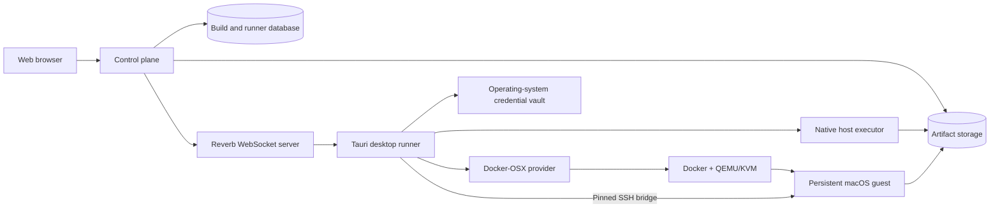

# BuildBridge Product Goal and Architecture

Status: working product and engineering reference  
Last updated: 2026-09-03

This document defines what BuildBridge is intended to become, the first complete workflow we are building, the boundaries between its components, and the order in which the project should expand. It should be updated when a durable product or architecture decision changes.

## North star

BuildBridge turns a Linux box into a Mac build server: install the desktop, create and prepare a managed macOS machine once, hold signing material in the host's vault, and build and sign an IPA with nothing else installed. Everything else is optional. Pairing the desktop to a control plane adds two things — starting a build from any browser, and a record of every build that outlives the desktop — and it adds them without moving a secret or a path off the host.

The desktop is the product; the control plane is a remote for it.

The intended experience is:

1. Install the BuildBridge desktop runner on a Linux, Windows, or macOS machine.
2. Pair it to the BuildBridge control plane with a short-lived, single-use code.
3. Register one or more local execution environments, such as the native host or a managed macOS guest.
4. Configure a project, toolchain, and signing material without exposing secrets to the web UI or build logs.
5. Queue a typed build from the web interface.
6. Watch state and logs update in real time from any browser.
7. Download or locate the resulting artifacts and retain an auditable build record.

“Cross-platform” does not mean pretending every toolchain can execute on every operating system. It means BuildBridge presents a consistent workflow while dispatching work to a compatible executor.

## Definition of success

BuildBridge reaches its initial product goal when a developer can:

- pair and revoke runners securely;
- see the online state and capabilities of Linux, Windows, and macOS runners;
- register a local project workspace without giving the control plane arbitrary filesystem access;
- choose a compatible executor and queue a typed build;
- receive build state and logs over WebSockets rather than job polling;
- build native targets on their corresponding platforms;
- configure a persistent macOS development machine, sign in to Apple and Xcode interactively, and retain that state;
- provision certificates, profiles, and App Store Connect credentials through a deliberate secure workflow;
- run a real `xcodebuild` archive/export operation inside the macOS executor;
- inspect and retrieve build artifacts through the web interface; and
- recover safely from runner restarts, network interruptions, expired leases, and guest identity changes.

## First complete workflow

The first golden path is intentionally narrower than the full platform matrix:

> From the web control plane, queue an Apple build on a paired Linux x86_64 runner that manages a persistent Docker-OSX guest; securely provision the guest, run a typed Xcode archive/export operation, stream live logs, and return the signed artifact.

The workflow is complete only when all of these steps work together:

1. Pair the Linux desktop runner to the control plane.
2. Validate Docker, KVM, display, storage, and OpenSSH prerequisites.
3. Create and retain a managed Docker-OSX machine and its stable machine identity.
4. Complete macOS installation, Apple login, 2FA, and Xcode setup interactively inside the guest.
5. Enable macOS Remote Login.
6. Compare and explicitly pin the guest SSH host fingerprint.
7. Generate a dedicated BuildBridge Ed25519 access key on the host.
8. Install the public key for the intended macOS user: either with the macOS login password, used once over a single SSH session to the pinned guest, or by typing the shown commands in the guest Terminal.
9. Verify authenticated access and detect the macOS and Xcode versions.
10. Register an approved local workspace and synchronize a build snapshot into an isolated guest directory.
11. Provision the selected signing identity and profiles into a dedicated guest keychain.
12. Queue a typed Apple archive/export job from the web interface.
13. Wake the runner over its private Reverb channel.
14. Claim the job with a lease, execute fixed `xcodebuild` arguments, and stream ordered logs.
15. Return the archive, exported package, dSYMs, and build manifest.
16. Report completion and preserve enough state to retry safely.

We should finish this path before broadening Docker-OSX support to Windows or adding every native toolchain.

## System shape

The web application is the control plane. It coordinates identity, intent, status, logs, and artifacts. It does not execute untrusted build commands itself.

The desktop application is the trusted local runner. It owns local filesystem approval, credential-vault access, provider lifecycle, and command execution.

An executor is a build environment exposed by a runner. A runner may eventually expose more than one executor—for example, a Linux native executor and a managed macOS executor.

## Component responsibilities

### Web control plane

The control plane owns:

- human accounts and sessions;
- runner pairing, token issuance, revocation, and last-seen state;
- project and build configuration that is safe to store centrally;
- typed build creation and compatible-runner selection;
- build leases, retries, cancellation, and completion records;
- ordered log ingestion and real-time browser updates;
- artifact metadata, access control, and retention policy; and
- audit events for security-sensitive actions.

It must not own:

- Apple ID passwords or 2FA responses;
- raw desktop credential-vault contents;
- arbitrary host filesystem paths supplied remotely;
- general-purpose shell commands; or
- implicit trust of a newly discovered guest machine.

### Tauri desktop runner

The desktop application owns:

- the user-visible pairing and connection experience;
- the long-lived runner token in the operating-system credential vault;
- Reverb connection and private-channel authorization;
- periodic runner health heartbeats;
- locally approved workspaces and executor configuration;
- native and managed-executor capability discovery;
- Docker-OSX lifecycle management on supported hosts;
- local signing material and secret summaries;
- guest SSH keys and host-key pins;
- typed job execution and log forwarding; and
- safe cancellation and local recovery.

The desktop runner is the primary control-plane client even when a build runs in a guest. For the first workflow, it claims the job and delegates the typed operation over the pinned SSH bridge. A separately paired guest agent remains a later optimization, not a requirement for the first signed build.

### Shared Rust crates

The Rust workspace is split by responsibility:

- `buildbridge-contract` contains versioned wire DTOs and enums shared by clients.
- `buildbridge-runner` contains control-plane transport and typed, shell-free execution logic without a Tauri dependency.
- `buildbridge-docker-osx` contains Docker-OSX host probing, lifecycle, guest trust, and guest diagnostics.
- the Tauri crate adapts these libraries to desktop state, secure storage, and UI commands.

Protocol v1 remains additive. Renaming or removing fields or enum values requires a protocol version change.

## Platform and provider strategy

VirtualBox is not the universal backend. WSL2 is not universal either; it is a Windows-specific route to the Linux/KVM environment Docker-OSX expects.

| Host | Native builds | macOS build route | Product position |
| --- | --- | --- | --- |
| macOS on Apple hardware | Native macOS/Xcode executor | Native Xcode; virtualization can be added separately when justified | Preferred Apple production runner |
| Linux x86_64 with KVM | Native Linux executor | Docker-OSX through Docker, QEMU, and KVM | First experimental managed-macOS workflow |
| Windows 11 x86_64 | Native Windows executor | Dedicated WSL2/KVM adapter when `/dev/kvm` is available | Best-effort after the Linux golden path |
| Windows without usable nested virtualization | Native Windows executor | Connect to a remote Apple or supported Linux runner | Supported control experience, no local macOS promise |
| Remote Apple hardware | Headless/native runner | Native Xcode | Preferred production and CI path |
| VirtualBox host | Not a primary provider | Possible future community/optional adapter | Deferred |

### Why VirtualBox is deferred

Docker-OSX is built around QEMU/KVM. Standardizing on VirtualBox would add a second hypervisor lifecycle, networking model, disk format, display path, and diagnostic surface while still depending on host-specific nested virtualization behavior.

If a future VirtualBox provider is added, it must implement the same executor contract and pass the same lifecycle, trust, snapshot, cancellation, and artifact tests. It must not leak VirtualBox-specific behavior into the control plane.

### Windows and WSL2

The native Windows Tauri process cannot treat WSL2 as if it were the Windows host. A Windows provider must deliberately route Docker, KVM, path translation, port discovery, and display operations through a selected WSL distribution using fixed `wsl.exe` arguments.

The WSL2 provider should be implemented only after the direct Linux workflow is complete. This gives it a known-good Linux provider to adapt rather than creating two incomplete workflows simultaneously.

### Apple platform boundary

Docker-OSX is useful for local research and a self-hosted experimental executor, but BuildBridge must not present generic-PC macOS virtualization as an automatically compliant production path.

Apple’s macOS license permits virtualization under conditions tied to Apple-branded hardware, and the Apple Developer Program agreement restricts use of Apple SDKs and Xcode on non-Apple-branded computers. This is a product and distribution constraint that needs appropriate legal review; this document is not legal advice.

The production recommendation remains a native or remote runner on Apple hardware. Docker-OSX support should be labeled experimental/self-hosted in the UI and documentation.

## Runner and build communication

### Pairing and authentication

1. An authenticated control-plane user generates a short-lived, single-use pairing code.
2. The desktop submits the code with its name, platform, architecture, version, capabilities, and protocol version.
3. The control plane atomically claims the code and creates a runner.
4. The control plane issues a runner token scoped to the `runner` ability.
5. The desktop stores that token in the operating-system credential vault.
6. Runner API and private-channel requests require the scoped token and a non-revoked runner.
7. Unpairing or revocation invalidates future access.

Human web authentication uses the control plane's own session model. Human authorization and runner authorization remain separate concerns even when one framework supports both.

### Real-time behavior

Reverb WebSockets are the primary event transport:

- each runner subscribes to its authenticated private channel;
- a queued build emits a `build.queued` event after the database transaction commits;
- the runner claims work after connection, subscription, or a build event;
- control-plane views receive runner, build, log, and artifact changes in real time; and
- reconnection triggers state reconciliation.

The heartbeat timer is health signaling, not job polling. High-frequency job polling should not return. The one reconciliation that exists rides on the heartbeat that is sent anyway: its reply carries the number of builds queued for the runner (or running on a lapsed lease), and a runner that sees a non-zero count claims immediately. That recovers a queue event lost in transit within twenty seconds without becoming the normal dispatch mechanism — dispatch is still the WebSocket event, and the count is normally zero.

### Build leases

A claim grants a time-bounded lease to one runner. Execution must be idempotent around reconnects and process restarts:

- only a compatible, non-revoked runner may claim a build;
- a runner periodically renews a long-running lease;
- completion is accepted only from the runner holding the lease;
- cancellation is a typed state transition delivered in real time;
- an expired lease can be reclaimed according to explicit retry policy; and
- duplicate artifact or log writes are rejected or de-duplicated by stable sequence identifiers.

## Project source and workspace model

BuildBridge is local-first. The first source contract should use a workspace that the user explicitly registers in the desktop application.

The control plane receives an opaque workspace identifier and display metadata, not an arbitrary absolute path it can later change. A build can reference only a previously approved workspace.

For a managed macOS guest, the desktop runner creates a bounded source snapshot and synchronizes it into a per-build guest directory over the authenticated bridge. The result records the source revision, dirty-state fingerprint, and snapshot checksum so the web view can identify exactly what was built.

Future source providers can add a repository URL and immutable commit checkout, but they must use locally stored repository credentials and the same typed source contract.

Workspace safety requirements:

- canonicalize and validate the selected root locally;
- never accept a raw host path from a build payload;
- prevent traversal outside the approved root;
- apply explicit ignore and maximum-size rules;
- never include BuildBridge vault files or private SSH keys;
- use a fresh per-build guest directory; and
- remove transient snapshots according to a visible retention policy.

### Current guided project workflow

The first real project fixture is the Ionic/Capacitor application at the Ionic/Capacitor fixture project. This path is development data, not a privileged or hard-coded product path. The desktop UI requires the user to approve the exact local folder and validates its package lock, Capacitor configuration, CocoaPods project, Xcode workspace, and Xcode project before it stores the approval.

The desktop presents the project workflow as the first three steps of a machine's **Build** checklist (see [Desktop application](#desktop-application)):

1. **Approve the project folder** — paste or drop the local project folder. This is read-only and does not copy source yet.
2. **Synchronize source** — create a bounded, checksummed archive and stream it through the authenticated, host-key-pinned SSH bridge. The progress display reports source inspection, bytes transferred, and guest extraction.
3. **Run the unsigned test build** — prepare pinned guest tools, install Apple's iOS Simulator platform when the selected Xcode has no compatible runtime, install locked JavaScript dependencies, build the web application, run Capacitor synchronization, resolve pods from the committed native lock baseline, and compile the `App` scheme for a generic iOS Simulator. Live phase and bounded log output remain visible in the desktop UI. The multi-gigabyte Apple platform download is a one-time persistent guest operation with measured byte/percentage progress and a distinct install/register state. The guest runs one durable smoke-build job at a time, so repeating the build action after a desktop restart or development hot reload reattaches to its log instead of starting a duplicate build. If regenerated Capacitor plugin metadata requires CocoaPods to refresh `Podfile.lock`, that change remains guest-only and is reported clearly rather than silently modifying the host project.

The first implementation caps an approved snapshot at 50,000 files and 2 GiB before compression. It excludes Git metadata, `node_modules`, generated native/web output, dependency stores, common IDE/cache directories, every `.env` variant, package-manager authentication files, SSH material, private keys, certificates, provisioning profiles, and App Store Connect keys. It rejects included symlinks and non-regular files. The archive checksum and source counts are retained in the local workspace record; removing approval does not modify the host project.

For this local acceptance slice, the guest target is the single managed path `~/BuildBridge/workspaces/active`; replacement is staged and validated before the previous snapshot is removed. The control-plane build workflow must evolve this into an opaque workspace ID plus fresh per-build directories, source/dirty-state fingerprints, cleanup policy, cancellation, and recipe-controlled workspace/scheme selection.

## Typed build model

The control-plane job protocol currently supports only `diagnostics`. The desktop now also exposes typed local Apple smoke-build and signed archive/export operations. The signed recipe fixes the approved workspace, detected scheme, `Release` configuration, generic iOS destination, verified team/bundle/profile/identity, and `app-store-connect` export method; it does not accept a command string or upload to Apple. These local operations prove the executor before the same recipe is added to the remotely queued protocol.

The first production build kind should be an Apple archive/export operation with validated fields such as:

- approved workspace identifier;
- executor identifier;
- Xcode workspace or project selection;
- scheme;
- configuration;
- SDK and destination;
- archive/export mode;
- export-options profile;
- signing-kit reference; and
- expected artifact types.

The web app never sends an arbitrary command string. Rust maps validated fields to fixed program names and argument vectors without invoking a shell. Future Android, Linux, or Windows build kinds follow the same pattern.

The target domain model consists of:

- **Project** — a user-facing buildable project;
- **Workspace** — a locally approved source mapping owned by a runner;
- **Runner** — a paired physical or virtual host client;
- **Executor** — a native or managed environment advertised by a runner;
- **Build recipe** — typed, reusable build configuration;
- **Build** — one leased execution attempt and its state;
- **Build log** — ordered stdout, stderr, or system output;
- **Artifact** — content metadata, checksum, retention, and access location; and
- **Signing kit** — a metadata reference to secrets retained outside normal database payloads.

## Managed macOS lifecycle

### Host lifecycle

The desktop keeps a registry of managed machines (`machines.json`); each entry owns one persistent container named after its identifier, a per-machine configuration directory, and a per-machine artifact directory. The builder created before the registry existed is migrated as machine `default` and keeps its original `buildbridge-macos-builder` container and `macos-builder/` directory, so an existing installation keeps working. For every machine the provider will:

- validate Linux x86_64, Docker daemon access, `/dev/kvm`, display, storage, and SSH tooling;
- create a stable generated machine identity;
- create and start the managed container with validated, fixed arguments, reporting image pull, identity generation, container creation, and start as distinct progress phases;
- open the interactive GTK console at a compact 1280×720 resolution with zoom-to-fit enabled;
- preserve the container and macOS disk on stop;
- never remove or rebuild the machine implicitly;
- surface missing, created, running, stopped, failed, and unavailable states without treating first-run absence as an error; and
- pin an immutable Docker image digest before production use instead of relying on `latest`.

Rebuild, reset, and delete operations are separate, explicit, confirmation-protected actions with a clear explanation of what state will be lost. The desktop currently exposes two: **Discard container and disk** removes a stopped machine's container (and therefore its macOS disk), clears its pinned host identity and guest signing record, and keeps the machine profile, access key, approved project, and retained artifacts; **Delete machine** additionally removes those per-machine files and the registry entry. Neither touches the host project folder or the signing kit in the operating-system vault, and both refuse while the container is live. Every machine publishes a distinct forwarded SSH port; the registry rejects duplicates. Long-running operations hold a per-machine busy marker that the view model exposes as a stable key, so a reopened desktop shows which step is still running instead of failing on the next click.

The Disk Utility erase and macOS installation are first-time initialization, not a per-launch workflow. Stopping and resuming the same managed container continues to use its existing macOS disk. That disk, its NVRAM file and, for migrated machines, the installer image live in the machine's own `disk/` directory on the host and are bound into the container — the documented `IMAGE_PATH` route for the disk, file binds over the image's hard-coded paths for the other two — so a container can be recreated with different arguments without losing macOS. Machines created before this layout keep their disk in the container's writable layer until a step needs the new arguments; the *Run on the device* step then migrates them in place: stop, check free space on the data directory's filesystem, `docker cp` the files out with progress, remove, recreate, start. `docker commit` was considered and rejected for this migration because overlayfs copy-up would keep a second copy of the disk inside the committed image permanently. Cloning and dependable backup still need a visible storage-health surface.

### Local templates and first-boot provisioning

BuildBridge should distribute the Docker-OSX orchestration and obtain the macOS installer on the user's machine. It should not bundle or publish a preinstalled macOS disk image. Besides making releases exceptionally large, redistributing an installed Apple operating system introduces licensing and provenance risks that are materially different from automating a local installation.

A reusable setup is still practical as an opt-in, local workflow:

1. The user completes one interactive macOS installation and account setup.
2. BuildBridge establishes the pinned SSH bridge and applies non-secret bootstrap configuration.
3. The guest is shut down cleanly and its host-managed disk is captured as a local template.
4. A new builder uses a copy-on-write disk derived from that local template.
5. BuildBridge assigns each builder a unique serial, UUID, MAC address, SSH host identity, and access key before it is allowed to sign or build.
6. Signing certificates, provisioning profiles, keychain credentials, and App Store Connect keys are provisioned after guest authentication; they are not copied into the base template by default.

This makes disk erase and OS installation a once-per-template operation while preserving per-machine isolation. BuildBridge may automate Xcode import, first-launch tasks, and its own guest agent, but it must not attempt to inject an Apple account password into an offline disk. Apple Account login remains an optional interactive capability on supported native Apple executors; the Docker-OSX workflow must not depend on it.

Docker-OSX's prebuilt `auto` flow is useful as a development reference, but its fixed older macOS image is not the production default for a current Xcode build service. BuildBridge's production-facing path should create a user-owned local template from a supported installer and track the template's macOS version, Xcode version, checksum, creation time, and compatibility with the pinned provider image.

### Guest trust and bootstrap

The guest connection uses a strict trust-on-explicit-confirmation flow:

1. Probe the configured forwarded SSH port.
2. Scan only the expected guest host-key type.
3. Display its SHA-256 fingerprint.
4. Require the user to compare and explicitly trust that fingerprint.
5. Store the exact `known_hosts` pin in a restricted local file.
6. Reject a changed key as a security mismatch.
7. Require an explicit “forget identity” action before trusting a replacement.
8. Authenticate with a dedicated Ed25519 key and strict host-key checking.
9. Run only fixed bootstrap and diagnostic operations.

BuildBridge must not collect or relay Apple Account passwords or 2FA responses. Apple documents additional service limitations for macOS virtual machines, and Docker-OSX sign-in is not reliable enough to be a build prerequisite. A user-owned persistent guest may use an interactive Xcode account as the preferred convenience route when Apple permits it, but the managed Docker-OSX workflow must retain host-imported Xcode and signing material as a complete route that does not require an Apple session.

### Xcode acquisition and activation

The user downloads a compatible Universal Xcode `.xip` from Apple using a trusted host browser. BuildBridge then:

1. accepts an explicit host path or a Tauri file drop;
2. verifies that the completed file is a bounded XIP/XAR archive;
3. streams it directly through the pinned SSH channel while emitting measured byte and elapsed-time progress;
4. runs Apple's `xip` utility in an isolated guest staging directory so macOS verifies and expands the signed archive;
5. installs the result into the guest user's Applications directory without requesting elevation; and
6. offers an **Activate Xcode** action that opens a short-lived, host-generated command file in the logged-in macOS Terminal, where fixed `xcode-select`, license acceptance, and `xcodebuild -runFirstLaunch` operations execute with interactive `sudo` authorization.

Activation offers two routes for the administrator password those commands need. Typed into the desktop, the password is written once to the SSH session's stdin, where a single `sudo -S` reads it and runs the fixed commands over the pinned bridge; output streams back so the interface names the command in progress, and the password is never an argument on either side, never a file, and gone when the session ends. Left blank, BuildBridge opens a short-lived command file in the guest Terminal and the user types the password into Apple's own `sudo` prompt, so it never leaves macOS. The Terminal route exists because a passwordless elevation would need the Authorization Services prompt, which macOS will not show in an SSH session; with a password, `sudo` needs no prompt. A per-attempt status file lets the Terminal route detect success, command failure, a closed Terminal, or a 30-minute timeout rather than waiting indefinitely. Both routes report elapsed time and verify the selected developer directory, first-launch status, and Xcode version afterward. Fixed manual Terminal commands remain available under a recovery disclosure.

Once activation succeeds, normal project preparation and unsigned builds execute over the pinned SSH bridge and do not ask for the macOS password. The current smoke-build UI bootstraps Node 24.20.0, pnpm 11.5.0, and CocoaPods 1.16.2 into the guest user's BuildBridge tool directory. Node is downloaded from the official distribution URL and checked against a pinned SHA-256 digest before extraction. CocoaPods uses a pinned ActiveSupport 6.1 dependency set compatible with macOS's bundled Ruby 2.6 instead of allowing the old RubyGems resolver to select Ruby-3-only releases; the build environment explicitly preloads Ruby's standard `Logger` library required by that combination. JavaScript dependencies remain locked by `pnpm-lock.yaml`. The unsigned smoke build may refresh a guest-only `Podfile.lock` when generated native plugin metadata has drifted, and records that fact in the UI. Production archive/export recipes must instead require a reviewed, synchronized native lockfile and fail closed on drift.

Activation runs Xcode's required first-launch tasks, and the project workflow installs the selected iOS platform automatically when it is absent. Xcode may still display Apple's component-selection sheet the first time its graphical application opens. The desktop explains that the user should keep iOS selected, leave unrelated platforms unchecked, and confirm **Download & Install** once. This GUI acknowledgement and the installed components persist with the retained builder and with a future user-owned local template. BuildBridge should use only Apple's supported component commands and must not depend on undocumented Xcode preference mutations to suppress the sheet.

### Guest agent direction

The host-mediated SSH bridge is sufficient for the first complete workflow and gives BuildBridge a small, inspectable bootstrap surface.

A future signed guest agent can improve cancellation, log streaming, file transfer, and capability reporting. If added, the desktop still establishes trust and installs or upgrades it explicitly. The agent should reuse `buildbridge-contract` and `buildbridge-runner` rather than create a second protocol.

## Signing and secrets

The intended signing experience is convenient without making the control plane a secret store.

### Setup choices

The desktop distinguishes three signing/account strategies before asking for credentials:

1. **Link the developer team with an App Store Connect Team API key — planned primary Docker-OSX route.** The user creates a Team Key in a trusted host browser and supplies its Key ID, Issuer ID, and local `.p8` path. BuildBridge verifies that key with a short-lived ES256 token and separate read-only requests for the App Store app record and Developer provisioning identifier. If Apple's exact Developer-ID filter returns an empty result for an identifier that is visible in the portal, BuildBridge safely scans the bounded account inventory and matches the exact identifier locally. Once resolved, it lists safe provisioning-profile and certificate metadata and reports certificate type, expiry, and App Store eligibility rather than silently omitting an ineligible record. When no active App Store profile remains, the user can select an existing future-dated distribution certificate and explicitly confirm creation of one replacement; BuildBridge downloads it into owner-only local storage and adds it to the signing kit without revoking old profiles. Generating a new signing private key/CSR and Apple Distribution certificate remains the next managed step. The `.p8` authorizes provisioning but is not itself a code-signing identity. Every Apple resource mutation requires a clearly described user action; verification/list operations remain read-only.
2. **Import signing files — recommended working route today and independent of guest Apple login.** The user supplies a password-protected `.p12`/`.pfx` containing an Apple Distribution certificate and its private key, one or more matching `.mobileprovision` files, and a newly chosen BuildBridge guest-keychain password. The files are acquired and stored on the trusted host before BuildBridge transfers them through the pinned guest bridge.
3. **Sign in through Xcode — optional best effort.** The user may open **Xcode → Settings → Accounts** inside a persistent guest and complete sign-in and 2FA directly with Apple. Docker-OSX reports that Apple services can detect and reject virtualized environments, and the real acceptance guest returned Apple's generic verification failure in both macOS and Xcode. The UI tells the user to cancel rather than repeatedly retry and BuildBridge does not apply VM-hiding kernel patches. This route can remain available for environments where Apple permits it, but it is not a prerequisite or the recommended Docker-OSX path.

The file-acquisition guide is part of the desktop UI:

1. On a trusted Mac, open **Xcode → Settings → Accounts → Manage Certificates**, create an **Apple Distribution** identity if needed, then export that identity as a password-protected `.p12`. The private key remains on the Mac that created the identity; an Apple `.cer` download alone cannot be used as the signing identity and cannot recover a missing private key.
2. In Apple Developer **Certificates, Identifiers & Profiles → Profiles**, create a Distribution **App Store Connect** profile using the exact project bundle ID, team, and exported distribution certificate, then download its `.mobileprovision` file.
3. Enter the `.p12` export password and create a separate BuildBridge guest-keychain password. Neither value is an Apple Account password.
4. For managed profile replacement and later TestFlight/App Store uploads, create a Team API key in App Store Connect **Users and Access → Integrations → App Store Connect API**, record its Key ID and Issuer ID, and download its `.p8` private key once. This key enables BuildBridge's confirmed profile-creation action but does not replace the `.p12` signing identity or its private key.

The desktop displays the detected project team and release bundle identifier beside these instructions and provides copyable links to the relevant Apple portals. It must not imply that the certificate archive can be downloaded from App Store Connect or that a `.p8` key is a signing identity.

### Storage

- The desktop stores App Store Connect keys, certificate passphrases, and guest-keychain credentials in the operating-system credential vault.
- The desktop accepts an absolute `.p8` host path, validates its extension, bounded size, PEM envelope, filename/key-ID agreement, and owner-only Unix permissions, reads it once, and stores only the key contents in the OS vault. It never sends the source path or private contents to Vue after storage. A conventional `AuthKey_<KEY_ID>.p8` filename supplies the Key ID automatically.
- **Verify developer team** loads the key only from the host OS vault, signs a five-minute ES256 JWT locally, and performs `GET /v1/apps` plus `GET /v1/bundleIds` with the approved project's exact bundle identifier. A successful-but-empty filtered Developer-ID result falls back to a read-only, 200-record account inventory and an exact local comparison. When the opaque Bundle-ID resource is resolved, `GET /v1/bundleIds/{id}/profiles` requests name, type, platform, state, UUID, and dates only; `GET /v1/certificates` similarly requests safe certificate metadata without certificate content. The UI receives the key ID, project team, app/bundle/profile/certificate metadata, resource visibility, and verification time; it never receives the issuer ID, private key, JWT, profile payload, or certificate payload. An empty result never triggers automatic registration or revocation.
- Apple's read responses do not expose the Team key's assigned role. BuildBridge therefore treats record matching as verification, not permission to mutate. Managed Apple Distribution certificate creation remains disabled until the UI asks the user to confirm an **Admin** Team key; a Developer key may remain connected for read-only/app-delivery work.
- Saving the Team API route and portable signing-file route is additive. Blank fields preserve the other already-stored route; the separate confirmation-protected **Clear signing kit** action removes the complete vault record.
- Secret values are never serialized into normal desktop view models, web payloads, logs, Docker environment variables, or command-line arguments. The one exception is an env set's secrets, which the editor fetches through a dedicated command when it opens on a stored set and holds masked behind an eye icon; they never travel inside a summary.
- The UI exposes only safe summaries such as a key ID, certificate filename, and profile count.
- The BuildBridge SSH private key is stored in the desktop application configuration directory with restricted filesystem permissions because OpenSSH requires a file-backed identity.

### Provisioning

After guest authentication, the user explicitly selects “provision signing.” BuildBridge then:

1. creates or opens a dedicated BuildBridge keychain in macOS;
2. transfers certificate and profile files over the authenticated channel into a restricted staging directory;
3. imports the certificate into that keychain without exposing the passphrase in argv or logs;
4. installs provisioning profiles with predictable identifiers;
5. stores App Store Connect material only where the selected build/export operation requires it;
6. deletes transient certificate and key staging files; and
7. verifies available code-signing identities and reports metadata only.

The dedicated keychain may persist inside the long-lived guest for usability, but it is unlocked only during an authorized build. The desktop must provide an explicit action to clear provisioned signing state from the guest.

## Logs and artifacts

Logs are ordered and typed as stdout, stderr, or system messages. The runner batches them, and the web UI receives updates through the control plane’s real-time channel.

Before real builds are enabled, log handling must enforce:

- maximum line and batch sizes;
- stable sequence numbers and duplicate handling;
- redaction of known secret values and sensitive paths;
- no dumping of complete process environments;
- bounded local buffering during network interruptions; and
- visible truncation rather than unbounded memory or database growth.

The first Apple build should produce an artifact manifest containing relevant items such as:

- `.xcarchive` metadata;
- exported `.ipa` or package;
- dSYM bundles;
- selected build logs;
- source and recipe fingerprints;
- Xcode/macOS versions;
- code-signing identity metadata; and
- file sizes and SHA-256 checksums.

Artifact bytes should be streamed to a configurable storage backend rather than loaded fully into application memory. The control plane owns authorization and retention; the runner owns creation and upload.

## User experience

### Web application

The web application should provide:

- authentication and account settings;
- fleet view with runner and executor health;
- compatible-executor selection;
- projects, approved workspace mappings, and build recipes;
- build queue and cancellation;
- real-time status and logs;
- artifact download and retention state;
- runner revocation; and
- clear warnings for experimental or incompatible providers.

### Desktop application

The desktop is an application shell, not a scrolling document. A slim top bar carries the identity and the two facts that are true of the whole application — whether this host can run a machine, and whether the control plane is connected. A resizable sidebar lists **Overview** and every registered **macOS machine** with a status dot (or a spinner while an operation runs), with **Signing kit** and **Control plane** grouped beneath; the selected item fills the main pane.

The visual language is BuildBridge's own, written in **stock Tailwind utilities only** — no custom colour classes and no bespoke utility layer — so any Tailwind developer can read a template and know exactly what it renders. The palette is fixed by convention, documented at the top of `apps/desktop/src/style.css` and matched by the web control plane:

| Role | Light | Dark |
| --- | --- | --- |
| Page | `bg-zinc-50` | `bg-zinc-950` |
| Surface | `bg-white` | `bg-zinc-900` |
| Well and recesses | `bg-zinc-100` / `bg-zinc-50` | `bg-zinc-800` / `bg-zinc-950` |
| Hairline | `border-zinc-200` | `border-zinc-800` |
| Text | `text-zinc-900`, soft `600`, muted `500` | `text-zinc-50`, soft `300`, muted `400` |
| Action | `bg-zinc-900 text-white` | `bg-zinc-100 text-zinc-950` |
| Success, warning, failure | `emerald`, `amber`, `red` | same families, `400` weights |

Every control is a component in `apps/desktop/src/components/ui`, and none of them is a native
form control with a border drawn around it. The browser renders a select's popup, a number's
spinner and a checkbox's tick itself — its own font, its own row height, its own highlight colour,
and on Linux a menu that ignores the page's dark mode — so those are built here instead: `Select`
is a listbox (a `combobox` trigger and a teleported `listbox` panel with arrow keys, Home/End,
typeahead, Escape, click-away, and a panel that flips above the control when there is no room
below), `NumberField` has its own steppers, and `Checkbox` draws its own tick. A path is
`PathField` or `PathListField` with the browse control inside the box. Anything the user can click
therefore shares one height, radius, border and focus ring. `Field` owns the label, the optional
action beside the control, and the hint or error below the row, so a control and the button next
to it are aligned by structure rather than by a per-site margin.

The listbox panel is teleported to the body and positioned against the viewport, because a select
is usually inside a dialog or a scrolling pane that would otherwise clip its popup. Its Escape
handler stops propagation so a select inside a dialog closes itself first rather than closing the
dialog with it. Keyboard movement lives in `apps/desktop/src/lib/listbox.ts` as pure functions with
unit tests, in the same way step state does.

Content follows three rules that keep the interface tight. A **tooltip** exists only where the
label cannot carry the consequence or the scope on its own — "Keeps the container and its disk",
"Applies from the next sync" — and never restates the label, counts things, or narrates the
mechanism; a labelled button that already says what it does has none, and an icon-only control
always has one. The **timeline node is the status**: a number, a tick, a cross, or a spinner. The
words beside a row say only what the node cannot — how long a run has taken, that a failure needs a
person, that an open step is yours, how long it usually takes — so a step that is simply next says
nothing extra. Every **action shows that it is running**: the button that started an operation
carries a spinner until the operation returns, whether the work takes a hundred milliseconds or
an hour, and a manual refresh is visible in the same way.

There is deliberately no accent hue. The grey ramp is `zinc`, which is neutral rather than the blue-tinted `slate`, and an action is ink — near-black in light, near-white in dark — so colour is spent only on status: an emerald, amber or red anywhere on screen always means done, needs attention, or failed. Light and dark are the same classes with `dark:` variants, following the system unless overridden. Standing rules: sentence case everywhere, no uppercase styling, no gradients, no decorative colour, one glyph per row, and colour never carrying meaning alone — every status dot names its state on hover.

Each machine page has three tabs that keep their own state while other machines are selected:

1. **Setup** is done once per machine and lists seven ordered steps — check the Linux host, start the machine, install macOS in the console, pin the guest identity, authorize the BuildBridge key, import Xcode, activate Xcode. Setup and Build both render as a **step rail beside a detail panel**: the rail is a numbered vertical timeline whose node shows each step's state at a glance and never scrolls away, and the panel holds that step's instructions and controls. Each step is labelled **Automatic** (BuildBridge does it), **You do this** (the user acts inside macOS and BuildBridge verifies afterwards), or **Assisted** (BuildBridge starts it and the user confirms inside macOS). Selection follows the checklist forward on its own but yields as soon as the user picks another step. While the machine runs but SSH is not yet reachable, the page probes every ten seconds so the checklist advances by itself.
2. **Build** is repeated per project on an already prepared machine: approve the project folder, synchronize source, run the unsigned test build, attach a signing kit, provision signing into macOS, build the signed archive and IPA. The tab states which installed macOS and Xcode it reuses; a machine whose setup is complete is marked **ready to build**, and approving a different folder replaces the project without repeating any setup.
3. **Logs** shows bounded, secret-free output per source: session activity, the test build, the signed archive, and the Docker-OSX console tail. The drawer never opens on its own — a running step's progress strip already shows the phase and the last line, and the collapsed bar keeps a live summary — it only re-points itself at the source of whatever started, so opening it lands on the lines that matter.

Step state is derived from the backend view model by pure, unit-tested functions (`apps/desktop/src/model/steps.ts`); components never infer readiness on their own. Every native command is wrapped once in a typed backend adapter, and a development-only mock backend lets the whole interface run in a plain browser without Docker or a guest.

The **Signing kits** page is host-level. Each kit is a named set of Apple material — a `.p12` identity and its passphrase, one or more provisioning profiles, a guest keychain password, and optionally an App Store Connect Team key — held in the operating-system vault so the files are entered once rather than per machine. A host keeps as many kits as it has developer teams or apps (bounded at twelve), and every kit shows exactly what is stored: the identity filename, whether each password is held, the profile filenames, the Team key ID, when it was added, and which machines are attached to it. Secret values are never returned to the interface, so editing a kit treats a blank field as "keep what is stored".

A kit can also **create its own identity at Apple with no Mac anywhere**. The button on the kit
generates an RSA key and a CSR on this host with fixed-argv OpenSSL, sends the CSR to Apple's
certificates endpoint through the kit's Team key (which needs the Admin role), and packages the
returned certificate with the host key as a password-protected `.p12`, written owner-only into
BuildBridge's managed certificates directory with a password OpenSSL generated and received
through the environment, never an argument. The `.p12` path and password land in the kit, the
loose key and PEM are deleted, and the existing profile action then works against that
certificate. Nothing at Apple is revoked; if the team is at its certificate limit Apple refuses
and that refusal is shown as is. The private key exists only in that `.p12`, which is why the
confirmation says to keep the host's vault backed up. Removing the kit removes the identity it
created, since its password lived nowhere else.

Every provisioning profile BuildBridge downloads is retained under its owner-only managed
profiles directory, and the kit form lists what is already there so a profile can be put back into
a kit with one click. This matters because a kit stores a *path* to a profile, not the file: if the
vault is lost the files are not, and re-entering a kit should not mean going back to Apple for
something already on the disk. The same applies from the other direction — the verification list
offers **Add to kit** on any active App Store profile, which downloads Apple's copy into the
attached kit and shows **In kit** once the kit holds that UUID.

The kit form separates what is required from what is not, because the two are additive rather
than alternatives: the four signing files are what actually sign a build, and the App Store
Connect key only adds read-only verification and replacement-profile creation on top. Presenting
them as tabs would imply a choice. Instead the required set is always visible, each field is
marked, a running count and a "still needed" line name the gap, the acquisition guide is one
disclosure away, and the optional key is collapsed with a sentence about what it buys. Readiness
counts what is typed now plus what the vault already holds, so editing a stored kit does not
report its own stored values as missing.

Attachment is what ties the two levels together: a machine's Build checklist chooses which kit it uses, and provisioning then imports that kit into that machine's own guest keychain. The same kit can serve several machines. The page also hosts the read-only Apple verification and the confirmed replacement-profile creation, both of which run against a chosen machine — the Team key comes from that machine's attached kit and the bundle identifier from the project approved on it.

Every path the desktop asks for — the signing identity, provisioning profiles, the App Store Connect key, the project folder, and the Xcode archive — is chosen through a native file picker with the matching type filter, typed directly, or dropped on the window. The picker is the primary route, so no path has to be known by heart; a dropped file claims only a field whose filter it matches, and picking profiles adds to the list rather than replacing it.

Destructive actions — discard container, delete machine, forget pinned identity, remove provisioned signing, clear artifacts, clear signing kit, unpair — open a confirmation dialog that states exactly what is lost; high-risk ones require an explicit acknowledgement checkbox.

Closing the main window hides BuildBridge to the system tray so the paired runner can continue receiving work. The tray lists every machine as a submenu with its state, start/resume, and safe stop, plus refresh, open, stop-all-then-quit, and quit-while-machines-keep-running. Window close, runner quit, and machine stop are deliberately separate actions.

The web and desktop should expose the same underlying states and identifiers, but only the desktop may perform operations requiring local trust or filesystem access.

## Current implementation

As of 2026-09-02:

| Area | Current state | Next gap |
| --- | --- | --- |
| Monorepo | Vite+ JavaScript workspace, Tauri/Vue desktop app, Cargo workspace | CI and release packaging |
| Runner pairing | Single-use code and scoped runner token; token stored in OS vault; a runner can be removed from the control plane, which deletes its tokens, keeps its build history, and hides it from the dashboard | Human web authentication, and reusing one runner identity across re-pairings instead of creating a second record |
| Realtime | Reverb private runner channel wakes the desktop; the heartbeat is separate but its reply reports work still waiting, so a lost queue event is recovered within twenty seconds | Browser log/artifact event coverage and reconnection tests |
| Job protocol | Versioned DTOs, leases with renewal, ordered logs streamed during long jobs, completion with a kind-specific result, and heartbeats that report each machine's name and readiness | Cancellation, retries, executor assignment |
| Build kinds | Control-plane diagnostics and `apple_archive` — a signed Release archive and App Store export on a named machine, of the approved folder or of a ref of the same project — plus the local unsigned smoke build and signing provisioning the archive builds on | Cancellation and retries; Android and native Linux/Windows kinds |
| Native runner | Fixed-argv platform diagnostics | Native-host workspace and real build providers |
| Desktop lifecycle | Close-to-tray with per-machine start, stop, refresh, and explicit quit actions; a machine registry with per-machine directories, container names, ports, busy markers, and legacy migration; a sidebar/tab shell with Setup, Build, and Logs per machine; every long-running operation carries a **Stop** that kills its host-side processes and, for builds that outlive their SSH session, the job inside the guest | Notifications and richer background-state recovery |
| Docker-OSX host | Prerequisite probing, stable identity, create/start/stop/status/logs with launch-phase progress, elapsed-time and guest-readiness monitoring, explicit confirmation-protected container discard and machine deletion; the macOS disk in a host-managed `disk/` directory bound through `IMAGE_PATH`, with in-place migration of older machines; a QMP control socket and, when the host has `plugdev` and `/dev/bus/usb`, iPhone passthrough by `usb-host` hot-plug with a root-installed udev rule that releases the phone from `usbmuxd` | Image pinning, local templates (clone a prepared machine), storage health, cancellation |
| macOS guest bridge | SSH reachability, Ed25519 access key, explicit fingerprint pin, one-time password-authenticated key install on the pin, password-optional Xcode activation over the bridge, mismatch rejection, macOS/Xcode probes, measured Xcode XIP transfer/expansion, bounded project snapshot transfer, fixed tool bootstrap, automatic Simulator installation progress, durable unsigned-build reconnection, a validated simulator build, password-safe signing provisioning, fixed signed archive/export execution, and — experimental — `devicectl` listing of a passed-through iPhone, a Debug build signed with the development identity for that phone, install, launch, and its console streamed into the log drawer | Per-build isolation, signed-job restart recovery, cancellation, and the debugger/live-reload routes |
| Env sets | Named sets of build variables in the OS vault, attached per machine as a default and chosen per signed archive (desktop step and dashboard form), written into the guest as `.env.production.local` for the web build and sourced by the build shell, with the web assets rebuilt in place for a per-archive choice; variables read back with their values, secrets by key only in summaries, fetched masked into the editor with an eye to show one; set names travel in the heartbeat | Env for native compile-time configuration |
| Signing kits | Multiple named kits in the OS vault with per-machine attachment, safe stored-detail display, and named recovery states when the vault is cleared or unreadable; portable file import remains available; Xcode VM sign-in is labeled best-effort; `.p8` keys are accepted by restricted host path and retained in the OS vault; Apple app, Bundle ID, certificate, and profile metadata are verified read-only; an expired App Store profile can be replaced through confirmed native creation and owner-only retention, and an existing Apple profile can be downloaded into the attached kit or re-added from the host's retained copies; a Distribution identity can be created at Apple for a key generated on the Linux host and packaged into the kit, so no Mac is needed at any point; certificate/profile paths are revalidated and the real signing kit is provisioned and code-sign probed through a fixed native helper; archive execution unlocks and relocks the dedicated keychain within that helper's process boundary; a kit may also hold an optional development identity, imported or created at Apple the same way, and the device step registers the attached phone and creates an `IOS_APP_DEVELOPMENT` profile for it on demand, each a confirmed, non-revoking mutation | Rotation/revocation handling |
| Workspaces | Exact local path approval, project-shape validation, secret-filtered bounded archive, checksum, measured pinned-SSH transfer, atomic active-workspace replacement | Opaque workspace IDs in the control plane, dirty-state fingerprint, per-build snapshots and retention |
| Artifacts | Local `.ipa` and portable `.xcarchive.zip` transfer with bounded sizes, guest/host SHA-256 agreement, private retention, reveal/copy actions, and confirmation-protected cleanup | Control-plane upload, download authorization, retention policy, and dSYM separation |
| Windows Docker-OSX | Not implemented | WSL2 provider after Linux golden path |
| VirtualBox | Not implemented | Deferred unless a concrete supported use case justifies it |

## Validated acceptance record and issue ledger

### Linux/Docker-OSX unsigned Apple build — 2026-09-02

The first real local executor slice has passed end to end:

- host: Linux x86_64 with Docker, QEMU, and KVM;
- executor: persistent managed Docker-OSX guest with pinned SSH identity;
- guest/toolchain: macOS 26.6.2, Xcode 26.6, and iOS Simulator 26.5;
- fixture: the Ionic/Capacitor fixture project, an Ionic/Vue/Capacitor application with CocoaPods;
- source path: explicitly approved on the host, filtered, checksummed, transferred, and atomically installed at the managed guest workspace;
- build: fixed unsigned `App` scheme build for the generic iOS Simulator with signing disabled; and
- result: the repeat UI build completed in 49 seconds and produced `App.app` under the isolated DerivedData directory. The desktop retained the successful Xcode version and presented signing as the next stage.

This unsigned-build record proves project approval, source synchronization, guest dependency bootstrap, Capacitor synchronization, CocoaPods resolution, Simulator preparation, Xcode compilation, live phase/log delivery, and successful result persistence. The later records below now also prove signing, archive/export, and local artifact return; remote web dispatch/upload and cancellation remain.

### Local signing provisioning implementation — 2026-09-02

The desktop now exposes the next guided action after a successful unsigned build:

1. In **Apple signing**, use the recommended portable signing-files route or inspect the optional Xcode-account route. The UI explains that Apple may reject VM sign-in, tells the user not to retry generic verification failures repeatedly, and states which route is executable in the current build.
2. For the currently implemented file route, follow the in-app acquisition guide, select the absolute `.p12`/`.pfx` certificate path, enter its export passphrase, select one or more `.mobileprovision` paths, and choose a dedicated guest-keychain password. Select **Store in OS vault**. These values are not returned to the Vue view model after storage.
3. BuildBridge automatically reads the approved Xcode project’s unambiguous `DEVELOPMENT_TEAM` and prefers the non-debug `PRODUCT_BUNDLE_IDENTIFIER`. Both values are shown with the acquisition instructions and the approved project.
4. Select **Provision signing into macOS**. The action is enabled only after the guest/Xcode connection, signing-kit summary, detected project identifiers, and unsigned test build are ready.
5. BuildBridge revalidates every host path and size, transfers the certificate and profiles through pinned SSH, creates a namespaced keychain, imports exactly one identity as non-extractable, checks certificate expiry and team ownership, proves the private key works by signing and strictly verifying a disposable local binary, checks each profile’s expiry/team/application identifier and embedded developer certificate, installs matching profiles in the current and legacy Xcode user-profile locations, locks the keychain again, and returns only certificate, identity, team, bundle, and profile metadata.
6. Use **Remove provisioned signing** to delete the BuildBridge guest keychain and the exact installed profile UUIDs. **Clear signing kit** remains a separate action that removes the source credentials from the host OS vault.

The native Security-framework helper was compiled inside the live macOS 26.6.2/Xcode 26.6 guest and exercised with a generated one-day PKCS#12 fixture. Keychain creation, user search-list registration, PKCS#12 import, non-secret DER extraction, and cleanup completed successfully. A separate generated CMS profile fixture verified UUID/team/application/expiry extraction and embedded-certificate fingerprinting. The real Apple-issued `.p12` also reached and passed the native import helper; the original post-import `security find-identity -v` gate then returned no valid identity. BuildBridge now validates the helper's exact imported identity count and uses an actual disposable `codesign`/strict-verification probe instead of treating that macOS 26 enumeration as authoritative.

The isolated keychain also receives Apple's public WWDR G3 intermediate before the signing probe. The PEM is retained in the release from Apple's official PKI endpoint, converted to DER in the guest, and must match pinned SHA-256 a pinned SHA-256 before import; no runtime download or password is involved. Apple documents G3 as the software-signing intermediate for Apple Development, Apple Distribution, iOS Development, and iOS Distribution certificates, with expiry on 2030-02-20. This release asset must be deliberately rotated before then. The native helper also applies Apple's `apple-tool:` and `apple:` signing partitions to the one imported private key and commits the ACL using Security.framework with the dedicated keychain password still held only in helper memory. It follows Apple's own open-source partition-list implementation and avoids the insecure `security -k <password>` command-line route. Because macOS scopes the usable unlocked state to the SSH security session, the probe mode reads the keychain password through the same protected framing, unlocks with Security.framework, runs fixed `codesign` and strict-verification children, and relocks before exit. The later archive command must use the same unlock-and-child-process boundary. No real signing credential has been read or logged during development.

The real signing retry then completed successfully in the desktop. The guest reports **Provisioned** for `iPhone Distribution: the developer team (TEAM123456)`, exact project match `com.example.app`, certificate validity through 2027-09-02, and one installed profile for `TEAM123456.com.example.app`. App Store Connect verification independently reports one active iOS App Store profile, `the created App Store profile`, expiring on 2027-09-02. This accepts the complete real certificate/private-key/profile path.

### Signed local archive/export implementation — 2026-09-02

The desktop now renders **Signed App Store archive** immediately after guest signing is provisioned. The card shows the exact non-editable recipe—detected scheme, `Release`, App Store Connect export, project bundle, app-target-only signing, and selected profile UUID—before execution. The action remains disabled if the unsigned build is missing, Xcode/signing is unavailable, or the guest-only native lockfile changed.

Selecting **Build signed archive & IPA** compiles the fixed native helper with the active Xcode SDK, sends the dedicated keychain password through the existing length-framed SSH stdin channel, unlocks that keychain in-process, and runs fixed `xcodebuild archive` and `xcodebuild -exportArchive` child argument vectors before relocking. Before the archive, BuildBridge resolves the selected scheme's exact target and Bundle ID and writes a temporary target-scoped XCConfig. Only that application target receives the verified team, identity, and profile; CocoaPods targets remain profile-free. `ExportOptions.plist` fixes `destination=export`, `method=app-store-connect`, manual signing, the verified team/certificate/profile mapping, symbol settings, and no automatic version/build-number mutation. Live Xcode lines and distinct prepare/archive/export/verify/package/transfer phases are emitted to the Vue UI; secret values are never included.

After export, BuildBridge requires exactly one IPA, strictly verifies the archived app with `codesign`, rechecks its bundle identifier, reads its marketing/build versions, packages the `.xcarchive` as a portable ZIP, and computes both guest checksums. Each artifact is copied through pinned SSH into a new owner-only application-data directory with a 20 GiB combined bound, written to a restricted partial file, checked for exact length and ZIP signature, checksummed again on the host, and atomically renamed only when the guest and host SHA-256 values agree. The UI retains safe version, size, hash, and path metadata and provides **Reveal folder**, path-copy, rebuild, and two-click cleanup actions. It states explicitly that this stage does not upload to Apple. Failures are also retained as a bounded safe diagnostic across desktop restarts so the recovery history is not lost.

Live acceptance completed on 2026-09-02 against the real fixture workspace in macOS 26.6.2/Xcode 26.6. Xcode reported both `ARCHIVE SUCCEEDED` and `EXPORT SUCCEEDED` for `com.example.app`, marketing version `3.2.0`, build `15`, using `iPhone Distribution: the developer team (TEAM123456)` and profile `11111111-2222-3333-4444-555555555555`. BuildBridge returned an owner-only 7,096,076-byte IPA with SHA-256 a recorded SHA-256 and a 28,268,787-byte portable archive with SHA-256 a recorded SHA-256. Independent host checks reproduced both hashes and `unzip -t` accepted both files without errors. The final desktop state displayed version/build, sizes, shortened hashes, retained paths, reveal/copy controls, rebuild, and confirmation-protected cleanup.

### App Store Connect Team-key verification implementation — 2026-09-02

The desktop now exposes **Verify developer team** after a complete Team key is stored and an approved Apple project supplies one unambiguous development team and release bundle identifier. The native layer creates an Apple-compatible five-minute ES256 JWT, checks Apple's App Store app list and Developer bundle-ID list independently with exact identifier filters, and applies a 20-second timeout to each call. If the Developer bundle-ID filter succeeds but returns no data, BuildBridge performs one bounded read-only account-inventory request and compares the requested identifier locally. Once the opaque Bundle-ID resource is found, it reads the related provisioning profiles and returns only names, types, platforms, states, UUIDs, and creation/expiry dates. The UI shows active versus expired/invalid profiles and recommends replacement without silently creating, revoking, or downloading anything. A provisioning `403` is retained as a safe partial result when the app lookup succeeded. `401`, `403`, `429`, timeout, invalid-key, and malformed-response failures are mapped to actionable messages without logging the `.p8`, issuer ID, JWT, or profile content.

Live verification on 2026-09-02 established that Admin Team key `KEYID12345` is accepted by Apple, project team `TEAM123456` matches, and App Store app `1234567890` exists for `com.example.app`. Apple's exact filtered Developer bundle-ID request returned an empty list even though the same explicit identifier was visible in Certificates, Identifiers & Profiles. The account-inventory fallback resolved the existing `UNIVERSAL` Bundle ID, Apple allowed its related profiles request, and the tolerant decoder rendered the live profile inventory successfully after a native restart. At that point all four returned profiles were expired: the newest iOS App Store profile expired on 2026-07-28 and the remaining App Store, ad hoc, and team profiles expired on 2025-07-31. The UI correctly reported **Replacement needed**, preserved those records, and subsequently created the explicitly confirmed replacement described below.

### Managed replacement-profile creation implementation — 2026-09-02

When verification finds no active, future-dated `IOS_APP_STORE` profile, BuildBridge inventories Apple certificates without requesting certificate content. The read-only inventory displays every returned certificate with its type, serial, and expiry so a Development or expired record cannot disappear behind an ambiguous “no certificate” message. `DISTRIBUTION` and `IOS_DISTRIBUTION` records are eligible when their certificate validity date is in the future; Apple's generic `activated` metadata is not used as a code-signing eligibility gate. The user selects an eligible certificate and performs a two-step confirmation that names the exact project Bundle ID and states that no existing resource will be deleted. Immediately before profile mutation, the native command re-resolves the Bundle ID, refreshes certificates and profiles, rejects a removed/expired certificate, and refuses creation if another active App Store profile has appeared.

The confirmed request sends Apple's typed `POST /v1/profiles` body with one existing Bundle-ID relationship, one selected certificate relationship, and `IOS_APP_STORE`; it does not include devices. BuildBridge verifies that the returned profile is active and future-dated, base64-decodes only bounded profile content, writes `<UUID>.mobileprovision` under its owner-only managed configuration directory, and adds that exact path to the existing OS-vault signing kit. If Apple creates the resource but download or local retention fails, the error says explicitly that the Apple profile still exists and directs the user to verify again before retrying. Existing profiles are never revoked or overwritten. **Clear signing kit** also removes BuildBridge-managed profile files.

This operation deliberately uses an existing Apple Distribution certificate. The matching private key must be available in the `.p12` signing identity, and the later guest provisioning check verifies that match. Managed guest private-key/CSR and new certificate creation remain separate work; BuildBridge will not create a profile against an arbitrary certificate while implying that the profile alone can sign an archive.

Live acceptance succeeded on 2026-09-02. After the user confirmed the exact Bundle ID and selected the future-dated `iOS Distribution` certificate, Apple created the replacement profile, BuildBridge retained it as `11111111-2222-3333-4444-555555555555.mobileprovision` under its owner-only managed profiles directory, and the exact path was added to the existing OS-vault signing kit. The four expired profiles remained untouched.

### Issues encountered and durable resolutions

| Symptom | Cause | Durable resolution and user experience | State |
| --- | --- | --- | --- |
| Desktop pairing failed against `127.0.0.1:8000` | The desktop was pointed at a control-plane URL that was not reachable from its current network context | Keep the control-plane URL editable and show the complete request failure; pairing succeeds with the correct reachable URL | Resolved and manually verified |
| A new builder showed `no such object: buildbridge-macos-builder` | Container absence was treated like an exceptional inspect failure | Model a missing container as the expected first-run state and offer **Create & launch** | Resolved and unit tested |
| Closing the QEMU window did not stop the machine and the console returned | The graphical console is not the VM lifecycle controller | Separate window close, runner quit, managed-machine stop, and stop-then-quit; expose lifecycle actions in the desktop and tray | Resolved in the UI |
| The QEMU console opened excessively large | Default guest display sizing was unsuitable for onboarding | Launch at a compact 1280×720 with QEMU zoom-to-fit; retain manual zoom controls as recovery | Resolved and manually verified |
| EFI boot and Disk Utility did not explain which disk to erase | First boot exposes installer and target disks without product guidance | The desktop identifies the largest uninitialized top-level target, instructs the user to erase it as `Macintosh HD` using APFS/GUID, and explains that this occurs once per retained disk | UI-guided by design; destructive choice remains explicit |
| macOS installation took a long time with little desktop feedback | Apple exposes the authoritative install estimate only in its graphical installer | Show the current setup stage, elapsed time, Docker output, and keep the compact console available for Apple’s remaining-time estimate | UI-guided; extracting exact installer percentage remains a future console-integration improvement |
| Remote Login and initial SSH authorization required manual setup | No authenticated guest channel exists before the first public key is installed | Require the local macOS user to enable Remote Login, explicitly pin the discovered host fingerprint, generate the dedicated key in the desktop, then install it either with the macOS login password over one password-authenticated SSH session to the pinned guest (the `ssh-copy-id` route) or with copyable Terminal commands | UI-guided trust bootstrap; the macOS password is held in memory for that one session, never stored or logged |
| Authorizing the key meant typing a 68-character public key into the guest by hand | Nothing pastes into the QEMU console window, and the desktop refused to accept the guest password on principle | Accept the macOS login password once, after the host fingerprint is pinned, and hand it to `ssh` through the environment of that one process via a fixed askpass helper; keep the Terminal commands as the no-password route | Resolved in the desktop; the password never appears in an argument, a file, or a diagnostic |
| Apple Account sign-in returned an unknown verification error in both macOS Settings and Xcode Accounts | Apple services can detect and reject generic macOS virtual machines; Docker-OSX's documented VM-hiding workaround changes kernel behavior and carries guest-agent and account risks | Do not make Apple Account login a build prerequisite or apply the patch in BuildBridge; recommend file import now and make Team API-key provisioning the managed route | Resolved architecturally and manually verified; API provisioning pending |
| Opening Xcode showed the platform component chooser after command-line activation | Xcode retains a separate first-GUI-launch acknowledgement even when required tools or the selected iOS platform were prepared from the command line | Keep component installation automatic and show an in-app one-time instruction to retain iOS, omit unused platforms, and confirm Apple’s sheet; preserve the result in the retained disk/local template | UI-guided; unsupported preference hacks are deliberately avoided |
| Xcode activation failed when elevation was attempted through SSH | macOS did not present usable Authorization Services UI in the SSH session, and the desktop then held no password that `sudo` could take instead | **Activate Xcode** runs the fixed commands over the bridge with `sudo -S` when the password is typed in the desktop, and otherwise opens a short-lived fixed command file in the guest Terminal where the user enters it in Apple’s native `sudo` prompt | Resolved; the Terminal route is manually verified, and the bridge route's `sudo` stdin mechanics were verified against the live guest with a rejected password |
| CocoaPods bootstrap failed on the bundled Ruby | New dependency releases selected Ruby-3-only packages, and ActiveSupport required Ruby’s `Logger` constant | Pin the Ruby-2.6-compatible CocoaPods/ActiveSupport dependency set and preload the standard `Logger` library | Resolved and verified by the live repeat build |
| `cap sync ios` changed native lock state | Generated Capacitor plugin metadata had drifted from the copied `Podfile.lock` | Permit the lock refresh only inside the guest snapshot, report it in the UI, and never modify the approved host project implicitly | Resolved for smoke builds; signed recipes will fail closed until reviewed |
| Xcode reported that iOS 26.5 was not installed | Xcode’s application bundle did not include the matching Simulator runtime | Detect the missing runtime and run Apple’s typed platform downloader automatically | Resolved and manually verified |
| Simulator setup displayed only `Finding content…` | `xcodebuild` did not stream useful percentage text | Read Apple’s MobileAsset catalog and asset size, then report exact bytes, percentage, elapsed time, and a separate install/register state | Resolved with parser regression tests |
| Tauri hot reloads left several platform downloaders running | The original build lived only as a child of one desktop invocation | Run one durable guest-side job with a PID, status, and bounded log; later invocations reattach instead of launching duplicates | Implemented; standard repeat build verified, reconnection fault injection pending |
| The first compile failed in `CompileAssetCatalogVariant` immediately after runtime installation | The freshly downloaded Simulator runtime was visible before CoreSimulator/asset services had completely settled | Verify CoreSimulator and perform one bounded automatic retry only when the runtime was installed by that same job | Automated with marker regression coverage; clean first-install fault injection pending |
| The UI retained only Xcode’s final failure summary | High-volume output was throttled before important diagnostics reached the bounded UI buffer | Always retain and emit actionable `error:`/failed-command lines, include them in the returned failure context, and use a larger still-bounded desktop buffer | Automated with diagnostic parser tests; next real failure will validate presentation |
| Asset compilation reports three unassigned splash images | The fixture contains three legacy PNGs not referenced by its asset-catalog manifest | Treat these as project warnings, not executor failures; BuildBridge must not silently rewrite approved source | Non-blocking project cleanup |
| macOS `security` warns that command-line passphrase options are insecure | `security create-keychain -p`, `security import -P`, and keychain unlock arguments expose secrets to process inspection | Compile a fixed native Security-framework helper in the authenticated guest and send length-framed passphrases only through SSH standard input; normal DTOs and logs contain metadata only | Implemented; helper compiled in the guest and imported the real Apple identity, end-to-end provisioning retry pending |
| Xcode profile storage differs between older and current releases | Older tooling uses `~/Library/MobileDevice/Provisioning Profiles`, while newer Xcode releases use its user-data profile directory | Install the already-validated profile under its UUID in both user-scoped locations and remove both copies through the explicit guest cleanup action | Implemented; real profile discovery will be checked during archive acceptance |
| Existing approved-workspace records lacked signing identifiers | Team and release bundle detection was added after the unsigned workflow had already persisted the fixture | Backward-compatible loading derives missing values from the still-approved Xcode project; explicit re-approval also refreshes them | Automated with compatibility and project-setting tests |
| The signing panel exposed unexplained `.p12`, `.mobileprovision`, `.p8`, and password fields | Code-signing assets and App Store credentials came from different Apple surfaces and the UI did not distinguish VM account login from portable provisioning | Present the routes first, show exact acquisition steps and detected project identifiers, explain the Team API key's managed-provisioning role, and provide copyable Apple portal links | Resolved in the desktop UI; API client implemented |
| App Store Connect setup required pasting private `.p8` contents into the Vue form | Copying a private key through the clipboard is unnecessary exposure and makes filename/key-ID validation impossible | Accept an absolute host path, infer conventional `AuthKey_<KEY_ID>.p8` IDs, require owner-only permissions on Unix, validate/read the file in Rust, and store only its contents in the OS credential vault | Implemented, unit tested, and accepted by Apple with the user's Team key |
| Storing a newly downloaded `.p8` appeared to do nothing | The secure host-path validator correctly rejected group/world-readable key permissions, but the failure appeared only in the page-level status area | Keep the owner-only validation and repeat its actionable error directly beside **Store in OS vault**; retrying clears the prior error | Resolved in the desktop UI; automatic host permission changes remain deliberately out of scope |
| A stored Team API key could not be checked before provisioning work | Credential shape validation cannot prove Apple accepts the issuer, key ID, signature, or provisioning permission | Sign a five-minute ES256 JWT in Rust and expose GET-only exact-identifier checks for both the App Store app and Developer bundle ID, with safe result metadata and specific recovery for authentication, permission, throttling, and network failures | Implemented and unit tested; Team-key and App Store app checks accepted live |
| A successful but empty Developer bundle-ID lookup was presented as an unregistered app even though the app existed in App Store Connect | The App Store app record and Developer provisioning identifier are distinct API resources, and checking only the latter could not distinguish mismatch from access/visibility | Query `/v1/apps` and `/v1/bundleIds` separately, display each result, preserve provisioning `403` as an actionable partial result, and never recommend creating a duplicate until the existing app's exact identifier is checked | Resolved and covered by response-parser tests |
| An Admin Team key found the App Store app but Apple's exact Developer bundle-ID filter still returned an empty result for the portal's existing explicit identifier | Apple returned a successful empty filtered result despite the identifier being visible under the same team, so treating that response as authoritative produced a false missing state | Fall back to a bounded read-only bundle inventory, exact-match locally, then inventory related profile metadata and expiry without requesting profile content or mutating Apple resources | Implemented, unit tested, and fallback accepted live |
| The user could not tell whether the existing provisioning profile had expired | App Store app and Bundle-ID existence do not report the state of related provisioning profiles | After the Bundle ID resolves, list its profiles read-only and show type, state, and expiry in the UI; recommend creating a replacement only when no active iOS App Store profile remains and never revoke automatically | Implemented, unit tested, and live verified: all four current profiles are expired |
| Apple returned “unreadable profiles response” after the fallback resolved the existing Bundle ID | The live profiles payload omitted or null-filled metadata that the initial decoder required on every profile | Decode profile attributes defensively, retain safe defaults for unavailable metadata, and classify only an explicitly active, future-dated iOS App Store profile as usable | Resolved with sparse/null payload regression coverage and live UI confirmation |
| All matching provisioning profiles were expired, but the UI could only recommend replacement | Apple profile creation needs an existing Bundle resource ID and a future-dated distribution-certificate relationship, and it mutates the developer account | Inventory safe certificate metadata, require a usable selected certificate and a second-click confirmation, recheck all preconditions natively, then create exactly one `IOS_APP_STORE` replacement without revoking existing profiles | Resolved, tested, and accepted live; replacement retained locally and added to the signing kit |
| A created profile could be lost locally if Apple omitted content from the POST response or the host vault failed afterward | Apple creation and local retention cannot be one atomic transaction | Fetch the created profile by opaque ID when the POST response is incomplete, bound/decode/write it owner-only, and surface partial-success recovery that forbids a blind retry until verification refreshes Apple state | Implemented with request/content/path tests; live fault acceptance pending |
| A valid-looking `.p12` was stored but no replacement-profile button appeared | A local `.p12` proves possession of a private key but does not explain how Apple classified the corresponding team certificate; the UI discarded non-distribution records behind one generic message | Preserve and display Apple's complete safe certificate inventory with type, serial, expiry, and a specific eligibility label; keep only future-dated distribution records selectable and never mutate Apple during diagnosis | Implemented and regression tested; refreshed live inventory exposed both Development and iOS Distribution records |
| The refreshed inventory showed a new future-dated `IOS_DISTRIBUTION` certificate with generic `activated: false` metadata while Xcode continued using a separate `Apple Development` identity and team development profile | BuildBridge incorrectly treated Apple's generic activation field as a prerequisite for iOS code-signing profiles; trying the generic certificate-activation update against this record produced Apple's unrelated “no Merchant ID ios” error | Removed the unsupported activation action and stopped requesting/using that metadata for distribution eligibility. Keep the working Development identity untouched, classify future-dated `DISTRIBUTION`/`IOS_DISTRIBUTION` records as ready, and let Apple's profile-creation endpoint validate the confirmed certificate relationship | Resolved from live API evidence and confirmed when Apple accepted the replacement-profile request |
| Provisioning the real signing kit failed with “the imported archive must contain exactly one valid code-signing identity” even though native PKCS#12 import had succeeded | The old gate relied on `security find-identity -v`; current macOS 26 can fail to enumerate a valid imported identity even when Security framework returned one identity, and the message could not distinguish zero/multiple archive identities from post-import validity | The fixed helper now reports the exact PKCS#12 identity count and gives specific re-export guidance for zero or multiple identities. For exactly one identity, derive bounded certificate metadata from its DER and prove usability with a disposable `codesign` plus strict verification; surface the real signing failure if that probe fails | Identity-count and real code-sign-probe paths accepted live; the probe exposed the missing trust chain below |
| The first retry advanced past identity enumeration but reported only `certificate_expired`, while Apple's inventory showed the selected distribution certificate expiring in September 2027 | The lifetime probe mapped every failure from LibreSSL's `x509 -checkend` operation to “expired,” hiding an unsupported option, parsing failure, or incorrect guest clock behind the same message | Read `notBefore` and `notAfter` explicitly, parse them with macOS `date`, compare both against the guest epoch, and include the certificate boundary plus guest UTC time in any failure. Continue only when the imported certificate is currently valid | Resolved with command-shape regression coverage and live diagnostic confirmation |
| The corrected lifetime check showed that the imported `.p12` expired on 2026-07-28 even though Apple lists a different distribution certificate valid until September 2027 | The exported archive contains the old distribution identity; creating a replacement provisioning profile does not update the certificate/private key inside an existing `.p12` | Keep the newly created profile. In the failed guest-signing panel, show UI-only recovery: on the trusted key-owning Mac select the unexpired Distribution identity under Keychain Access → login → My Certificates, confirm its private key, export only that item, replace the `.p12` path/password, and store the partial update in the OS vault without erasing profiles or API credentials | Resolved live: replacement the replacement `.p12` passed identity, team, and lifetime checks |
| Keychain Access showed only expired Distribution identities after a new `.certSigningRequest` was generated | A CSR is the signed public-key request, not an Apple-issued certificate or portable identity; the matching private key remains in the login keychain on the Mac that created it. The host Downloads directory contained the valid 2048-bit RSA CSR and the expired `.p12`, but no issued `.cer` | The permanent acquisition guide and expired-certificate recovery explain both branches: download the already-issued unexpired Distribution `.cer` from its Apple Developer record without creating a duplicate, or upload the CSR only if it has not been issued. Open the resulting `.cer` on the same key-owning Mac, verify it pairs under **My Certificates**, then export that one identity as `.p12` | Resolved live; the resulting replacement identity imported successfully |
| The valid replacement identity reached the real signing probe but `codesign` returned `errSecInternalComponent` with “unable to build chain to self-signed root” | BuildBridge's fresh isolated keychain contained the leaf certificate and private key but not Apple's WWDR G3 intermediate. Apple assigns G3 to both legacy iOS/iPhone Distribution and unified Apple Distribution software-signing certificates | Bundle Apple's public WWDR G3 intermediate from the official PKI endpoint, convert it to DER, verify its pinned SHA-256, and import it automatically into only the dedicated keychain before the disposable signing probe. Keep private-key ACL handling and passwords unchanged | Resolved live: the next retry no longer emitted the trust-chain warning and advanced to the private-key authorization failure below |
| With the WWDR chain installed, the disposable probe still returned `errSecInternalComponent` while replacing its ad-hoc signature | Current macOS additionally gates unattended Apple signing with the private key's partition-ID ACL, and the dedicated keychain's usable unlocked state does not cross into a later SSH login merely because the import helper left it open | Mirror Apple's open-source partition-list implementation inside the native helper: set `apple-tool:` and `apple:` on the imported private key and commit access using the in-memory dedicated-keychain password. Run the fixed `codesign` probe as the helper's child after an in-process unlock, then relock. Never pass the password to `security -k`, argv, or logs | Resolved live: the disposable Xcode 26 test isolated the session boundary, and the following real retry provisioned and code-sign probed the Apple identity successfully |
| The first signed archive retry applied the App Store profile to every CocoaPods target, and the next applied the distribution identity globally | Command-line Xcode build-setting overrides are inherited by every target in the scheme; Pods do not accept an app provisioning profile and automatically signed Pods reject a manually specified distribution identity | Resolve the scheme's exact application target and Bundle ID before building, generate a temporary XCConfig whose values are keyed by `TARGET_NAME`, and keep the exact manual profile/identity mapping for that app target and export only. The UI describes this as **App target only · locked export** | Resolved with fixed-recipe coverage and live acceptance; Pods compiled and the signed App archive/export succeeded |
| The first target-scoped retry said Xcode did not return the application target even though `-showBuildSettings` contained it | The general SSH output sanitizer correctly capped output at 4,000 characters, but Xcode emitted the required target fields later in a much larger settings listing | Filter the guest output to only `TARGET_NAME` and `PRODUCT_BUNDLE_IDENTIFIER`, preserve pipeline failure, validate both values, and keep the host-side bound | Resolved with parser coverage and live acceptance |
| A signed-archive failure was visible in the current progress panel but disappeared after a native desktop restart | Progress events are deliberately transient and there was no durable safe failure record for this local operation | Clear a restricted `archive-error.txt` at run start/success, retain a control-character-filtered 8,000-character diagnostic on failure, reload it into the view model, and remove it with artifact cleanup | Resolved in the UI and exercised across the live retries |
| A native restart briefly reported that no default credential store was set | The Linux host credential-vault adapter was temporarily unavailable while the restarted desktop initialized; the macOS guest login state is not involved | Keep credentials in the host OS vault, surface vault failures without falling back to plaintext, and retry once the host session service is available | Transient; subsequent verification succeeded without changing credentials |
| Saving API credentials after a portable signing kit, or the reverse, could replace the other route with blank form values | Secret inputs are deliberately cleared after storage, so a later partial form submission did not contain the earlier values | Merge non-empty validated input into the existing vault record; only the confirmation-protected clear action removes all routes | Resolved and unit tested |
| The desktop was one 6,300-line scrolling panel with three separate step rails, per-section error slots, and a single global operation lock | Every capability had been appended to one component with no step model, no per-machine state, and no way to reattach after a restart | Rebuilt the desktop as a sidebar-and-tabs shell over a typed backend adapter, per-machine sessions, and pure step derivation with unit tests; the native layer reports a stable busy key per machine and launch-phase progress | Rebuilt 2026-09-03; every prior command remains reachable |
| Only one macOS machine could exist; its container name and directory were hard-coded and the profile could not be changed without a rebuild command that did not exist | The first slice modelled a singleton builder | Added a machine registry with per-machine container names, directories, ports, and artifacts; migrated the existing builder as `default` without moving its container or files; added confirmation-protected discard and delete | Implemented and unit tested; live migration of the accepted builder pending |
| The desktop reported `Realtime connection error: [object Object]` and both surfaces sat on **realtime disconnected** | `pusher-js` reports failures as nested plain objects, so the reason never reached the screen; the reason itself was that another project's Reverb held the default port 8080 and answered the handshake with `4001 Application does not exist`, and BuildBridge's own Reverb container published no host port | Read the close code and message out of whatever shape arrives (`lib/realtime.ts`, unit tested) and name the endpoint, the code, and — for 4001 — the likely port clash; `describeError` never prints `[object Object]` again; the Reverb service moved to 8081 in `.env.example` with a comment saying why | Resolved and verified end to end: the control plane reports **realtime connected** |
| A build queued while the desktop was connected sat at **queued** indefinitely | Its `build.queued` broadcast failed (the queue worker still pointed at the old Reverb port) and nothing ever re-checked: the heartbeat reported health only | The heartbeat reply now carries the number of builds waiting for the runner; a non-zero count triggers a claim, so a missed event costs at most one heartbeat interval | Resolved with a control-plane test and a contract test |
| Starting a new machine showed a spinner for minutes while Docker pulled the image | `launch` reported nothing until it returned | Emit preparing, pulling-image, generating-identity, creating-container, starting, and completed phases | Implemented; the desktop shows the phase and elapsed time |

### Automation and UI boundary

BuildBridge automatically performs repeatable, non-interactive work: provider probing, container lifecycle, source filtering and transfer, tool installation, runtime download, dependency installation, build execution, progress/log collection, bounded retry, signing-kit transfer/import/match verification, signed archive/export, signature verification, artifact packaging, checksummed return, and local result retention. The desktop presents a typed action and state for each operation; a terminal-only happy path is not acceptable.

User interaction remains intentional where BuildBridge cannot safely infer consent or accept a secret: erasing an installation disk, creating the first macOS account, enabling Remote Login, confirming a new host fingerprint, entering the local macOS administrator password for `sudo` when the user prefers the Terminal route, and any optional Apple login/2FA. These actions must be explained step by step in the desktop and verified automatically afterward. BuildBridge must not automate them by collecting passwords, bypassing trust prompts, or silently performing destructive actions.

The one place BuildBridge does accept the macOS login password is installing the initial SSH key. With the host fingerprint already pinned, the desktop may take the password once, hold it only in memory for a single password-authenticated SSH session that appends the key to `authorized_keys`, and then discard it. It is never stored, logged, or reused, and the copyable Terminal commands remain available for anyone who prefers not to enter it. Xcode activation offers the same choice: typed into the desktop, the password feeds one `sudo -S` over the bridge; left blank, the guest Terminal opens and the password never leaves macOS. Administrator optimizations still use the Terminal route only.

### Verification baseline

The 2026-09-03 repository baseline is:

- 83 Rust workspace tests pass across the contract, runner, Docker-OSX, and Tauri crates; all Rust documentation tests pass;
- Rust formatting and workspace Clippy pass with warnings denied;
- 75 desktop unit tests pass over the pure step, signing-requirement, env-set, path, bounded-number, listbox, control-plane-chip, and realtime-failure helpers;
- Vite+ formatting/lint, desktop Vue type checking, and production bundling pass;
- the live fixture acceptance result above remains recorded separately from automated tests.

Any regression discovered in a later milestone must add a focused automated test where deterministic reproduction is possible and a row in this ledger when it changes workflow or recovery behavior.

### Current milestone: signed local archive and export

The next slice keeps execution local in the desktop while proving signing before remote orchestration is expanded:

1. Add a typed **Provision signing** action to the desktop signing panel. **Implemented.**
2. Create a dedicated BuildBridge keychain in the guest and transfer the selected certificate and provisioning profiles over pinned SSH without placing passphrases in argv or logs. **Implemented with a fixed native Security-framework helper.**
3. Verify the imported identity by an actual disposable code-sign operation, then verify profile application identifier, development team, bundle identifier, certificate expiry, and certificate/profile fingerprint match; display only safe metadata and actionable mismatches. **Implemented and accepted with the real Apple identity/profile in the Xcode 26 guest.**
4. Add read-only Team API-key verification that reports safe team/key metadata, Bundle-ID fallback resolution, provisioning-profile expiry, and required permissions without sending the credential to the web control plane. **Implemented and accepted live, including fallback resolution and four expired profiles.**
5. Generate the signing private key and CSR, then add explicit API-backed actions to create/download an Apple Distribution certificate and matching App Store Connect profile. **Both are implemented: the key and CSR are generated on the Linux host with fixed-argv OpenSSL, Apple issues the certificate through the kit's Team key, and the result is packaged as a `.p12` straight into the kit; profile creation/download follows.** Show the exact production resources before mutation and never revoke or replace an existing certificate implicitly.
6. Add typed project controls for scheme, configuration, archive mode, and export method, using detected defaults where unambiguous. **Implemented locally with a fixed detected scheme, `Release`, and App Store Connect export recipe.**
7. Run `xcodebuild archive` and `xcodebuild -exportArchive`, then produce an artifact manifest with sizes and SHA-256 checksums. **Implemented and accepted live with the real Xcode 26.6 the fixture project; both returned artifacts independently passed checksum and ZIP verification.**
8. Let the user reveal or copy the local artifact path from the desktop, with explicit cleanup and signing-state removal actions. **Implemented for the local IPA and portable Xcode archive.**
9. Add success, invalid certificate, mismatched profile, locked keychain, cancellation, and secret-redaction tests. **Metadata/parser, fixed-recipe, bounds, backward-compatibility, framing, helper-import, and real signing-identity coverage exists; signed-job restart recovery and cancellation remain.**

Only after this local signed slice passes should the same typed recipe be queued from the control plane and observed in a browser over Reverb.

## Delivery phases

### Phase 0 — control-plane foundation

Status: substantially complete.

- Monorepo structure and shared tooling.
- Runner pairing and a scoped runner token.
- Reverb private-channel connection.
- Typed diagnostic build claim, logs, leases, and completion.
- Docker-OSX managed container lifecycle.
- Guest SSH trust and readiness checks.

### Phase 1 — first signed Apple build

Status: in progress; the local unsigned smoke-build, real signing provisioning, signed archive/export, and verified local artifact return are accepted. The remaining Phase 1 work is control-plane dispatch/download, cancellation, lease renewal, and signed-job restart recovery.

- Register an approved local workspace. **Implemented locally in the desktop UI.**
- Define the executor and Apple build recipe contracts.
- Snapshot and synchronize source into the guest. **Implemented for the managed active workspace.**
- Add fixed guest bootstrap/file-transfer operations. **Implemented for pinned Node/pnpm/CocoaPods and the first fixture.**
- Run an unsigned iOS Simulator smoke build and expose phases/logs in the desktop UI. **Implemented and validated with the real Capacitor fixture on 2026-09-02.**
- Provision a dedicated guest signing keychain and profiles. **Implemented and accepted with the real Apple signing kit on 2026-09-02.**
- Execute typed `xcodebuild archive` and `-exportArchive` operations. **Implemented and accepted locally with Xcode 26.6 on 2026-09-02.**
- Stream logs in real time. **Implemented for local smoke and signed archive operations.**
- Upload an artifact manifest and downloadable output.
- Implement cancellation, lease renewal, and restart recovery.

Acceptance test: from the web UI, a user queues one configured project, observes live execution in the Docker-OSX guest, and downloads a verifiably signed output without entering Apple ID credentials into BuildBridge.

### Phase 2 — production Apple runners

- Run the same typed Apple workflow on a native Mac desktop runner.
- Add a headless remote-Mac runner mode.
- Make executor selection capability-driven.
- Test certificate rotation, profile replacement, Xcode upgrades, and revocation.
- Add artifact retention and audit history.

Acceptance test: the same project recipe runs on a native or remote Apple executor without changing the control-plane workflow.

### Phase 3 — Windows and broader native builds

- Implement native Windows workspace and build capabilities.
- Add the deliberate WSL2/KVM Docker-OSX adapter where supported.
- Implement path, port, display, and lifecycle translation through fixed `wsl.exe` arguments.
- Add typed Linux, Windows, Android, Tauri, or other build recipes based on actual user needs.

Acceptance test: Windows runners build supported native targets, and eligible Windows 11 machines can expose the same experimental managed-macOS executor contract through WSL2.

### Phase 4 — hardening and distribution

- Signed desktop updates and release channels.
- Protocol compatibility and upgrade policy.
- Executor isolation and resource quotas.
- Backup/export for machine configuration without exporting secrets by default.
- Metrics, structured diagnostics, and actionable failure recovery.
- Threat-model and Apple licensing/distribution review.
- Multi-user authorization and deployment hardening if BuildBridge moves beyond local/team use.

## Durable decisions

The following decisions should be treated as settled until this document is deliberately revised:

1. BuildBridge remains a monorepo with separate web, desktop, and shared Rust packages.
2. The control plane is a web service; Tauri/Rust is the trusted local runner.
3. Reverb WebSockets are the primary build-notification transport.
4. Runner tokens scope API and private-channel access; human and runner identities remain distinct.
5. Build jobs are typed and mapped to fixed argv. The web cannot submit arbitrary shell.
6. A runner can expose multiple executors; Docker-OSX is an executor provider, not a separate control plane.
7. The first end-to-end workflow is direct Linux/KVM plus Docker-OSX.
8. Windows Docker-OSX support uses a dedicated WSL2 adapter after the Linux path works.
9. VirtualBox is not the default cross-platform architecture.
10. Native or remote Apple hardware is the preferred production Xcode path.
11. BuildBridge never collects Apple Account passwords or 2FA, and Docker-OSX builds do not require an in-guest Apple Account session.
12. Signing secrets remain local and are provisioned only across an authenticated, pinned channel.
13. Guest identity changes fail closed and require explicit re-verification.
14. Local workspace paths are approved in the desktop and referenced remotely only by opaque IDs.
15. Destructive machine, trust, pairing, and secret operations are explicit and confirmation-protected.
16. BuildBridge distributes installation automation, not a preinstalled macOS disk image.
17. Reusable macOS templates are created and retained locally, with unique identity and access material per derived builder.
18. Signing secrets and Apple account credentials are excluded from base templates by default.
19. The first real fixture is an Ionic/Vue/Capacitor application with CocoaPods and an Xcode workspace; it proves the executor before signing is added.
20. Local source sync is an explicit UI action, uses a bounded filtered archive, and travels only over the authenticated pinned guest bridge.
21. The initial real build is deliberately unsigned and targets the iOS Simulator; signing, archive/export, and artifact delivery are separate later milestones.
22. Signing passphrases move from the host OS vault to a fixed, unprivileged native macOS helper only through length-framed SSH standard input; they are never interpolated into shell commands, process arguments, logs, or UI result models.
23. App Store Connect Team-key verification is native, local, short-lived, and GET-only. The private key, issuer ID, and JWT never enter the Vue view model, guest, control plane, or normal logs.
24. Apple provisioning-profile creation is a separate, explicitly confirmed native action. It rechecks the exact Bundle ID, selected active certificate, and absence of an active App Store profile immediately before mutation; it never revokes existing Apple resources.
25. The desktop manages a registry of macOS machines. Each machine owns its container, identity, keys, host-key pin, approved project, signing record, and artifacts; the signing kit is host-level and shared. The pre-registry builder is migrated as machine `default` and keeps its container and directory.
26. The desktop derives every step's state from the backend view model through pure functions with unit tests, and can run against a development-only mock backend.
27. Every control is a shared component from the desktop's own UI directory. No native select, number spinner, or checkbox reaches the screen — a select is a listbox with full keyboard support, not a bordered `<select>` — and a field's label, action and hint are laid out by `Field` rather than by per-site spacing. The interface is written in stock Tailwind utilities with no custom colour classes, following one documented palette: neutral zinc surfaces and text, ink-coloured actions, and emerald/amber/red reserved for success, warning and failure. There is no accent hue, so colour always carries status. Sentence case, flat fills, hairline rules; no uppercase styling, no gradients, and no ellipsis on a button label.
28. Losing the host's credential vault is a recoverable, named state rather than an error or a
    silent reset to "unconfigured". A machine reports `signingHealth`, and a runner reports
    `credentialsMissing`, so the interface can distinguish a fresh install from a keyring that was
    cleared while its on-disk records survived.
29. Signing material is stored as one or more named **signing kits** in the host's operating-system vault, and each machine is attached to one kit. The files and passwords are entered once per kit and shared by every machine attached to it; provisioning remains per machine, importing the attached kit into that machine's own guest keychain. Nothing is attached on a machine's behalf, not even when the host holds exactly one kit: which identity signs a build is a choice, and the interface shows it being made.
30. Provisioning profiles BuildBridge downloads are retained on the host and offered back to any
    kit. A kit references a profile by path, so retention is what makes a lost vault recoverable
    without contacting Apple. Pulling an existing profile from Apple into a kit is a read-only
    download and is distinct from creating a replacement profile, which stays a confirmed mutation.
31. The desktop is complete without a control plane, and the interface says so: an unpaired
    desktop is **local only**, a neutral state, and only a pairing that exists but is not working
    gets warning or failure colour. Remote triggering and history are what pairing adds.
32. A remote build names a machine and, optionally, a ref of the project already approved there.
    The control plane never supplies a repository or a filesystem path; the runner fetches only
    from the approved project's own remote and refuses a revision whose bundle identifier or team
    differs from the approved one.
33. Long-running builds keep their lease by renewal and stream their logs while they run. A lease
    that lapses is re-offered to the same runner, never silently abandoned.
34. Build environments are **env sets**: vault-held, attached per machine as a default with no
    implicit fallback, applied at synchronization, and chosen per signed archive by rebuilding
    the web assets in place. The control plane learns set names, never values, and may name one
    for a remote build only if the runner reported holding it.
35. Every long-running operation can be stopped from where it is shown, and a stop is an
    outcome, not a failure: it kills the operation's processes on both sides of the bridge,
    keeps nothing already retained, and records no diagnostic.
36. Signing identities can be created without a Mac. The private key is generated on the Linux
    host, Apple signs the CSR through the kit's Team key, and the result is packaged into the
    kit; the key never exists anywhere but that kit's `.p12`. Nothing at Apple is revoked or
    replaced by this path, and Apple's refusal, when it comes, is shown unedited.
37. Guest optimizations are a fixed catalogue with the source's own tiers and caveats. A
    user-level tweak runs over the bridge; anything needing an administrator goes through the
    guest's Terminal, never through a password BuildBridge holds. The extremely insecure ones
    are offered with the source's warning unedited and an explicit acknowledgement, on the
    grounds that the guest is reachable from this host's loopback only.
38. The macOS disk is host-managed: it lives in the machine's `disk/` directory and is bound into
    the container, so recreating a container is cheap and never loses macOS. Older machines are
    migrated by copying the disk out, never by `docker commit`, which would double the footprint
    through overlay copy-up.
39. Running on a physical iPhone is an optional, experimental step over raw QEMU `usb-host`
    passthrough hot-plugged through QMP — never `usbfluxd`, never `--privileged`. The host
    releases the phone through one root-installed udev rule with a fixed argv, the UDID always
    comes from the attached phone, and device registration, development certificate and
    development profile are confirmed, non-revoking mutations at Apple. Trust and Developer Mode
    stay the user's actions on the phone.

### Credential loss and recovery

The host's operating-system keyring holds two things: the runner token and every signing kit. A
keyring can be reset, recreated on a password change, or come up locked, and when that happens the
on-disk records survive: `runner.json`, `machines.json`, each machine's `signing.json`, its
approved workspace, and its retained artifacts. A guest keeps its provisioned keychain and
installed profiles, because those live inside the macOS machine.

Treating that as "never configured" is wrong and sends a person looking for a problem they do not
have, so both surfaces name it:

| Condition | What the interface reports | Recovery |
| --- | --- | --- |
| `machines.json` lists a machine, `signing.json` exists, no kit resolves | `signingHealth: kit_missing` — the Build checklist's kit step **fails** and the signed-archive step is blocked | Store the kit again, attach it, then provision once more. Provisioning recreates the guest keychain, so the new keychain password need not match the old one. |
| The vault itself cannot be read | `signingHealth: vault_unavailable` plus the underlying reason; the machine view still renders | Unlock the keyring and refresh. Nothing has been lost. |
| `runner.json` exists but its token does not | `credentialsMissing` on the runner, distinct from "not paired" | Generate a new pairing code and pair again; machines and artifacts are unaffected. |
| A kit has to be entered again and its profile paths are gone | The kit form lists the profiles already on this host under the profiles field | Add the retained file back with one click. Apple is not contacted and no profile is created. |

A vault read failure never fails the machine view. The view reports the condition and continues,
so a locked keyring cannot make a working machine look broken.

### Remote signed archives

The control plane can queue an `apple_archive` build on any machine a runner reports as ready.
Readiness is computed by the desktop — container running, guest identity pinned, a project
approved, signing provisioned — and sent with every heartbeat along with the machine's name, the
approved project's name and bundle identifier, and the project's git remote if it has one. The
dashboard offers **Signed archive** on each ready machine with one optional field: a branch, tag
or commit.

The payload is deliberately small: `{ machine_id, ref }`. The control plane never names a
repository or a path. A ref is a revision *of the project already approved on that machine*, and
the runner fetches it from that project's own `origin` into a per-machine checkout directory with
fixed-argv git, then refuses to build it if its Xcode project targets a different bundle
identifier or team than the approved one — the provisioned signing would not match. A blank ref
builds the approved folder as it is. The ref grammar is validated three times, by the control
plane, the contract crate and the runner, and is limited to what git itself would accept.

Execution is the Build tab's own steps in order — synchronize, unsigned test build, signed
archive — run by the same commands the tab uses, so the desktop shows the same progress live.
Every progress event those commands emit is also forwarded as an ordered control-plane log line
by a pump thread that sends batches every two seconds and renews the two-minute lease every
minute; a lapsed lease is offered back to the runner by its next claim rather than lost.
Completion carries a result with the artifact names, sizes and SHA-256 checksums, the marketing
version and build number. The files stay on the host; the desktop reveals them.

### Stopping an operation

Every running operation — starting a machine, importing Xcode, provisioning, synchronizing, the
test build, the signed archive — shows a **Stop** on its progress strip. Stopping is not an error
path dressed up: the operation's scope (`OperationScope` in the Docker-OSX crate) is entered by
the blocking thread that runs it, every `ssh`, `docker` and `tar` child it starts is registered
there, and a stop terminates those children and refuses further spawns under that scope. The
operation then returns **Stopped.** rather than whatever the killed process last said, the
desktop reports it as an outcome rather than a failure, and no failure diagnostic is retained
for it. The test build and archive deliberately survive a dropped SSH session so a restarted
desktop can reattach; a stop therefore also reaches into the guest and terminates the job's
process group by the pid files under `~/.buildbridge/tools/jobs`, then clears them so a later
run starts fresh rather than reattaching to a corpse.

### Env sets

An env set is the environment a build runs with: a named list of variables held in the host's
operating-system vault under its own entry, next to the signing kits, and attached per machine.
As with signing kits, nothing is attached on a machine's behalf: a machine builds with exactly the
set it is attached to, or with none, because a production build silently pointed at the wrong
backend is worse than a build that fails to start.

The attachment is a default, not a binding. Every synchronization writes the attached set into the
guest so the test build runs with it, and every **signed archive chooses its own set** — on the
archive step in the desktop and on the dashboard's form, pre-selected to the attached one. Choosing
a different set does not repeat the sync or the test build: the archive recipe writes the chosen
set into the existing guest workspace, rebuilds the web assets (`vp build`, `cap sync ios`), refuses
to continue if that moved the native lockfile, and then archives. A staging TestFlight build and a
production store build therefore come from one snapshot, about a minute apart, and each retained
archive records which set it was built with. Native code that reads its environment at compile
time is outside this mechanism, and the interface says so.

The set is rendered twice, because its two readers quote differently: as `.env.production.local` for Vite's dotenv loader (double quotes
with `$` and backticks escaped; single quotes when the value holds a double quote) and as a
single-quoted `export` script for the guest build shell, which the unsigned test build sources
before installing dependencies. Both files are uploaded over the pinned SSH bridge through stdin,
land owner-only, and are replaced or removed by the next sync. A value that the two renderings
would read differently — line breaks, or both kinds of quote — is refused at save time by the
dialog and again by the runner.

A set holds two kinds of entry, and the dialog keeps them in two sections. A **variable** is
configuration that is not sensitive — an API base URL, a feature flag — and reads back with its
value, so editing shows it as stored. A **secret** — a token, a key, a DSN — is masked as it is
typed and left out of every summary. When the editor opens on a stored set it fetches that set's
secrets through a dedicated command and holds them masked, with an eye icon on each row to show
one, so a secret can be checked without being retyped. If that fetch fails the row stays blank,
where blank keeps what is stored, and the runner still refuses to carry a stored secret over into
a variable unless its value is entered. Both kinds are rendered into the guest the same way. Sets
stored before the distinction existed read back as secrets, since that is what they were promised.

### Guest optimizations

Below a machine's timeline is a **Guest optimizations** section: the tweaks from
`sickcodes/osx-optimizer` that matter for a build VM, as a fixed catalogue in the Docker-OSX
crate. Each entry carries the script verbatim, a check that prints whether the guest already has
it, the source's own caveat, and a tier in the source's own words — *recommended*, *at your own
risk*, *extremely insecure*. The desktop lists them with their current state (asked in one round
trip over the bridge; a check that cannot run reads as *unknown*, never as *not applied*) and an
**Apply** button. Items that only touch the user's defaults run straight over the bridge; items
that need an administrator open the guest's own Terminal with a fixed command file, exactly as
Xcode activation's Terminal route does, so `sudo` reads the password from its TTY and BuildBridge
never sees it.
The riskier the tier the more the button asks first: at-your-own-risk items confirm with the
caveat shown, and the extremely insecure ones — disabling passwords, passwordless sudo for every
account — require an explicit acknowledgement and are shown with the source's warning unedited.
They are offered only because the guest listens on this host's loopback and nowhere else.

### Running on a real iPhone

The fourteenth step, **Run on the device**, is optional and labelled experimental. It installs a
Debug build of the approved project on an iPhone plugged into this host and streams the app's
console into the log drawer. It is the only step that reaches outside the container, so its
ladder is shown as a readiness grid and every rung has one primary action:

1. **Prepare the host** installs one udev rule, `/etc/udev/rules.d/40-buildbridge-iphone.rules`,
   through a single `pkexec /usr/bin/install` with fixed arguments. Sorted after `usbmuxd`'s own
   rule, it keeps the configuration-0 reset that holds `ipheth`/PTP off the phone but drops the
   `usbmuxd` ownership and systemd activation, and hands the node to `plugdev` at `0660`. While
   it is installed, host-side iPhone sync is off for every iPhone on this host; the step says so
   and offers the mirror removal. The user replugs the phone so the new mode applies.
2. **Enable USB on this machine** recreates the container with `--device-cgroup-rule=c 189:* rwm`,
   a `/dev/bus/usb` bind and `--group-add=<plugdev gid>`; never `--privileged`. A machine whose
   disk is still inside the container is migrated to the host first (see *Host lifecycle*).
3. **Attach** hot-plugs the phone into the guest's `qemu-xhci` controller over QMP:
   `device_add usb-host` by `hostbus`/`hostport` with `guest-reset=false`, then polls
   `x-query-usb` for enumeration and, on timeout, surfaces the last `libusb` line from the
   container log, because `device_add` itself cannot report an open failure. Port matching means
   an unplug/replug on the same port re-attaches on its own; detach is `device_del`.
4. **Trust** and **Developer Mode** are the user's on the phone; the step polls
   `xcrun devicectl list devices` until the guest reports the phone paired over a wired tunnel.
5. **Prepare signing** registers the phone with the team (its UDID comes from the attached
   phone, never from a text box), creates a development certificate into the kit when it holds
   none, finds or creates an `IOS_APP_DEVELOPMENT` profile listing that phone, downloads it into
   the kit, and provisions the machine again so the guest keychain holds both identities.
6. **Build and run** compiles the App scheme in `Debug` for `generic/platform=iOS` inside the same
   fixed native helper that archives use, verifies the bundle (signature, embedded profile UUID,
   `get-task-allow`), then a detached guest job runs `devicectl device install app` and
   `devicectl device process launch --console --terminate-existing`. Stop ends the console and
   keeps the run; every line reaches the drawer's **Device console** tab.

Why not Docker-OSX's documented `usbfluxd` route: since iOS 17, developer services run as
CoreDevice/RemoteXPC over the phone's USB Ethernet interface, which a `usbmuxd` proxy never
carries, so `ideviceinfo` sees the phone while Xcode and `devicectl` do not. Whole-device
`usb-host` passthrough carries it. The Docker-OSX threads that report it working also report VM
freezes on hot-plug, hence the label and the advice to detach before unplugging. Out of scope and
said so in the panel: Xcode's debugger and Instruments, Capacitor live reload, and a QR/OTA
install route.

### Runner identity and removal

Pairing creates a runner record and a scoped token. **Unpair** in the desktop clears only that
host's stored token, because a desktop that has just deleted its credential cannot authenticate a
revocation; **Remove** in the control plane is the other half — it deletes the runner's tokens and
sets `revoked_at`, so the record stops authenticating and leaves the dashboard while every build
it ran stays readable. Nothing is deleted, because builds reference the runner.

A consequence worth naming: pairing the same desktop twice produces two runner records, and the
older one lingers until it is removed. Reusing one identity across re-pairings would need the
desktop to present a stable host identity at pairing time, which is a protocol change rather than
a UI one.

## Open decisions

These require a concrete implementation decision before their phase begins:

- the artifact storage backend for local development and hosted deployment;
- the long-term configurable ignore format and retention policy beyond the initial fixed safe exclusions;
- whether the long-term guest executor remains SSH-mediated or installs a signed headless agent;
- the console transport after first-boot X11, such as VNC or a separately secured browser viewer;
- the pinned Docker-OSX image version/digest and upgrade/migration policy;
- the supported Windows 11 editions, CPU architectures, and WSL distributions;
- artifact and log retention defaults; and
- the product language and distribution policy required by Apple licensing constraints;
- how a prepared machine is captured as a local template and cloned into a new machine (the disk now lives on the host; the template format and copy-on-write derivation remain open); and
- whether projects become first-class records that can target several machines, which requires per-project guest workspace directories.

## External references

- [Docker-OSX repository and Windows/WSL2 guidance](https://github.com/sickcodes/Docker-OSX)
- [Docker-OSX FAQ](https://github.com/sickcodes/Docker-OSX/blob/master/FAQ.md)
- [Microsoft nested virtualization documentation](https://learn.microsoft.com/en-us/windows-server/virtualization/hyper-v/nested-virtualization)
- [Oracle VirtualBox user guide](https://docs.oracle.com/en/virtualization/virtualbox/7.1/user/EN-VBOX-7-1-USER.pdf)
- [Apple macOS Sequoia software license agreement](https://www.apple.com/legal/sla/docs/macOSSequoia.pdf)
- [Apple support: iCloud and Apple Media Services in macOS virtual machines](https://support.apple.com/en-us/120468)
- [Apple Developer Program License Agreement](https://developer.apple.com/support/terms/apple-developer-program-license-agreement/)
- [Apple: Creating API keys for App Store Connect API](https://developer.apple.com/documentation/appstoreconnectapi/creating-api-keys-for-app-store-connect-api)
- [Apple: Generating tokens for API requests](https://developer.apple.com/documentation/appstoreconnectapi/generating-tokens-for-api-requests)
- [Apple: List bundle IDs](https://developer.apple.com/documentation/appstoreconnectapi/get-v1-bundleids)
- [Apple: List apps](https://developer.apple.com/documentation/appstoreconnectapi/get-v1-apps)
- [Apple: List profiles for a bundle ID](https://developer.apple.com/documentation/appstoreconnectapi/get-v1-bundleids-_id_-profiles)
- [Apple: Provisioning profile state and expiry attributes](https://developer.apple.com/documentation/appstoreconnectapi/profile/attributes-data.dictionary)
- [Apple: List and download certificates](https://developer.apple.com/documentation/appstoreconnectapi/get-v1-certificates)
- [Apple: Create a provisioning profile](https://developer.apple.com/documentation/appstoreconnectapi/post-v1-profiles)
- [Apple: Provisioning profile creation relationships](https://developer.apple.com/documentation/appstoreconnectapi/profilecreaterequest/data-data.dictionary/relationships-data.dictionary)
- [Apple Developer Program roles](https://developer.apple.com/help/account/access/roles)
